# DOMAIN_MODEL 领域模型

- 版本：v1.8
- 日期：2026-08-06
- 维护者：CIO（JINZA）｜审核：CTO
- 关联：[PRODUCT_VISION.md](./PRODUCT_VISION.md) ｜ [ROADMAP.md](./ROADMAP.md) ｜ [ADR](./ADR/)

## 1. 业务主链（客户 → 项目 → 订单 → 交付 → 回款）

```
BusinessPartner（客户/供应商，统一往来单位）
        │
        ▼
Opportunity（项目机会：线索→准入→方案→报价）
        │  1:0..1
        ▼
Project（项目：试样→测试→小批量→批量供货→暂停/失败/结项）
        │  含 Stakeholder/Member/Milestone/Task/Budget/Expense/Product/Risk/Visit/Progress/Acceptance/Closure
        ▼
Quotation（报价单）──> Sales Order（销售订单）──> Contract（合同）
        │                                      │
        ▼                                      ▼
Delivery（发货 DO）                       Invoice（发票 CI）
        │                                      │
        ▼                                      ▼
Inventory（库存出库）                    Payment（收款核销）
                                                │
                                                ▼
                                              AR（应收）
```

## 2. 物料与供应链链（物料 → 价格 → 库存 → 采购/销售）

```
Item（物料：成品/原材料/配件/外购件/服务/包装物 + 工业字段）
  │
  ├── PriceList / PriceListItem（9 类价格：采购/销售/VIP/代理/工程/战略/区域/客户专属/历史）
  │
  └── Warehouse（仓库）──> Stock（库存余额）──> Batch（批次）
           │                    │
           ▼                    ▼
  Inventory Movement（出入库流水）──> Stock Count（盘点）/ Transfer（调拨）
           │
           ├── Purchase（采购：PR → PO → GRN → Supplier Invoice → Payment → AP）
           └── Sales（销售：Quotation → SO → Delivery → Invoice → Payment → AR）
```

## 3. 主数据关系

```
UnitOfMeasure ──< Item >── LinearGuideSpecification（1:1 扩展）
                    │
                    ├──< ItemStandard >── TechnicalStandard（GB/T 等）
                    │
                    └──< PriceListItem >── PriceList（priceType/含税体系）

BusinessPartner（uscc 唯一）──< ProjectOpportunity / Project

DocumentSequence（17 种单据类型，全局编号）
CommercialTerm（EXW/FOB/CIF/NET30）
```

## 4. 数据流（单据 → 财务）

```
Quotation ──> Sales Order ──> Delivery ──> Invoice ──> Payment ──> AR
                                                          │
Purchase Request ──> Purchase Order ──> GRN ──> Supplier Invoice ──> Payment ──> AP
                                                          │
Project Expense / 日常 Expense ──> 审批流 ──> Voucher（凭证）
                                                          │
                                              Journal ──> General Ledger ──> Profit / Cash Flow
```

## 5. 状态机（核心枚举）

| 对象 | 枚举 |
| --- | --- |
| 项目阶段 | LEAD → QUALIFIED → SOLUTION → QUOTATION → SAMPLING → TESTING → SMALL_BATCH → MASS_SUPPLY → PAUSED / FAILED / CLOSED |
| 关系人角色 | REQUESTER / TECHNICAL / PURCHASER / DECISION_MAKER / END_USER |
| 回款状态 | UNPAID / PARTIAL / PAID / OVERDUE |
| 里程碑 | PLANNED / IN_PROGRESS / COMPLETED / DELAYED |
| 任务 | TODO / IN_PROGRESS / DONE / CANCELLED |
| 风险 | OPEN / MITIGATING / CLOSED |
| 走访 | VISIT / PHONE / VIDEO / MEETING / OTHER |
| 验收 | PASSED / CONDITIONAL_PASS / FAILED / PENDING |
| 价格类型 | PURCHASE / SALES / VIP / AGENT / ENGINEERING / STRATEGIC / REGIONAL / CUSTOMER / HISTORICAL |
| 单据类型 | QUOTATION / SALES_ORDER / PURCHASE_ORDER / PROFORMA_INVOICE / COMMERCIAL_INVOICE / DELIVERY_ORDER / GOODS_RECEIPT_NOTE / GOODS_ISSUE / INVOICE / CREDIT_NOTE / DEBIT_NOTE / PAYMENT_VOUCHER / RECEIPT / EXPENSE / JOURNAL / CONTRACT / PROJECT |
| 报价状态（Sprint 4A） | DRAFT → SUBMITTED → APPROVED → SENT → ACCEPTED → CONVERTED；REJECTED（可编辑重提）；CANCELLED（DRAFT/SUBMITTED/APPROVED/SENT 可取消）；EXPIRED（惰性投影：SENT/APPROVED 且 validUntil < now，不落库） |
| 报价快照类型（Sprint 4A） | SUBMITTED / APPROVED / SENT / ACCEPTED / CONVERTED（仅固化节点生成，只读） |
| 报价修订状态（Sprint 4A） | DRAFT / SUBMITTED / APPROVED / SUPERSEDED（Revision 系统生成，不开放自由编辑） |

## 6. 已落地 vs 规划中

- ✅ 已落地（Sprint 2，PR #4）：Item / LinearGuideSpecification / BusinessPartner / PriceList / TechnicalStandard / UnitOfMeasure / CommercialTerm / DocumentSequence + 项目领域 14 模型
- ✅ 已落地（Sprint 3A，PR #5）：Workflow Foundation 22 模型（Workflow 6 + Approval 7 + Notification 4 + Dictionary 2 + Settings 3），见第 7-10 节
- 🔄 进行中（Sprint 3C）：Customer Foundation（第 16 节）✅ + Supplier/Item/Project/Price 后续子阶段
- ✅ 已落地（Sprint 4A，PR #12 验收中）：Quotation Foundation（Quotation/QuotationLine/QuotationRevision/QuotationSnapshot + ApprovalPolicy 复用），见第 19 节
- ⬜ 规划中（Sprint 4B-7）：Sales Order / Contract / Delivery / Invoice / Payment / Purchase / GRN / Warehouse / Stock / AR / AP / Voucher / Journal / GL

> 详细字段标准见数据库 schema（`prisma/schema.prisma`）与 [architecture/domain-model.md](./architecture/domain-model.md)。

## 7. Workflow Foundation（Sprint 3A）

### 7.1 模型关系

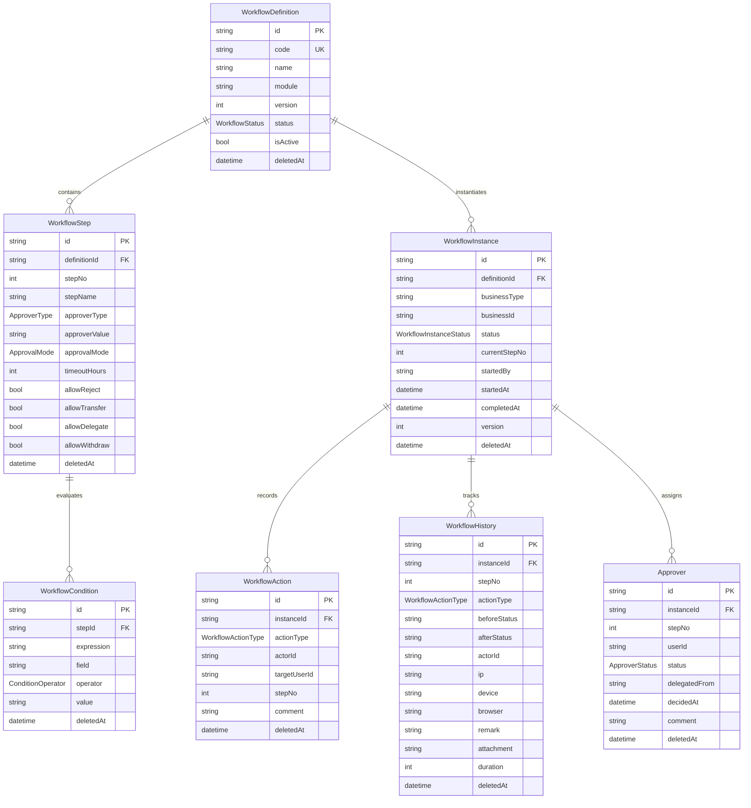

### 7.2 定义状态机（WorkflowStatus）

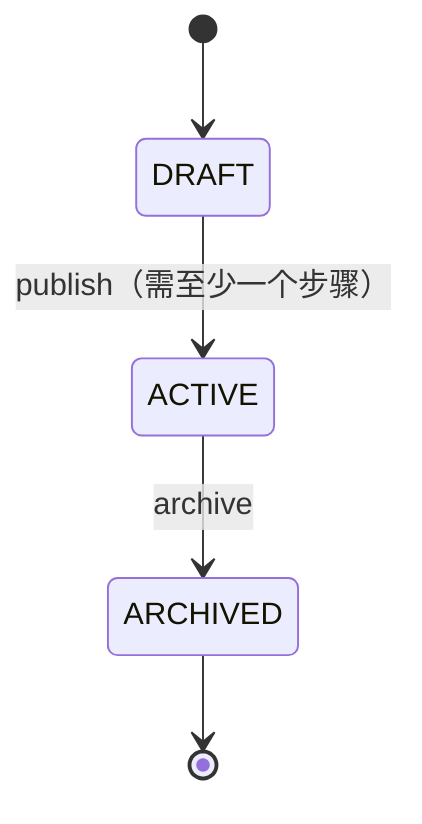

> 注意：已发布（ACTIVE）/归档（ARCHIVED）后禁止修改 code/module/steps，只能修改 name/description；更新必须携带 version（乐观锁）。

### 7.3 实例状态机（WorkflowInstanceStatus）

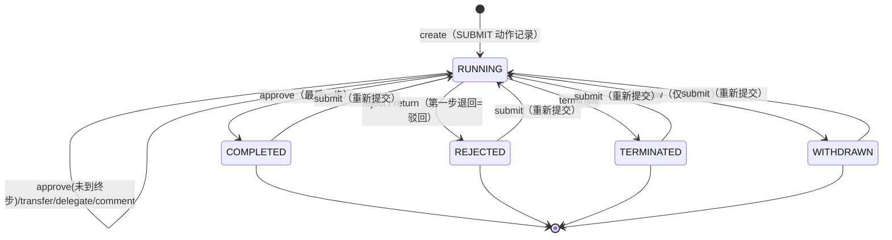

> 审批人状态（ApproverStatus）：PENDING → APPROVED / REJECTED / DELEGATED / SKIPPED。

## 8. Approval Engine（Sprint 3A，与 Workflow 解耦）

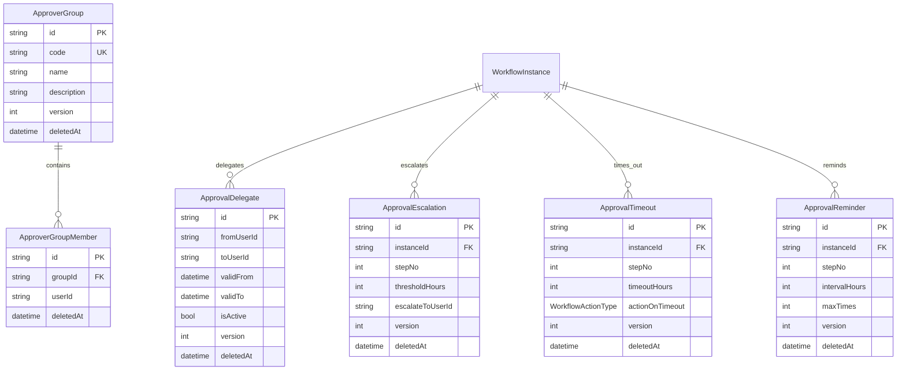

> Workflow 定义流程（Definition/Step/Condition）；Approval 执行审批（Approver/Group/Delegate/Escalation/Timeout/Reminder）。

## 9. Notification（Sprint 3A，统一事件中心）

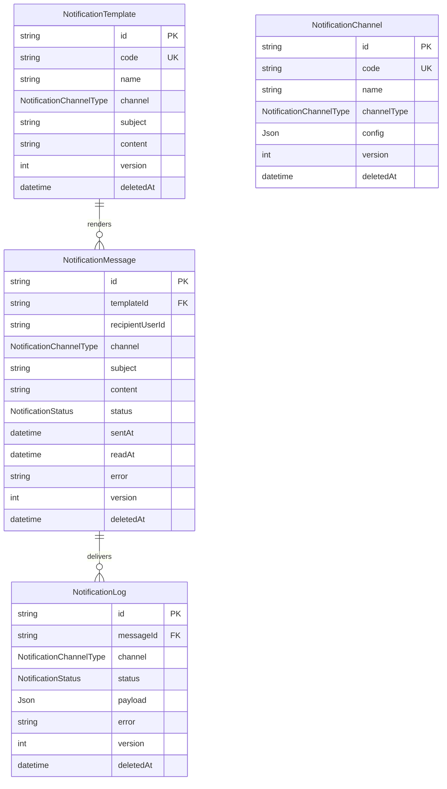

> 渠道（NotificationChannelType）：SYSTEM / EMAIL / TELEGRAM / WEBHOOK（本轮仅建模，不真实发送）+ WECHAT / DINGTALK（预留）。
> 状态（NotificationStatus）：PENDING / SENT / FAILED / READ。

## 10. Dictionary 与 Settings（Sprint 3A）

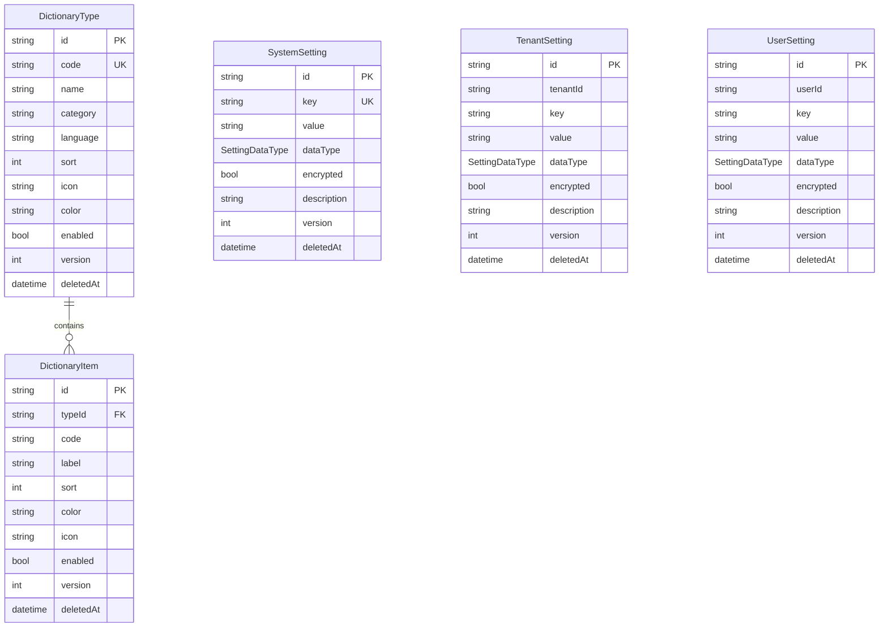

> Settings 三层：SYSTEM 全局唯一 key；TENANT 按 tenantId+key；USER 按 userId+key。
> `encrypted=true` 时 API 返回掩码（******），不返回明文（见 ADR-0004）。
> 数据类型（SettingDataType）：STRING / NUMBER / BOOLEAN / JSON / SECRET。

## 11. 关系及删除策略（Sprint 3A，真实 Schema）

| 关系 | onDelete | 原因 |
| --- | --- | --- |
| WorkflowDefinition → WorkflowStep | Cascade | 步骤依附定义，删定义即删步骤 |
| WorkflowStep → WorkflowCondition | Cascade | 条件依附步骤 |
| WorkflowDefinition → WorkflowInstance | Restrict | 已产生实例的模板不可物理删除 |
| WorkflowInstance → WorkflowAction | Cascade | 动作随实例保留 |
| WorkflowInstance → WorkflowHistory | Cascade | 历史随实例保留 |
| WorkflowInstance → Approver | Cascade | 审批人随实例保留 |
| WorkflowInstance → ApprovalEscalation / Timeout / Reminder | Cascade | 规则随实例保留 |
| ApproverGroup → ApproverGroupMember | Cascade | 成员依附组 |
| NotificationTemplate → NotificationMessage | SetNull | 保留发送历史，模板删除后消息置空 |
| NotificationMessage → NotificationLog | SetNull | 保留发送日志 |
| DictionaryType → DictionaryItem | Cascade | 字典项依附类型 |

> 统一审计字段（CTO 规则）：id / createdAt / createdBy / updatedAt / updatedBy / version / approvalStatus / isDeleted / deletedAt / deletedBy；业务数据一律软删除，禁止物理删除。

## 12. Audit Center（Sprint 3B 升级，ADR-0005）

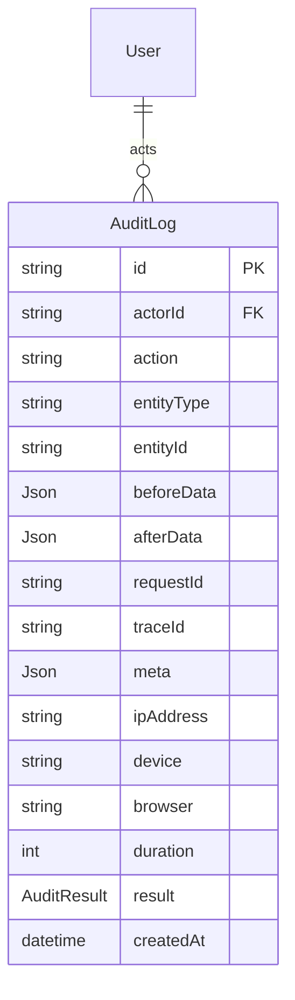

- 字段语义：entityType = ObjectType；entityId = ObjectId；beforeData/afterData = 操作前后数据快照；requestId/traceId = 链路追踪；device/browser = 终端环境（UA 解析）；duration = 耗时（毫秒）；result = SUCCESS/FAILURE/PARTIAL
- 枚举：AuditResult（SUCCESS / FAILURE / PARTIAL）
- 迁移 `0005_audit_upgrade`：仅 ALTER 加列 + 建索引（表已存在不重建，CTO 规则），新增 requestId/traceId/result 索引
- API：`GET /api/audit-logs`（分页 + actorId/entityType/entityId/action/result/requestId/traceId/时间过滤）+ `GET /api/audit-logs/:id`；权限 `audit:view`（仅 SUPER_ADMIN/ADMIN）
- requestMeta() 统一提取 IP/Device/Browser/RequestId/TraceId；所有写操作自动写入完整审计


## 13. Menu Center（Sprint 3B，ADR-0006）

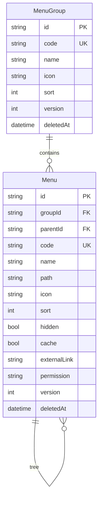

- RouteMeta 内联：path / icon / sort / hidden（隐藏）/ cache（缓存）/ externalLink（外链）/ permission（权限码）
- 删除策略：Menu → MenuGroup Cascade；Menu → Menu（parentId）SetNull（父删子提升为根）
- 迁移 `0006_menu_center`：2 表 + 索引 + 外键
- API：GET /api/menus（?tree=true 树形，前端直接读取）/ POST / GET / PATCH（乐观锁）/ DELETE（软删除，递归子树）
- 权限：menu / menu-group 模块，MANAGER 全量


## 14. Dashboard API（Sprint 3B，ADR-0007）

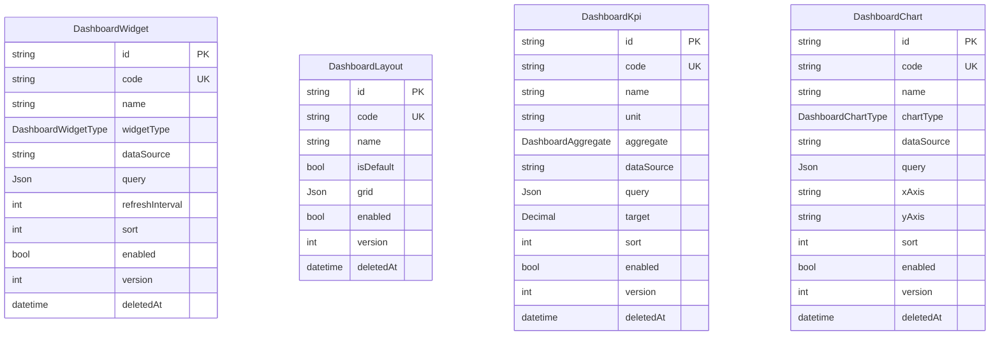

- 枚举：DashboardWidgetType（KPI/CHART/TABLE）、DashboardChartType（LINE/BAR/PIE/AREA/SCATTER）、DashboardAggregate（SUM/AVG/COUNT/MIN/MAX）
- 只提供数据 API（/api/dashboard/widgets|layouts|kpis|charts），页面 Sprint 8 开发
- 迁移 `0007_dashboard_api`：4 表 + 3 枚举 + code 唯一索引
- 权限：dashboard-widget / dashboard-layout / dashboard-kpi / dashboard-chart 模块，MANAGER 全量


## 15. File Center（Sprint 3B，ADR-0008）

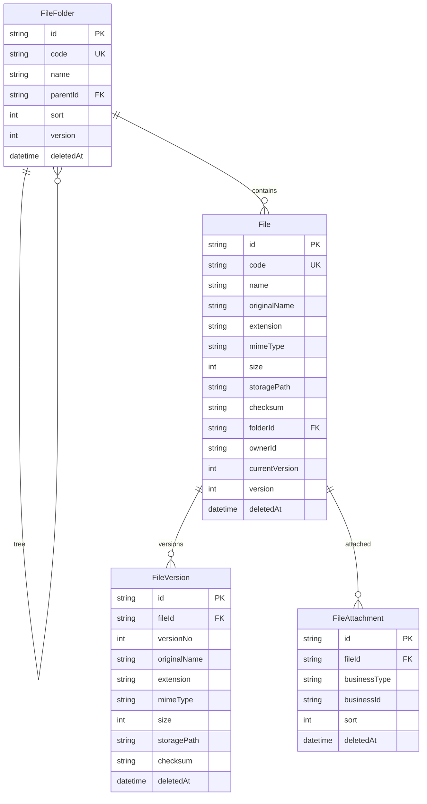

- File 只存元数据（storagePath 指向对象存储/本地），真实二进制存储后续接入
- 创建 File 自动生成 versionNo=1；新版本推进 currentVersion（事务）
- 附件关联：fileId + businessType/businessId（quotation/contract/sales-order/invoice/project 统一引用）
- 预览：GET /api/files/:id/preview 按 mimeType 白名单判定可预览
- 删除策略：File → FileFolder SetNull；FileVersion/FileAttachment → File Cascade（逻辑软删）
- 迁移 `0008_file_center`：4 表 + 索引 + 外键
- 权限：file / file-folder / file-version / file-attachment 模块，MANAGER 全量


## 16. Customer Foundation（Sprint 3C-1，ADR-0009）

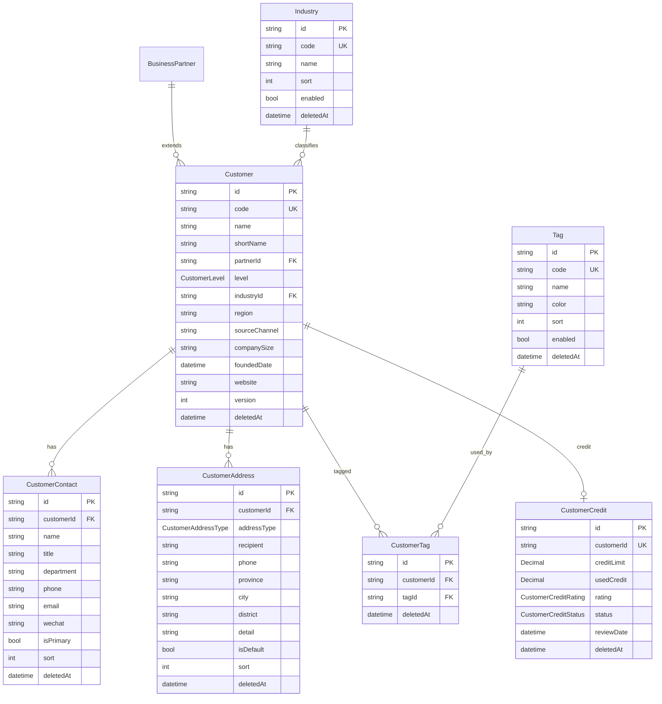

- 枚举：CustomerLevel（VIP/KEY/REGULAR/PROSPECT）、CustomerCreditRating（AAA~C）、CustomerCreditStatus（NORMAL/WATCH/FROZEN/CLOSED）、CustomerAddressType（REGISTERED/SHIPPING/INVOICING/CONTACT）
- 删除策略：Customer→Contact/Address/Credit/Tag Cascade（逻辑软删）；Customer→BusinessPartner/Industry SetNull
- 迁移 `0009_customer_foundation`：7 表 + 4 枚举 + 索引 + 外键
- API：customers 主档 CRUD + 子资源（contacts/addresses/tags/credit）+ industries/tags 字典 CRUD
- 权限：customer / customer-contact / customer-address / customer-tag / customer-credit / industry / tag 模块，MANAGER 全量
- seed：6 行业 + 4 标签（稳定 code + upsert）

## 17. Supplier Foundation（Sprint 3C-2，ADR-0010）

> 架构原则（CTO 最终模型）：**BusinessPartner 为唯一主体，Customer/Supplier 均为角色（BusinessPartnerRole），
> 联系人/地址/标签/银行/信用全部 Partner 级共享，绝不建两套**。
> Customer 3C-1 已交付子模型保留兼容，Sprint 5 统一迁移（ADR-0011）。

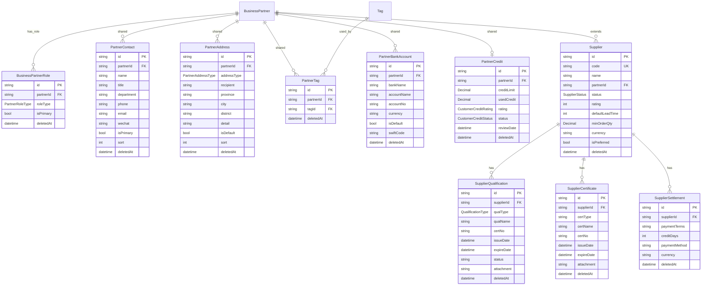

- 枚举：PartnerRoleType（CUSTOMER/SUPPLIER/BOTH/LOGISTICS/OUTSOURCING）、SupplierStatus（POTENTIAL/QUALIFIED/PREFERRED/SUSPENDED/BLACKLISTED）、QualificationType（BUSINESS_LICENSE/ISO9001/ISO14001/IATF16949/CE/ROHS/OTHER）、PartnerAddressType（REGISTERED/BILLING/SHIPPING/WAREHOUSE/FACTORY/INVOICING/CONTACT）
- 删除策略：Supplier→Qualification/Certificate/Settlement Cascade（逻辑软删）；Supplier→BusinessPartner Restrict；Partner 共享子表→BusinessPartner Cascade（逻辑软删）
- 业务规则：Supplier.partnerId 必填唯一 + type=SUPPLIER/BOTH 校验；创建自动写入 BusinessPartnerRole(SUPPLIER)；联系人/地址/银行默认唯一；标签去重；信用 1:1 upsert
- 迁移 `0010_supplier_foundation`：10 表 + 4 枚举 + 索引 + 外键（仅新增不改既有）
- API：suppliers 主档 CRUD + 子资源（qualifications/certificates/settlements）+ Partner 共享视图（contacts/addresses/tags/bank-accounts/credit）+ business-partners roles
- 权限：supplier / supplier-qualification / supplier-certificate / supplier-settlement / business-partner-role / partner-contact / partner-address / partner-tag / partner-bank-account / partner-credit 模块，MANAGER 全量
- seed：SUP-0001/SUP-0002（关联 BP-S-0001/BP-B-0001）+ 3 条 PartnerRole（CUSTOMER/SUPPLIER/BOTH）

## 18. Item Master Foundation（Sprint 3C-3，ADR-0012）

> 定位（CTO #2075）：**Item Master 是 ERP 核心主数据**，Sales / Purchase / Inventory / Warehouse / BOM / Production / Cost / Finance 全部引用。
> 五级层级（正式定义）：Level1 Category → Level2 SubCategory → Level3 Series → Level4 Model → Level5 Variant；不设第六层，特殊规格进 ItemSpecification。

```mermaid
erDiagram
    ItemCategory ||--o{ ItemCategory : parent_sub
    ItemCategory ||--o{ Item : classifies
    Item ||--o{ ItemSpecification : has
    Item ||--o{ UomConversion : converts
    UnitOfMeasure ||--o{ Item : stock_uom
    UnitOfMeasure ||--o{ Item : purchase_uom
    UnitOfMeasure ||--o{ Item : sales_uom
    UnitOfMeasure ||--o{ UomConversion : from
    UnitOfMeasure ||--o{ UomConversion : to
    Item ||--o{ ItemCost : costs
    Item ||--o{ SupplierItem : sources
    BusinessPartner ||--o{ SupplierItem : supplies
    Item ||--o{ ItemRevision : versions
    Item ||--o{ ItemTag : tagged
    Tag ||--o{ ItemTag : used_by
    FileAttachment ||--o{ Item : attaches

    Item {
        string id PK
        string code UK
        string name
        ItemType itemType
        string categoryId FK
        string series
        string model
        string variant
        string oemCode
        string barcode
        string qrCode
        string drawingNo
        string revision
        ItemLifecycle lifecycle
        ItemStatus status
        string stockUomId FK
        string purchaseUomId FK
        string salesUomId FK
        bool isSalable
        bool isPurchasable
        bool isManufacturable
        int version
        datetime deletedAt
    }

    ItemCategory {
        string id PK
        string code UK
        string name
        string parentId FK
        int level
        int sort
        datetime deletedAt
    }

    ItemSpecification {
        string id PK
        string itemId FK
        string specKey
        string specValue
        string unit
        int sort
        datetime deletedAt
    }

    UomConversion {
        string id PK
        string itemId FK
        string fromUomId FK
        string toUomId FK
        Decimal factor
        datetime deletedAt
    }

    ItemCost {
        string id PK
        string itemId FK
        ItemCostType costType
        Decimal amount
        string currency
        datetime effectiveFrom
        datetime effectiveTo
        string source
        datetime deletedAt
    }

    SupplierItem {
        string id PK
        string itemId FK
        string supplierId FK
        string supplierCode
        Decimal moq
        int leadTime
        string currency
        Decimal purchasePrice
        bool isPreferred
        string incoterm
        string paymentTerm
        datetime deletedAt
    }

    ItemRevision {
        string id PK
        string itemId FK
        int revisionNo
        string revision
        string changeSummary
        string releasedById
        datetime releasedAt
        string status
        datetime deletedAt
    }

    ItemTag {
        string id PK
        string itemId FK
        string tagId FK
        datetime deletedAt
    }
```

- 枚举：ItemType（FINISHED_GOOD/RAW_MATERIAL/SEMI_FINISHED/PURCHASED_PART/ACCESSORY/SERVICE/CONSUMABLE/ASSET/TOOLING/PACKAGING）、ItemStatus（ACTIVE/INACTIVE/LOCKED/ARCHIVED）、ItemCostType（STANDARD/LAST_PURCHASE/AVERAGE/CURRENT）、AttachmentType（DRAWING/CERTIFICATE/PHOTO/MANUAL/MODEL_3D/VIDEO/INSPECTION_REPORT，统一放 File Center）；ItemLifecycle 重命名五值（DESIGN/TRIAL/MASS_PRODUCTION/DISCONTINUED/OBSOLETE）
- 业务规则：不建 Item.supplierId 单值字段，建 SupplierItem（一个 Item 多供应商）；ItemCost 只建接口不写算法；Lifecycle 与 Status 分离；附件复用 File Center（businessType=item + attachmentType）
- 迁移 `0011_item_foundation`：Item 表 ALTER（RENAME COLUMN category→itemType + ADD COLUMN，不改既有列）+ 7 新表 + 枚举演进 + FileAttachment.attachmentType（仅新增/加列）
- API：items 主档 CRUD + 分类树 + specifications/uom-conversions/costs/supplier-items/revisions/tags/attachments 子资源
- 权限：item（动作级）+ item-category/item-specification/item-uom/item-cost/item-supplier/item-revision/item-tag/item-attachment 模块，MANAGER 全量
- seed：SEED_LINEAR_GUIDE_ITEMS 同步（itemType/lifecycle 新枚举）

## 19. Quotation Foundation（Sprint 4A，ADR-0015/0016）

> 定位（CTO 审核锁定）：**Quotation 是 Sales 主链起点**（Quotation → Sales Order → Delivery → Invoice → Payment，ADR-0016 主链）。
> 价格红线（ADR-0015）：行价必须来自 `PricingEngine.resolvePrice() → QuotationPriceSnapshot → QuotationLine.priceSnapshotId`，禁止前端直接决定 unitPrice。
> 审批以 Workflow 为唯一事实源（ADR-0016 决策①）：不建 QuotationApproval 表，Quotation 仅保存投影（workflowInstanceId / approvalStatus / approvedAt / approvedById）。
> EXPIRED 惰性判定（决策②）：不落库、不增调度器，仅投影 effectiveStatus。

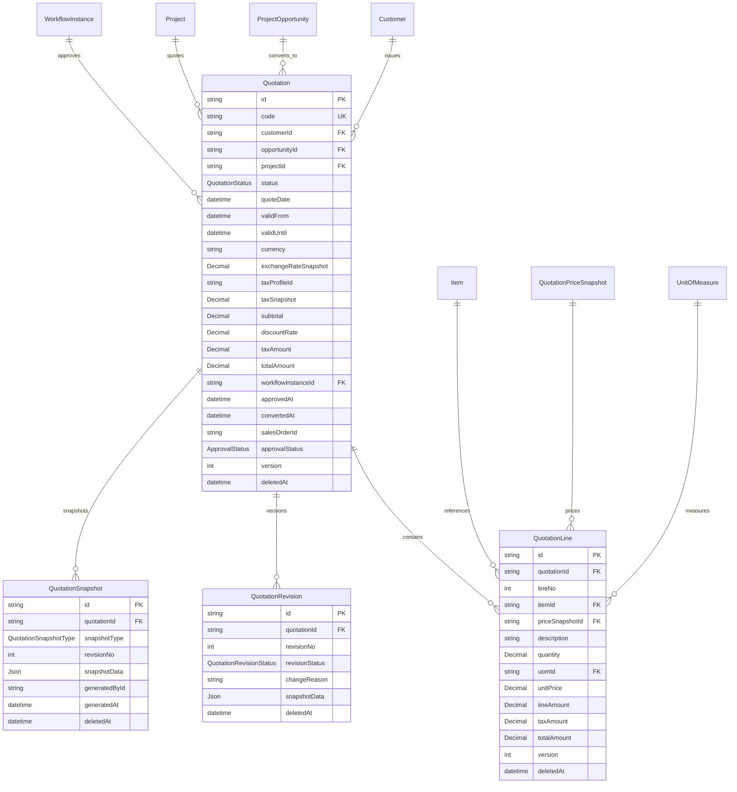

### 关系与约束（真实 Schema）

| 关系 | 基数 | onDelete | 说明 |
| --- | --- | --- | --- |
| Customer → Quotation | 1:N | Restrict | 有报价的客户不可物理删 |
| ProjectOpportunity → Quotation | 1:N | SetNull | 机会删除不影响报价 |
| Project → Quotation | 1:N | Restrict | 有报价的项目不可物理删 |
| WorkflowInstance → Quotation | 1:N | SetNull | 审批实例删除不影响报价投影 |
| Quotation → QuotationLine | 1:N | Cascade | 行随单据软删 |
| Item → QuotationLine | 1:N | Restrict | 物料可空（允许非物料行） |
| QuotationPriceSnapshot → QuotationLine | 1:N | SetNull | 价格快照（ADR-0015，与 ProjectProduct 同构） |
| Quotation → QuotationRevision | 1:N | Cascade | 修订历史随单据 |
| Quotation → QuotationSnapshot | 1:N | Cascade | 快照随单据 |

- `Quotation.code` 唯一；`QuotationLine @@unique([quotationId, lineNo])`（行号 10/20/30 步进，插 25 不重排）；`QuotationRevision @@unique([quotationId, revisionNo])`；`QuotationSnapshot @@unique([quotationId, snapshotType])`
- 统一审计字段：isActive / createdById / updatedById / approvedById / approvalStatus / version / deletedAt / createdAt / updatedAt（全模型同构）
- 索引：code / customerId / status / opportunityId / projectId / workflowInstanceId / deletedAt；行：quotationId / itemId / priceSnapshotId / deletedAt

### 状态机与业务规则（Sprint 4A）

- **状态流转**：DRAFT → SUBMITTED → APPROVED → SENT → ACCEPTED → CONVERTED；REJECTED（可编辑后重新提交）；CANCELLED（DRAFT/SUBMITTED/APPROVED/SENT 可取消，ACCEPTED/CONVERTED 禁止）；EXPIRED（惰性投影：SENT/APPROVED 且 validUntil < now，不落库）
- **Action API 锁定**：submit / accept / cancel / convert 全部独立端点，不 PATCH status（ADR-0016 §8）
- **Revision 系统生成**：每次影响商业内容的修改（头字段/行增删改）自动创建 revisionNo+1，不开放自由编辑
- **Snapshot 固化节点**：SUBMITTED / APPROVED / SENT / ACCEPTED / CONVERTED 仅系统生成，只读
- **乐观锁**：头/行 PATCH 必带 version，冲突返回 409 VERSION_CONFLICT
- **软删除**：DELETE 置 deletedAt + isActive=false，级联软删 lines/revisions/snapshots；列表/详情过滤 deletedAt=null
- **审计**：全部写操作写 AuditLog；领域事件（EVENTS.md v1.2 注册 11 个，已发布 7 个）当前以 AuditLog 留痕（事件总线未落地）

### 交付（Sprint 4A）

- 迁移 `0014_quotation_foundation`：+4 模型（Quotation/QuotationLine/QuotationRevision/QuotationSnapshot，QuotationPriceSnapshot 为 3C-4 既有）+ 3 枚举（QuotationStatus/QuotationSnapshotType/QuotationRevisionStatus）；仅 CREATE/ALTER/INDEX/FK，无 DROP
- API：12 路由文件 / 18 端点（主档 CRUD + lines + revisions + snapshots + submit/accept/cancel/convert）
- 权限：13 权限码（quotation* / quotation-line* / quotation-revision* / quotation-snapshot*）
- 集成：submit → ApprovalPolicy 匹配 → WorkflowInstance（复用 Sprint 3A Workflow Engine）；审批终态回写 syncQuotationApproval（COMPLETED → APPROVED，REJECTED → REJECTED）
- 预留：convert 返回 501（Sprint 4B Sales Order Foundation 落地）；SENT 状态为下游预留，4A 无独立发送 API

## 20. 变更记录

### v1.9（2026-08-07，Sprint 4A Quotation Foundation，ADR-0015/0016）

- 新增章节：19. Quotation Foundation（Quotation/QuotationLine/QuotationRevision/QuotationSnapshot + ApprovalPolicy 复用）
- 模型：+4（Quotation 域，不含 3C-4 既有 QuotationPriceSnapshot）；枚举：+3（QuotationStatus/QuotationSnapshotType/QuotationRevisionStatus）
- 状态机表格新增：报价状态（含 EXPIRED 惰性投影）/快照类型/修订状态
- 第 6 节已落地列表：Quotation Foundation 从规划中移入已落地（Sprint 4A，PR #12 验收中）
- 预留声明：convert（Sprint 4B）与 SENT 发送动作（后续阶段）未在 4A 实现

### v1.8（2026-08-06，Sprint 3C-3 Item Master Foundation，ADR-0012）

- 新增章节：17. Item Master Foundation（ItemType 10 类/五级层级/多 UOM/ItemSpecification/ItemCost/SupplierItem/ItemRevision/ItemTag）
- 模型：79 → 86（+ItemCategory 树/ItemSpecification/UomConversion/ItemCost/SupplierItem/ItemRevision/ItemTag）
- 枚举：37 → 40（+ItemStatus/ItemCostType/AttachmentType；ItemCategory→ItemType 扩展 10 类；ItemLifecycle 重命名五值）
- Item 升级：itemType/categoryId/series/model/variant/barcode/qrCode/revision/status/多 UOM/isSalable/isPurchasable/isManufacturable
- FileAttachment + attachmentType（统一放 File Center，CTO #2075）

### v1.7（2026-08-06，Sprint 3C-2 Supplier Foundation，ADR-0010）

- 新增章节：17. Supplier Foundation（BusinessPartnerRole + Partner 五共享 + Supplier 三独有）
- 模型：69 → 79；枚举：33 → 37

### v1.6（2026-08-05，Sprint 3C-1 Customer Foundation，ADR-0009）

- 新增章节：16. Customer Foundation（Customer/Contact/Address/Tag/Industry/Credit）
- 模型：62 → 69；枚举：29 → 33
