# DOMAIN_MODEL 领域模型

- 版本：v1.6
- 日期：2026-08-05
- 维护者：CIO（JINZA）｜审核：CTO
- 关联：[PRODUCT_VISION.md](./PRODUCT_VISION.md) ｜ [ROADMAP.md](./ROADMAP.md) ｜ [ADR](./ADR/)

## 1. 业务主链（客户 → 项目 → 订单 → 交付 → 回款）

```
BusinessPartner（客户/供应商，统一往来单位）
        │
        ▼
Opportunity（项目机会：线索→准入→方案→报价）
        │  1:0..1
        ▼
Project（项目：试样→测试→小批量→批量供货→暂停/失败/结项）
        │  含 Stakeholder/Member/Milestone/Task/Budget/Expense/Product/Risk/Visit/Progress/Acceptance/Closure
        ▼
Quotation（报价单）──> Sales Order（销售订单）──> Contract（合同）
        │                                      │
        ▼                                      ▼
Delivery（发货 DO）                       Invoice（发票 CI）
        │                                      │
        ▼                                      ▼
Inventory（库存出库）                    Payment（收款核销）
                                                │
                                                ▼
                                              AR（应收）
```

## 2. 物料与供应链链（物料 → 价格 → 库存 → 采购/销售）

```
Item（物料：成品/原材料/配件/外购件/服务/包装物 + 工业字段）
  │
  ├── PriceList / PriceListItem（9 类价格：采购/销售/VIP/代理/工程/战略/区域/客户专属/历史）
  │
  └── Warehouse（仓库）──> Stock（库存余额）──> Batch（批次）
           │                    │
           ▼                    ▼
  Inventory Movement（出入库流水）──> Stock Count（盘点）/ Transfer（调拨）
           │
           ├── Purchase（采购：PR → PO → GRN → Supplier Invoice → Payment → AP）
           └── Sales（销售：Quotation → SO → Delivery → Invoice → Payment → AR）
```

## 3. 主数据关系

```
UnitOfMeasure ──< Item >── LinearGuideSpecification（1:1 扩展）
                    │
                    ├──< ItemStandard >── TechnicalStandard（GB/T 等）
                    │
                    └──< PriceListItem >── PriceList（priceType/含税体系）

BusinessPartner（uscc 唯一）──< ProjectOpportunity / Project

DocumentSequence（17 种单据类型，全局编号）
CommercialTerm（EXW/FOB/CIF/NET30）
```

## 4. 数据流（单据 → 财务）

```
Quotation ──> Sales Order ──> Delivery ──> Invoice ──> Payment ──> AR
                                                          │
Purchase Request ──> Purchase Order ──> GRN ──> Supplier Invoice ──> Payment ──> AP
                                                          │
Project Expense / 日常 Expense ──> 审批流 ──> Voucher（凭证）
                                                          │
                                              Journal ──> General Ledger ──> Profit / Cash Flow
```

## 5. 状态机（核心枚举）

| 对象 | 枚举 |
| --- | --- |
| 项目阶段 | LEAD → QUALIFIED → SOLUTION → QUOTATION → SAMPLING → TESTING → SMALL_BATCH → MASS_SUPPLY → PAUSED / FAILED / CLOSED |
| 关系人角色 | REQUESTER / TECHNICAL / PURCHASER / DECISION_MAKER / END_USER |
| 回款状态 | UNPAID / PARTIAL / PAID / OVERDUE |
| 里程碑 | PLANNED / IN_PROGRESS / COMPLETED / DELAYED |
| 任务 | TODO / IN_PROGRESS / DONE / CANCELLED |
| 风险 | OPEN / MITIGATING / CLOSED |
| 走访 | VISIT / PHONE / VIDEO / MEETING / OTHER |
| 验收 | PASSED / CONDITIONAL_PASS / FAILED / PENDING |
| 价格类型 | PURCHASE / SALES / VIP / AGENT / ENGINEERING / STRATEGIC / REGIONAL / CUSTOMER / HISTORICAL |
| 单据类型 | QUOTATION / SALES_ORDER / PURCHASE_ORDER / PROFORMA_INVOICE / COMMERCIAL_INVOICE / DELIVERY_ORDER / GOODS_RECEIPT_NOTE / GOODS_ISSUE / INVOICE / CREDIT_NOTE / DEBIT_NOTE / PAYMENT_VOUCHER / RECEIPT / EXPENSE / JOURNAL / CONTRACT / PROJECT |

## 6. 已落地 vs 规划中

- ✅ 已落地（Sprint 2，PR #4）：Item / LinearGuideSpecification / BusinessPartner / PriceList / TechnicalStandard / UnitOfMeasure / CommercialTerm / DocumentSequence + 项目领域 14 模型
- ✅ 已落地（Sprint 3A，PR #5）：Workflow Foundation 22 模型（Workflow 6 + Approval 7 + Notification 4 + Dictionary 2 + Settings 3），见第 7-10 节
- 🔄 进行中（Sprint 3C）：Customer Foundation（第 16 节）✅ + Supplier/Item/Project/Price 后续子阶段
- ⬜ 规划中（Sprint 4-7）：Quotation / Sales Order / Contract / Delivery / Invoice / Payment / Purchase / GRN / Warehouse / Stock / AR / AP / Voucher / Journal / GL

> 详细字段标准见数据库 schema（`prisma/schema.prisma`）与 [architecture/domain-model.md](./architecture/domain-model.md)。

## 7. Workflow Foundation（Sprint 3A）

### 7.1 模型关系

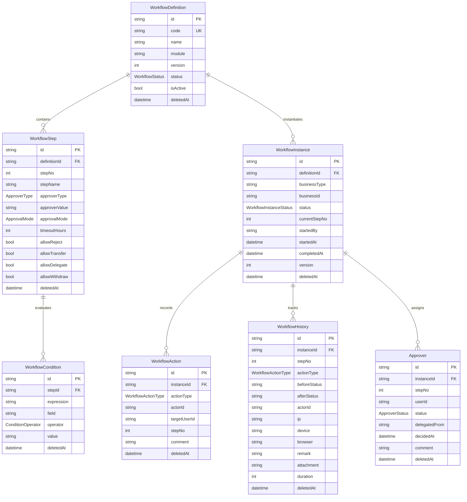

### 7.2 定义状态机（WorkflowStatus）

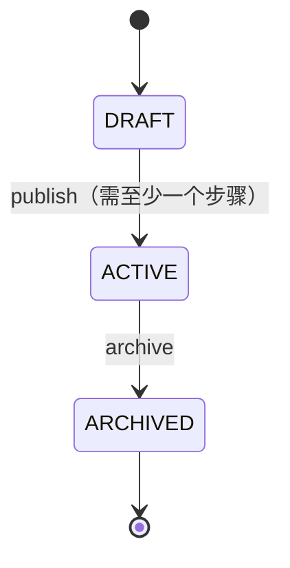

> 注意：已发布（ACTIVE）/归档（ARCHIVED）后禁止修改 code/module/steps，只能修改 name/description；更新必须携带 version（乐观锁）。

### 7.3 实例状态机（WorkflowInstanceStatus）

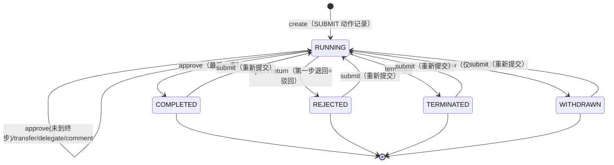

> 审批人状态（ApproverStatus）：PENDING → APPROVED / REJECTED / DELEGATED / SKIPPED。

## 8. Approval Engine（Sprint 3A，与 Workflow 解耦）

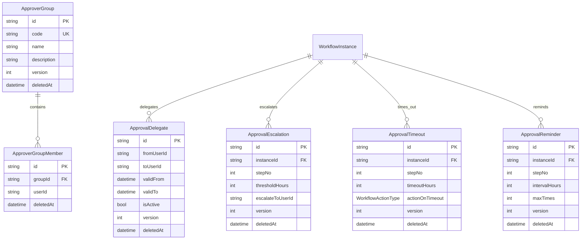

> Workflow 定义流程（Definition/Step/Condition）；Approval 执行审批（Approver/Group/Delegate/Escalation/Timeout/Reminder）。

## 9. Notification（Sprint 3A，统一事件中心）

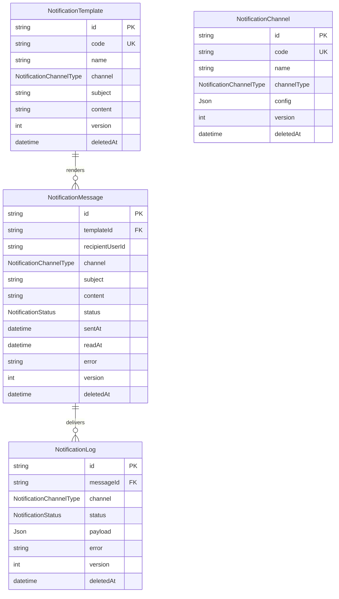

> 渠道（NotificationChannelType）：SYSTEM / EMAIL / TELEGRAM / WEBHOOK（本轮仅建模，不真实发送）+ WECHAT / DINGTALK（预留）。
> 状态（NotificationStatus）：PENDING / SENT / FAILED / READ。

## 10. Dictionary 与 Settings（Sprint 3A）

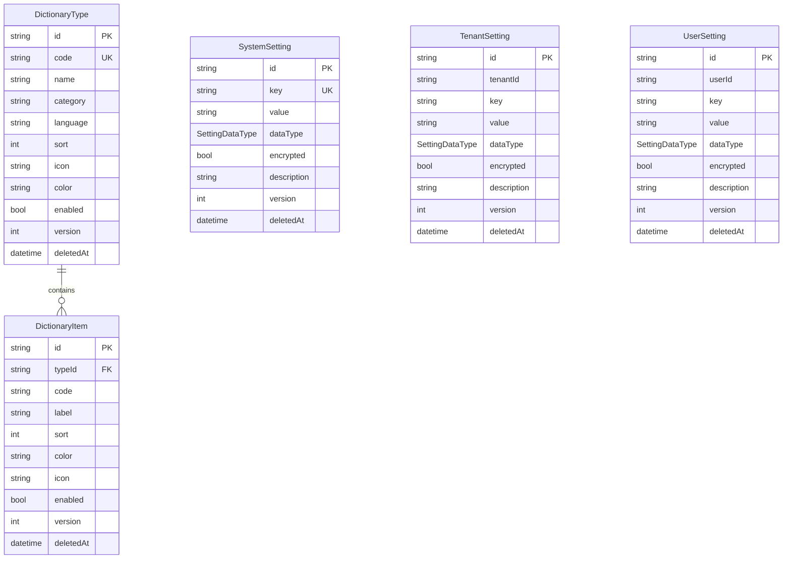

> Settings 三层：SYSTEM 全局唯一 key；TENANT 按 tenantId+key；USER 按 userId+key。
> `encrypted=true` 时 API 返回掩码（******），不返回明文（见 ADR-0004）。
> 数据类型（SettingDataType）：STRING / NUMBER / BOOLEAN / JSON / SECRET。

## 11. 关系及删除策略（Sprint 3A，真实 Schema）

| 关系 | onDelete | 原因 |
| --- | --- | --- |
| WorkflowDefinition → WorkflowStep | Cascade | 步骤依附定义，删定义即删步骤 |
| WorkflowStep → WorkflowCondition | Cascade | 条件依附步骤 |
| WorkflowDefinition → WorkflowInstance | Restrict | 已产生实例的模板不可物理删除 |
| WorkflowInstance → WorkflowAction | Cascade | 动作随实例保留 |
| WorkflowInstance → WorkflowHistory | Cascade | 历史随实例保留 |
| WorkflowInstance → Approver | Cascade | 审批人随实例保留 |
| WorkflowInstance → ApprovalEscalation / Timeout / Reminder | Cascade | 规则随实例保留 |
| ApproverGroup → ApproverGroupMember | Cascade | 成员依附组 |
| NotificationTemplate → NotificationMessage | SetNull | 保留发送历史，模板删除后消息置空 |
| NotificationMessage → NotificationLog | SetNull | 保留发送日志 |
| DictionaryType → DictionaryItem | Cascade | 字典项依附类型 |

> 统一审计字段（CTO 规则）：id / createdAt / createdBy / updatedAt / updatedBy / version / approvalStatus / isDeleted / deletedAt / deletedBy；业务数据一律软删除，禁止物理删除。

## 12. Audit Center（Sprint 3B 升级，ADR-0005）

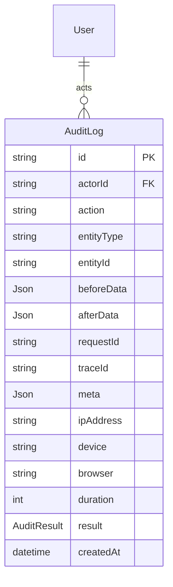

- 字段语义：entityType = ObjectType；entityId = ObjectId；beforeData/afterData = 操作前后数据快照；requestId/traceId = 链路追踪；device/browser = 终端环境（UA 解析）；duration = 耗时（毫秒）；result = SUCCESS/FAILURE/PARTIAL
- 枚举：AuditResult（SUCCESS / FAILURE / PARTIAL）
- 迁移 `0005_audit_upgrade`：仅 ALTER 加列 + 建索引（表已存在不重建，CTO 规则），新增 requestId/traceId/result 索引
- API：`GET /api/audit-logs`（分页 + actorId/entityType/entityId/action/result/requestId/traceId/时间过滤）+ `GET /api/audit-logs/:id`；权限 `audit:view`（仅 SUPER_ADMIN/ADMIN）
- requestMeta() 统一提取 IP/Device/Browser/RequestId/TraceId；所有写操作自动写入完整审计


## 13. Menu Center（Sprint 3B，ADR-0006）

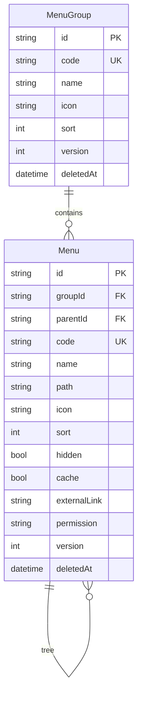

- RouteMeta 内联：path / icon / sort / hidden（隐藏）/ cache（缓存）/ externalLink（外链）/ permission（权限码）
- 删除策略：Menu → MenuGroup Cascade；Menu → Menu（parentId）SetNull（父删子提升为根）
- 迁移 `0006_menu_center`：2 表 + 索引 + 外键
- API：GET /api/menus（?tree=true 树形，前端直接读取）/ POST / GET / PATCH（乐观锁）/ DELETE（软删除，递归子树）
- 权限：menu / menu-group 模块，MANAGER 全量


## 14. Dashboard API（Sprint 3B，ADR-0007）

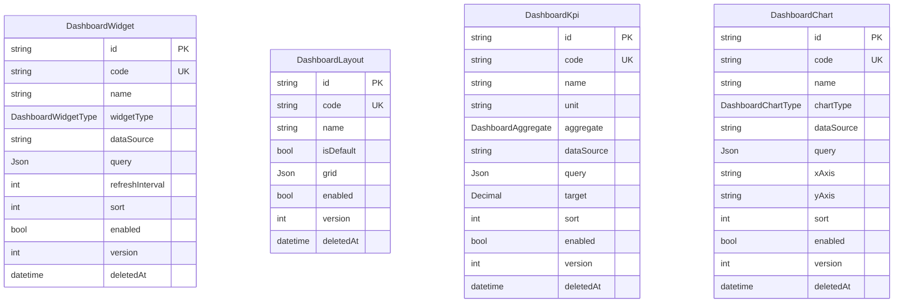

- 枚举：DashboardWidgetType（KPI/CHART/TABLE）、DashboardChartType（LINE/BAR/PIE/AREA/SCATTER）、DashboardAggregate（SUM/AVG/COUNT/MIN/MAX）
- 只提供数据 API（/api/dashboard/widgets|layouts|kpis|charts），页面 Sprint 8 开发
- 迁移 `0007_dashboard_api`：4 表 + 3 枚举 + code 唯一索引
- 权限：dashboard-widget / dashboard-layout / dashboard-kpi / dashboard-chart 模块，MANAGER 全量


## 15. File Center（Sprint 3B，ADR-0008）

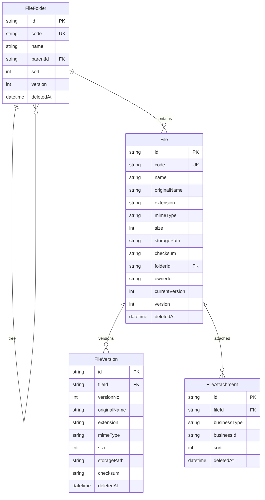

- File 只存元数据（storagePath 指向对象存储/本地），真实二进制存储后续接入
- 创建 File 自动生成 versionNo=1；新版本推进 currentVersion（事务）
- 附件关联：fileId + businessType/businessId（quotation/contract/sales-order/invoice/project 统一引用）
- 预览：GET /api/files/:id/preview 按 mimeType 白名单判定可预览
- 删除策略：File → FileFolder SetNull；FileVersion/FileAttachment → File Cascade（逻辑软删）
- 迁移 `0008_file_center`：4 表 + 索引 + 外键
- 权限：file / file-folder / file-version / file-attachment 模块，MANAGER 全量


## 16. Customer Foundation（Sprint 3C-1，ADR-0009）

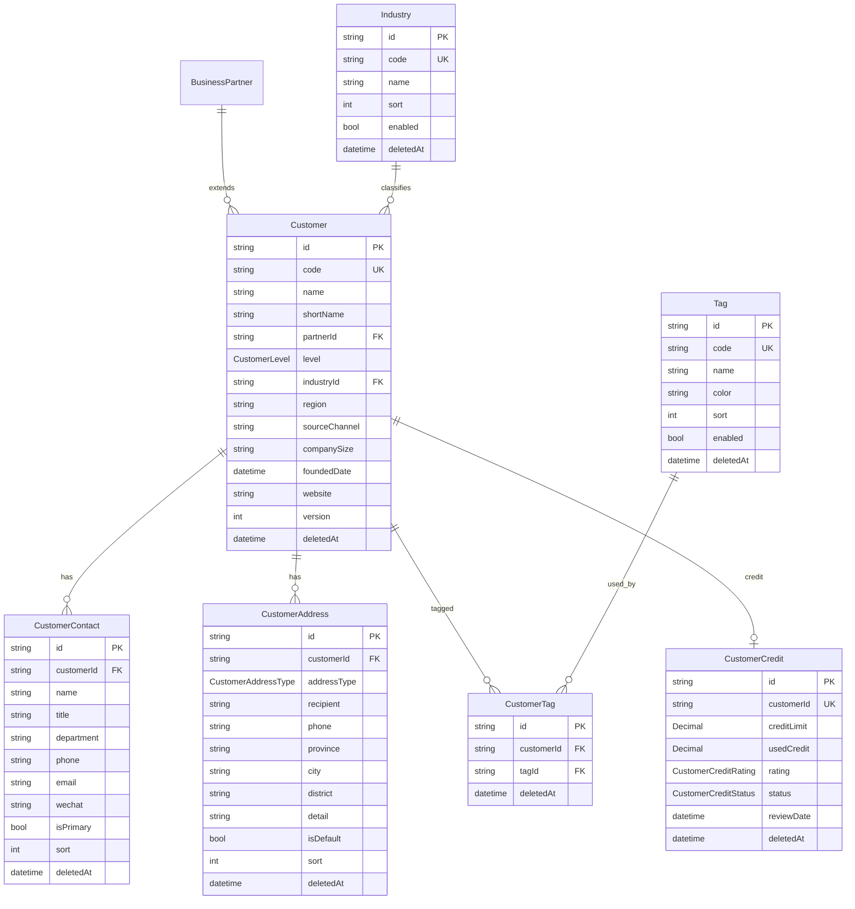

- 枚举：CustomerLevel（VIP/KEY/REGULAR/PROSPECT）、CustomerCreditRating（AAA~C）、CustomerCreditStatus（NORMAL/WATCH/FROZEN/CLOSED）、CustomerAddressType（REGISTERED/SHIPPING/INVOICING/CONTACT）
- 删除策略：Customer→Contact/Address/Credit/Tag Cascade（逻辑软删）；Customer→BusinessPartner/Industry SetNull
- 迁移 `0009_customer_foundation`：7 表 + 4 枚举 + 索引 + 外键
- API：customers 主档 CRUD + 子资源（contacts/addresses/tags/credit）+ industries/tags 字典 CRUD
- 权限：customer / customer-contact / customer-address / customer-tag / customer-credit / industry / tag 模块，MANAGER 全量
- seed：6 行业 + 4 标签（稳定 code + upsert）

## 17. 变更记录
