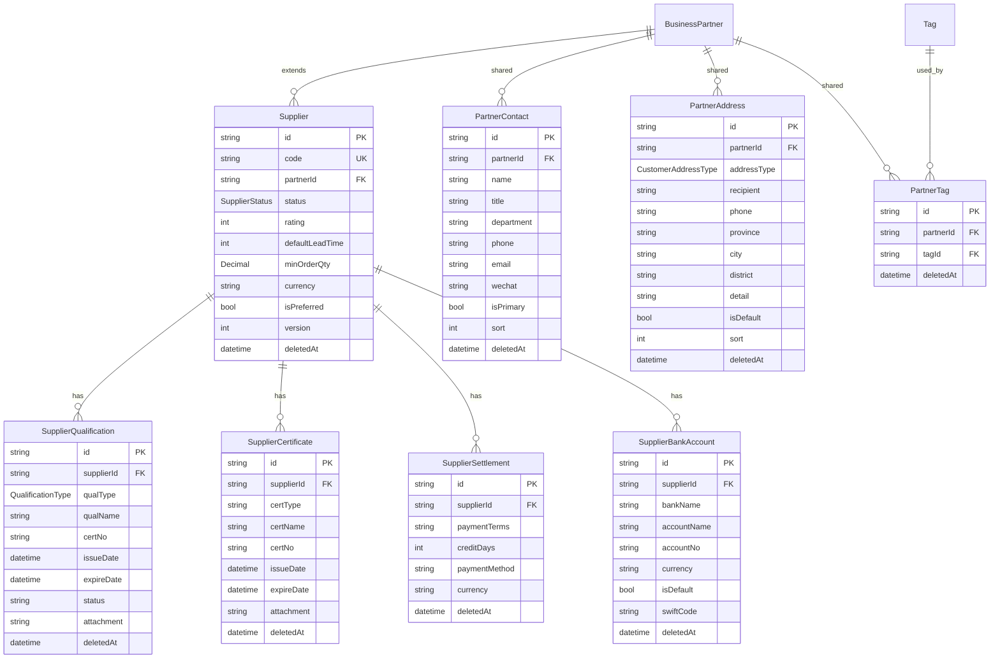

# 3C-2 Supplier Foundation 领域设计（草稿）

> 状态：Design（CTO 流水线：Customer=CI/Review、Supplier=Design、Item=Requirement、Project/Price=Waiting）
> 分支：待 PR #7（Customer Foundation）合并后创建 `feature/sprint3-supplier-foundation`
> 原则：**不写实现代码**，只产出 Schema 设计 / ERD / ADR / OpenAPI 草稿；设计重点检查与 Customer 复用 BusinessPartner，避免两套平行模型。

---

> [!NOTE]
> **CTO 审阅后最终模型（#1977）**：BusinessPartner 唯一主体 + **BusinessPartnerRole**（CUSTOMER/SUPPLIER/BOTH/LOGISTICS/OUTSOURCING 无限扩展）。
> 共享模型调整为 **PartnerContact / PartnerAddress / PartnerTag / PartnerBankAccount / PartnerCredit**（银行与信用均为 Partner 级共享，非 Supplier 独有）；
> Supplier 独有仅 **Qualification / Certificate / Settlement**；Customer 不返工（ADR-0011，Sprint 5 迁移）。
> 本文档为设计草稿，最终实现以 ADR-0010 / ADR-0011 / 迁移 0010 为准。


## 1. 复用评估（BusinessPartner 现状）

BusinessPartner（Sprint 2 已有，`type: CUSTOMER | SUPPLIER | BOTH`）已承载企业级字段：

| 分组 | 字段 |
| --- | --- |
| 主体 | code / mnemonic / name / shortName / fullName / groupName |
| 资质 | uscc（统一社会信用代码，唯一）/ taxpayerType / legalRepresentative / registeredAddress / foundedDate / registeredCapital / employeeCount |
| 财务 | invoiceInfo(Json) / bankName / bankAccount / settlementTerms |
| 业务 | region / industry / companySize / creditRating / sourceChannel / website / wechatOfficialAccount / tags(Json) |
| 联系人（单值） | contactPerson / phone / email / address |

Customer 3C-1 已通过 `Customer.partnerId → BusinessPartner`（type=CUSTOMER/BOTH）扩展，并建了多值子模型：CustomerContact / CustomerAddress / CustomerTag / CustomerCredit / Industry / Tag。

**结论：Supplier 必须复用同一套 BusinessPartner**，`Supplier.partnerId → BusinessPartner`（type=SUPPLIER/BOTH 校验），**绝不复刻** code/name/uscc/银行/结算/标签等企业字段。

---

## 2. 核心架构决策：抽象 Partner 级共享（避免两套联系人/地址/标签）

CTO 明确：不要形成两套联系人、两套地址、两套标签，否则 Sprint 4 销售 / Sprint 5 采购必重构。

### 推荐方案（Partner 级共享）

```
BusinessPartner（统一主体，type=CUSTOMER|SUPPLIER|BOTH）
   ├── PartnerContact（联系人，partnerId FK）     ← Customer 与 Supplier 共用
   ├── PartnerAddress（地址，partnerId FK）       ← Customer 与 Supplier 共用
   ├── PartnerTag（标签关联，partnerId+tagId）    ← Customer 与 Supplier 共用（复用全局 Tag）
   ├── Customer（角色扩展，type=CUSTOMER/BOTH）   ← 3C-1 已交付
   │     └── CustomerCredit（客户信用，1:1）
   └── Supplier（角色扩展，type=SUPPLIER/BOTH）   ← 3C-2 本设计
         ├── SupplierQualification（资质）
         ├── SupplierCertificate（证书）
         ├── SupplierSettlement（结算条款）
         └── SupplierBankAccount（银行账户，多账户）
```

- **联系人/地址/标签提升为 Partner 级共享**（PartnerContact/PartnerAddress/PartnerTag 挂 BusinessPartner）。
- 3C-1 已交付的 CustomerContact/CustomerAddress/CustomerTag 保留兼容（PR #7 已提交）；**后续通过新 ADR 统一迁移**到 Partner 级共享（标注为演进项，不阻塞 3C-2）。
- Supplier 3C-2 **不再新建** SupplierContact/SupplierAddress/SupplierTag，直接通过 `partnerId` 访问 Partner 级共享表（API 层暴露 `/api/suppliers/:id/contacts` 等视图，内部读写共享表）。

### 备选方案（不推荐）

Supplier 独立建 SupplierContact/SupplierAddress/SupplierTag —— 与 Customer 平行两套，Sprint 4/5 必重构。**放弃**。

---

## 3. ① Schema 设计（Prisma 草案，不落地）

```prisma
// ============ 3C-2 Supplier Foundation ============

enum SupplierStatus {
  POTENTIAL   // 潜在
  QUALIFIED   // 合格
  PREFERRED   // 优选
  SUSPENDED   // 暂停
  BLACKLISTED // 黑名单
}

enum QualificationType {
  BUSINESS_LICENSE  // 营业执照
  ISO9001
  ISO14001
  IATF16949
  CE
  ROHS
  OTHER
}

/// 供应商（BusinessPartner 角色扩展，type=SUPPLIER/BOTH）
model Supplier {
  id          String   @id @default(cuid())
  code        String   @unique // 供应商编码
  name        String
  partnerId   String   @unique // 关联统一往来单位（必填，type=SUPPLIER/BOTH 校验）
  partner     BusinessPartner @relation(fields: [partnerId], references: [id], onDelete: Restrict)
  status      SupplierStatus @default(POTENTIAL)
  rating      Int?     // 1-5 星
  defaultLeadTime Int? // 默认交期（天）
  minOrderQty Decimal? @db.Decimal(18,2) // 最小起订量
  currency    String   @default("CNY")
  isPreferred Boolean  @default(false)
  // 统一审计字段（CTO 规则）
  isActive    Boolean  @default(true)
  createdById String?
  updatedById String?
  approvedById String?
  approvalStatus ApprovalStatus @default(DRAFT)
  version     Int      @default(1)
  deletedAt   DateTime?
  createdAt   DateTime @default(now()) @db.Timestamptz(3)
  updatedAt   DateTime @updatedAt @db.Timestamptz(3)

  @@index([code])
  @@index([status])
  @@index([deletedAt])
}

/// 供应商资质（资质/认证，含附件）
model SupplierQualification {
  id          String   @id @default(cuid())
  supplierId  String
  supplier    Supplier @relation(fields: [supplierId], references: [id], onDelete: Cascade)
  qualType    QualificationType
  qualName    String
  certNo      String?
  issueDate   DateTime?
  expireDate  DateTime?
  status      String // VALID/EXPIRING/EXPIRED
  attachment  String? // FileId（File Center）
  // 统一审计字段
  isActive    Boolean  @default(true)
  createdById String?
  updatedById String?
  approvedById String?
  approvalStatus ApprovalStatus @default(DRAFT)
  version     Int      @default(1)
  deletedAt   DateTime?
  createdAt   DateTime @default(now()) @db.Timestamptz(3)
  updatedAt   DateTime @updatedAt @db.Timestamptz(3)

  @@index([supplierId])
  @@index([deletedAt])
}

/// 供应商证书
model SupplierCertificate {
  id          String   @id @default(cuid())
  supplierId  String
  supplier    Supplier @relation(fields: [supplierId], references: [id], onDelete: Cascade)
  certType    String
  certName    String
  certNo      String?
  issueDate   DateTime?
  expireDate  DateTime?
  attachment  String? // FileId
  // 统一审计字段
  isActive    Boolean  @default(true)
  createdById String?
  updatedById String?
  approvedById String?
  approvalStatus ApprovalStatus @default(DRAFT)
  version     Int      @default(1)
  deletedAt   DateTime?
  createdAt   DateTime @default(now()) @db.Timestamptz(3)
  updatedAt   DateTime @updatedAt @db.Timestamptz(3)

  @@index([supplierId])
  @@index([deletedAt])
}

/// 供应商结算（付款条款）
model SupplierSettlement {
  id          String   @id @default(cuid())
  supplierId  String
  supplier    Supplier @relation(fields: [supplierId], references: [id], onDelete: Cascade)
  paymentTerms String? // 付款条款（如 NET30）
  creditDays  Int?     // 账期
  paymentMethod String? // TT/LC/DP/DA
  currency    String   @default("CNY")
  // 统一审计字段
  isActive    Boolean  @default(true)
  createdById String?
  updatedById String?
  approvedById String?
  approvalStatus ApprovalStatus @default(DRAFT)
  version     Int      @default(1)
  deletedAt   DateTime?
  createdAt   DateTime @default(now()) @db.Timestamptz(3)
  updatedAt   DateTime @updatedAt @db.Timestamptz(3)

  @@index([supplierId])
  @@index([deletedAt])
}

/// 供应商银行账户（多账户）
model SupplierBankAccount {
  id          String   @id @default(cuid())
  supplierId  String
  supplier    Supplier @relation(fields: [supplierId], references: [id], onDelete: Cascade)
  bankName    String
  accountName String
  accountNo   String
  currency    String   @default("CNY")
  isDefault   Boolean  @default(false)
  swiftCode   String?
  // 统一审计字段
  isActive    Boolean  @default(true)
  createdById String?
  updatedById String?
  approvedById String?
  approvalStatus ApprovalStatus @default(DRAFT)
  version     Int      @default(1)
  deletedAt   DateTime?
  createdAt   DateTime @default(now()) @db.Timestamptz(3)
  updatedAt   DateTime @updatedAt @db.Timestamptz(3)

  @@index([supplierId])
  @@index([deletedAt])
}

// ============ Partner 级共享（新增，挂 BusinessPartner）============

/// 联系人（Partner 级共享：Customer/Supplier 复用）
model PartnerContact {
  id        String   @id @default(cuid())
  partnerId String
  partner   BusinessPartner @relation(fields: [partnerId], references: [id], onDelete: Cascade)
  name      String
  title     String?
  department String?
  phone     String?
  email     String?
  wechat    String?
  isPrimary Boolean  @default(false)
  sort      Int      @default(0)
  // 统一审计字段
  isActive    Boolean  @default(true)
  createdById String?
  updatedById String?
  approvedById String?
  approvalStatus ApprovalStatus @default(DRAFT)
  version     Int      @default(1)
  deletedAt   DateTime?
  createdAt   DateTime @default(now()) @db.Timestamptz(3)
  updatedAt   DateTime @updatedAt @db.Timestamptz(3)

  @@index([partnerId])
  @@index([deletedAt])
}

/// 地址（Partner 级共享）
model PartnerAddress {
  id        String   @id @default(cuid())
  partnerId String
  partner   BusinessPartner @relation(fields: [partnerId], references: [id], onDelete: Cascade)
  addressType CustomerAddressType @default(REGISTERED)
  recipient String?
  phone     String?
  province  String?
  city      String?
  district  String?
  detail    String?
  isDefault Boolean  @default(false)
  sort      Int      @default(0)
  // 统一审计字段
  isActive    Boolean  @default(true)
  createdById String?
  updatedById String?
  approvedById String?
  approvalStatus ApprovalStatus @default(DRAFT)
  version     Int      @default(1)
  deletedAt   DateTime?
  createdAt   DateTime @default(now()) @db.Timestamptz(3)
  updatedAt   DateTime @updatedAt @db.Timestamptz(3)

  @@index([partnerId])
  @@index([deletedAt])
}

/// 标签关联（Partner 级共享，复用全局 Tag）
model PartnerTag {
  id        String   @id @default(cuid())
  partnerId String
  partner   BusinessPartner @relation(fields: [partnerId], references: [id], onDelete: Cascade)
  tagId     String
  tag       Tag      @relation(fields: [tagId], references: [id], onDelete: Cascade)
  // 统一审计字段
  isActive    Boolean  @default(true)
  createdById String?
  updatedById String?
  approvedById String?
  approvalStatus ApprovalStatus @default(DRAFT)
  version     Int      @default(1)
  deletedAt   DateTime?
  createdAt   DateTime @default(now()) @db.Timestamptz(3)
  updatedAt   DateTime @updatedAt @db.Timestamptz(3)

  @@unique([partnerId, tagId])
  @@index([partnerId])
  @@index([tagId])
  @@index([deletedAt])
}
```

**新增枚举**：SupplierStatus / QualificationType（+2）。
**新增模型**：Supplier / SupplierQualification / SupplierCertificate / SupplierSettlement / SupplierBankAccount / PartnerContact / PartnerAddress / PartnerTag（+8）。
**复用**：BusinessPartner（企业字段）/ Tag（全局标签）/ CustomerAddressType（地址类型）/ File Center（附件）。

---

## 4. ② ERD（Supplier 模块，供 DOMAIN_MODEL 更新）



---

## 5. ③ ADR-0010 要点（Supplier Foundation）

- 决策：Supplier 围绕 BusinessPartner 扩展（partnerId 必填，type=SUPPLIER/BOTH 校验），不复刻企业字段。
- 决策：联系人/地址/标签抽象为 Partner 级共享（PartnerContact/PartnerAddress/PartnerTag 挂 BP），Customer 与 Supplier 复用，避免两套。
- 决策：3C-1 已交付的 CustomerContact/CustomerAddress/CustomerTag 保留兼容，后续通过新 ADR 迁移统一（演进项）。
- 决策：Supplier 特有子模型（Qualification/Certificate/Settlement/BankAccount）挂 Supplier。
- 决策：附件统一走 File Center（FileAttachment businessType=supplier）。

---

## 6. ④ OpenAPI 草稿（Supplier API 清单）

| 方法 | 路径 | 权限码 | 说明 |
| --- | --- | --- | --- |
| GET | /api/suppliers | supplier:view | 分页+过滤（code/name/status/rating） |
| POST | /api/suppliers | supplier:create | 创建（partnerId 必填校验 type=SUPPLIER/BOTH） |
| GET | /api/suppliers/:id | supplier:view | 详情（含 BP 企业字段 + 子资源） |
| PATCH | /api/suppliers/:id | supplier:edit | 乐观锁 version |
| DELETE | /api/suppliers/:id | supplier:delete | 软删除（级联子资源） |
| GET | /api/suppliers/:id/qualifications | supplier-qualification:view | 资质列表 |
| POST | /api/suppliers/:id/qualifications | supplier-qualification:create | 新增资质 |
| PATCH | /api/suppliers/:id/qualifications/:qualId | supplier-qualification:edit | 更新资质 |
| DELETE | /api/suppliers/:id/qualifications/:qualId | supplier-qualification:delete | 软删除 |
| GET | /api/suppliers/:id/certificates | supplier-certificate:view | 证书列表 |
| POST | /api/suppliers/:id/certificates | supplier-certificate:create | 新增证书 |
| PATCH | /api/suppliers/:id/certificates/:certId | supplier-certificate:edit | 更新证书 |
| DELETE | /api/suppliers/:id/certificates/:certId | supplier-certificate:delete | 软删除 |
| GET | /api/suppliers/:id/settlements | supplier-settlement:view | 结算列表 |
| POST | /api/suppliers/:id/settlements | supplier-settlement:create | 新增结算 |
| PATCH | /api/suppliers/:id/settlements/:settlementId | supplier-settlement:edit | 更新结算 |
| DELETE | /api/suppliers/:id/settlements/:settlementId | supplier-settlement:delete | 软删除 |
| GET | /api/suppliers/:id/bank-accounts | supplier-bank-account:view | 银行账户列表 |
| POST | /api/suppliers/:id/bank-accounts | supplier-bank-account:create | 新增账户 |
| PATCH | /api/suppliers/:id/bank-accounts/:accountId | supplier-bank-account:edit | 更新账户 |
| DELETE | /api/suppliers/:id/bank-accounts/:accountId | supplier-bank-account:delete | 软删除 |
| GET | /api/suppliers/:id/contacts | supplier-contact:view | 联系人（Partner 级共享表） |
| POST | /api/suppliers/:id/contacts | supplier-contact:create | 新增联系人（写入 PartnerContact） |
| PATCH | /api/suppliers/:id/contacts/:contactId | supplier-contact:edit | 更新 |
| DELETE | /api/suppliers/:id/contacts/:contactId | supplier-contact:delete | 软删除 |
| GET | /api/suppliers/:id/addresses | supplier-address:view | 地址（Partner 级共享表） |
| POST | /api/suppliers/:id/addresses | supplier-address:create | 新增地址（写入 PartnerAddress） |
| PATCH | /api/suppliers/:id/addresses/:addressId | supplier-address:edit | 更新 |
| DELETE | /api/suppliers/:id/addresses/:addressId | supplier-address:delete | 软删除 |
| GET | /api/suppliers/:id/tags | supplier-tag:view | 标签（Partner 级共享表） |
| POST | /api/suppliers/:id/tags | supplier-tag:create | 打标签（写入 PartnerTag） |
| DELETE | /api/suppliers/:id/tags/:tagId | supplier-tag:delete | 移除标签 |

新增权限模块：supplier / supplier-qualification / supplier-certificate / supplier-settlement / supplier-bank-account / supplier-contact / supplier-address / supplier-tag（8 模块 × 10 动作，MANAGER 全量）。

---

## 7. 流水线状态

| 模块 | 状态 |
| --- | --- |
| Customer | CI / Review（PR #7，CI success ✅ 待 CTO 审核合并） |
| Supplier | Design（本文档） |
| Item | Requirement |
| Project | Waiting |
| Price | Waiting |

## 8. 待 CTO 决策项

1. Partner 级共享（PartnerContact/PartnerAddress/PartnerTag）方案是否采纳？还是按 CTO 原列模型名建 SupplierContact/SupplierAddress（同构共享）？
2. 3C-1 已交付的 CustomerContact/CustomerAddress/CustomerTag 迁移到 Partner 级共享的时机（3C-2 内迁移 or 后续 ADR）？
