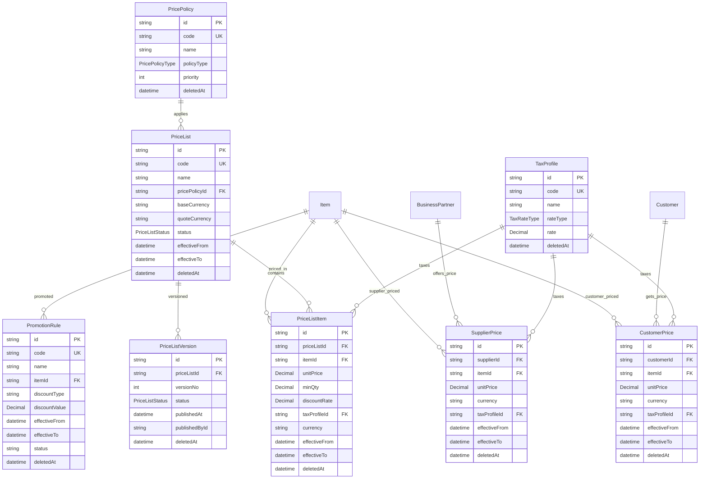

# 3C-4 Price Foundation 领域设计（草稿）

> 状态：Requirement → Design（CTO #2204：仅设计，不写实现代码、不提交 PR）
> 分支：待 PR #9（Item Foundation）合并后创建 `feature/sprint3-price-foundation`
> 前置：docs/PRICE_STRATEGY.md（价格策略）、docs/MASTER_DATA_DEPENDENCY.md（依赖图）
> 原则（CTO #2204）：**Price 与 Item 解耦、Price 与 BusinessPartner 解耦**，全部通过关联表建立关系，**不在 Item 上增加价格字段**。

---

> [!NOTE]
> **CTO 最终审阅（#2225）已确认**：
> ① **ADR 编号 = ADR-0013**（ADR-0012 已用于 Item，禁止复用）
> ② **PriceList 与 PricePolicy 双轨模式**（pricePolicyId FK + policyType Snapshot，策略修改后历史价格仍可解释）
> ③ **价格挂 Partner 级（长期方向）**：BusinessPartner → PartnerPrice；PartnerRole → Customer/Supplier；API 继续 /customer-prices、/supplier-prices 视图；数据库底层统一 Partner 级；Customer 模型兼容不返工，Sprint 5 统一迁移
> ④ **TaxProfile 环境默认**：ENV → Default Tax Profile → TaxProfile（环境变量只负责默认 Profile，不直接存税率）
> ⑤ **PromotionRule 批准独立模型**（Quotation/Campaign/Customer Group 都会引用）
> 新增要求：**PriceSource**（Manual/Import/Formula/Promotion/Supplier/Market）/ **PriceApproval**（PriceApprovalStatus + Workflow，价格修改直接审批）/ **PriceSnapshot**（QuotationPriceSnapshot，报价不实时读 PriceList）/ **PriceEngine 接口**（今日定义不实现）。
> 本文档为设计定稿，实现以迁移 0012 / ADR-0013 为准。


## 1. 定位

Price Foundation 是销售（Quotation/SO）与采购（PO）的价格引擎：
- 销售侧：PricePolicy → PriceList → PriceListItem（+CustomerPrice 客户专属价、PromotionRule 促销）
- 采购侧：SupplierPrice（供应商协议价）
- 支撑：TaxProfile（税率档案）、ExchangeRateReference（汇率参考，可预留）

**依赖关系（CTO #2204 强调）**：`Item ↔ PriceList ↔ BusinessPartner` 三角关系，
而非 Customer→Price / Supplier→Price 两条平行线。

---

## 2. ① Schema 草案（Prisma，不落地）

```prisma
// ============ Sprint 3C-4 Price Foundation ============

enum PricePolicyType {
  STANDARD   // 标准价
  VIP        // VIP 价
  PROJECT    // 项目价
  DEALER     // 经销商价
  REGIONAL   // 区域价
  PROMOTION  // 促销价
}

enum PriceListStatus {
  DRAFT
  PUBLISHED
  ARCHIVED
}

enum TaxRateType {
  ZERO      // 0%
  SIX       // 6%
  THIRTEEN  // 13%
  EXEMPT    // 免税
  CUSTOM    // 自定义
}

/// 价格策略（CTO #2204：独立建模，不写死在 PriceList）
model PricePolicy {
  id          String          @id @default(cuid())
  code        String          @unique
  name        String
  policyType  PricePolicyType
  priority    Int             @default(100) // 数值越小优先级越高（仅作基础排序）
  matchStrategy PriceMatchStrategy @default(HIGHEST_PRIORITY) // CTO #2249：FIRST_MATCH/BEST_PRICE/LOWEST_PRICE/HIGHEST_PRIORITY/COMBINE
  stopOnMatch Boolean          @default(true) // CTO #2249：命中即停（true）/继续匹配叠加（false）
  description String?
  // 统一审计字段
  isActive    Boolean  @default(true)
  createdById String?
  updatedById String?
  approvedById String?
  approvalStatus ApprovalStatus @default(DRAFT)
  version     Int      @default(1)
  deletedAt   DateTime?
  createdAt   DateTime @default(now()) @db.Timestamptz(3)
  updatedAt   DateTime @updatedAt @db.Timestamptz(3)

  priceLists PriceList[]
  @@index([policyType])
  @@index([deletedAt])
}

/// 税率档案（CTO #2204/#2225：TaxProfile，0%/6%/13%/免税/自定义）
/// 环境默认（CTO #2225）：ENV `DEFAULT_TAX_PROFILE_CODE` → 指定默认 TaxProfile.code（环境变量只负责默认 Profile，不直接存税率）
/// 中国/马来西亚/新加坡切换：切换环境默认 Profile 即可，税率数据不变
model TaxProfile {
  id       String     @id @default(cuid())
  code     String     @unique
  name     String
  rateType TaxRateType
  rate     Decimal?   @db.Decimal(5, 2) // CUSTOM 时填写
  // 统一审计字段
  isActive    Boolean  @default(true)
  createdById String?
  updatedById String?
  approvedById String?
  approvalStatus ApprovalStatus @default(DRAFT)
  version     Int      @default(1)
  deletedAt   DateTime?
  createdAt   DateTime @default(now()) @db.Timestamptz(3)
  updatedAt   DateTime @updatedAt @db.Timestamptz(3)

  priceListItems PriceListItem[]
  customerPrices CustomerPrice[]
  supplierPrices SupplierPrice[]
  @@index([deletedAt])
}

/// 汇率参考（CTO #2204：可预留，不写死汇率）
model ExchangeRateReference {
  id            String   @id @default(cuid())
  baseCurrency  String   // 基准币种
  quoteCurrency String   // 报价币种
  rate          Decimal  @db.Decimal(18, 6)
  rateSource    String?  // 汇率来源（央行/银行/自定义）
  effectiveDate DateTime @default(now())
  // 统一审计字段
  isActive    Boolean  @default(true)
  createdById String?
  updatedById String?
  approvedById String?
  approvalStatus ApprovalStatus @default(DRAFT)
  version     Int      @default(1)
  deletedAt   DateTime?
  createdAt   DateTime @default(now()) @db.Timestamptz(3)
  updatedAt   DateTime @updatedAt @db.Timestamptz(3)

  @@unique([baseCurrency, quoteCurrency, effectiveDate])
  @@index([deletedAt])
}

/// 价目表（PriceList；与 Item/BP 解耦）
model PriceList {
  id          String     @id @default(cuid())
  code        String     @unique
  name        String
  pricePolicyId String?  // 关联策略（可选）
  baseCurrency  String    @default("CNY") // 基准币种
  quoteCurrency String    @default("CNY") // 报价币种
  status      PriceListStatus @default(DRAFT)
  effectiveFrom DateTime? // CTO #2204：统一时间窗口
  effectiveTo   DateTime?
  // 统一审计字段
  isActive    Boolean  @default(true)
  createdById String?
  updatedById String?
  approvedById String?
  approvalStatus ApprovalStatus @default(DRAFT)
  version     Int      @default(1)
  deletedAt   DateTime?
  createdAt   DateTime @default(now()) @db.Timestamptz(3)
  updatedAt   DateTime @updatedAt @db.Timestamptz(3)

  policy   PricePolicy? @relation(fields: [pricePolicyId], references: [id], onDelete: SetNull)
  versions PriceListVersion[]
  items    PriceListItem[]
  @@index([code])
  @@index([status])
  @@index([deletedAt])
}

/// 价目表版本（CTO #2204：Price Version，Draft/Published/Archived，报价可追溯）
model PriceListVersion {
  id          String   @id @default(cuid())
  priceListId String
  priceList   PriceList @relation(fields: [priceListId], references: [id], onDelete: Cascade)
  versionNo   Int
  status      PriceListStatus @default(DRAFT)
  publishedAt DateTime?
  publishedById String?
  changeSummary String?
  // 统一审计字段
  isActive    Boolean  @default(true)
  createdById String?
  updatedById String?
  approvedById String?
  approvalStatus ApprovalStatus @default(DRAFT)
  version     Int      @default(1)
  deletedAt   DateTime?
  createdAt   DateTime @default(now()) @db.Timestamptz(3)
  updatedAt   DateTime @updatedAt @db.Timestamptz(3)

  @@unique([priceListId, versionNo])
  @@index([priceListId])
  @@index([status])
  @@index([deletedAt])
}

/// 价目表明细（PriceListItem；挂 Item；阶梯价 minQty）
model PriceListItem {
  id           String    @id @default(cuid())
  priceListId  String
  priceList    PriceList @relation(fields: [priceListId], references: [id], onDelete: Cascade)
  itemId       String
  item         Item      @relation(fields: [itemId], references: [id], onDelete: Cascade)
  unitPrice    Decimal   @db.Decimal(18, 4)
  minQty       Decimal   @default(0) @db.Decimal(18, 4) // 阶梯起点
  discountRate Decimal   @default(0) @db.Decimal(5, 2)
  taxProfileId String?
  taxProfile   TaxProfile? @relation(fields: [taxProfileId], references: [id], onDelete: SetNull)
  currency     String    @default("CNY") // 报价币种（可覆盖价目表）
  effectiveFrom DateTime?
  effectiveTo   DateTime?
  // 统一审计字段
  isActive    Boolean  @default(true)
  createdById String?
  updatedById String?
  approvedById String?
  approvalStatus ApprovalStatus @default(DRAFT)
  version     Int      @default(1)
  deletedAt   DateTime?
  createdAt   DateTime @default(now()) @db.Timestamptz(3)
  updatedAt   DateTime @updatedAt @db.Timestamptz(3)

  @@index([priceListId])
  @@index([itemId])
  @@index([deletedAt])
}

/// 专属价（PartnerPrice；CTO #2225：统一挂 BusinessPartner，PartnerRole 区分 Customer/Supplier；Customer 兼容不返工，Sprint 5 迁移）
model PartnerPrice {
  id          String    @id @default(cuid())
  partnerId   String
  partner     BusinessPartner @relation(fields: [partnerId], references: [id], onDelete: Cascade)
  partnerRoleType  PartnerRoleType  // CTO #2249：枚举（业务逻辑/查询/权限判断）
  partnerRoleName  String?  // CTO #2249：名称快照（可选，避免角色名称调整影响历史显示）
  itemId      String
  item        Item      @relation(fields: [itemId], references: [id], onDelete: Cascade)
  unitPrice   Decimal   @db.Decimal(18, 4)
  currency    String    @default("CNY")
  taxProfileId String?
  taxProfile  TaxProfile? @relation(fields: [taxProfileId], references: [id], onDelete: SetNull)
  effectiveFrom DateTime?
  effectiveTo   DateTime?
  priceSource  String   @default("MANUAL") // CTO #2225：PriceSource（Manual/Import/Formula/Promotion/Supplier/Market）
  // 统一审计字段
  isActive    Boolean  @default(true)
  createdById String?
  updatedById String?
  approvedById String?
  approvalStatus ApprovalStatus @default(DRAFT)
  version     Int      @default(1)
  deletedAt   DateTime?
  createdAt   DateTime @default(now()) @db.Timestamptz(3)
  updatedAt   DateTime @updatedAt @db.Timestamptz(3)

  @@index([partnerId])
  @@index([itemId])
  @@index([deletedAt])
}

/// 客户专属价视图（API /customer-prices；底层 PartnerPrice + roleType=CUSTOMER，Sprint 5 迁移统一）
/// 说明：3C-4 以 PartnerPrice 为唯一价格表，/customer-prices、/supplier-prices 为视图路由（读 PartnerPrice，写时校验 roleType）。
model CustomerPrice {
  id          String    @id @default(cuid())
  customerId  String
  customer    Customer  @relation(fields: [customerId], references: [id], onDelete: Cascade)
  itemId      String
  item        Item      @relation(fields: [itemId], references: [id], onDelete: Cascade)
  unitPrice   Decimal   @db.Decimal(18, 4)
  currency    String    @default("CNY")
  taxProfileId String?
  taxProfile  TaxProfile? @relation(fields: [taxProfileId], references: [id], onDelete: SetNull)
  effectiveFrom DateTime?
  effectiveTo   DateTime?
  // 统一审计字段
  isActive    Boolean  @default(true)
  createdById String?
  updatedById String?
  approvedById String?
  approvalStatus ApprovalStatus @default(DRAFT)
  version     Int      @default(1)
  deletedAt   DateTime?
  createdAt   DateTime @default(now()) @db.Timestamptz(3)
  updatedAt   DateTime @updatedAt @db.Timestamptz(3)

  @@index([customerId])
  @@index([itemId])
  @@index([deletedAt])
}

/// 供应商价（SupplierPrice；Supplier 通过 BusinessPartner 关联）
model SupplierPrice {
  id          String    @id @default(cuid())
  supplierId  String
  supplier    BusinessPartner @relation(fields: [supplierId], references: [id], onDelete: Cascade)
  itemId      String
  item        Item      @relation(fields: [itemId], references: [id], onDelete: Cascade)
  unitPrice   Decimal   @db.Decimal(18, 4)
  currency    String    @default("CNY")
  taxProfileId String?
  taxProfile  TaxProfile? @relation(fields: [taxProfileId], references: [id], onDelete: SetNull)
  effectiveFrom DateTime?
  effectiveTo   DateTime?
  // 统一审计字段
  isActive    Boolean  @default(true)
  createdById String?
  updatedById String?
  approvedById String?
  approvalStatus ApprovalStatus @default(DRAFT)
  version     Int      @default(1)
  deletedAt   DateTime?
  createdAt   DateTime @default(now()) @db.Timestamptz(3)
  updatedAt   DateTime @updatedAt @db.Timestamptz(3)

  @@index([supplierId])
  @@index([itemId])
  @@index([deletedAt])
}

/// 促销规则（PromotionRule；独立建模）
model PromotionRule {
  id            String   @id @default(cuid())
  code          String   @unique
  name          String
  itemId        String?  // 可选：指定物料
  item          Item?    @relation(fields: [itemId], references: [id], onDelete: SetNull)
  discountType  String   // PERCENT / AMOUNT
  discountValue Decimal  @db.Decimal(18, 4)
  effectiveFrom DateTime?
  effectiveTo   DateTime?
  status        String   @default("DRAFT") // DRAFT/ACTIVE/ARCHIVED
  // 统一审计字段
  isActive    Boolean  @default(true)
  createdById String?
  updatedById String?
  approvedById String?
  approvalStatus ApprovalStatus @default(DRAFT)
  version     Int      @default(1)
  deletedAt   DateTime?
  createdAt   DateTime @default(now()) @db.Timestamptz(3)
  updatedAt   DateTime @updatedAt @db.Timestamptz(3)

  @@index([itemId])
  @@index([status])
  @@index([deletedAt])
}
```

**新增枚举**：PricePolicyType / PriceListStatus / TaxRateType（+3）。
**新增模型**：PricePolicy / TaxProfile / ExchangeRateReference / PriceList / PriceListVersion / PriceListItem / CustomerPrice / SupplierPrice / PromotionRule（+9）。
**复用**：Item（3C-3）/ Customer（3C-1）/ BusinessPartner（Sprint 2）/ UnitOfMeasure（无需）。
**预计 Schema 总量**：96 模型 / 43 枚举。

---

## 3. ② ERD（Price Domain，供 DOMAIN_MODEL 更新）



**核心结构（CTO #2204 强调）**：`Item ↔ PriceList ↔ BusinessPartner` 三角关系，
而非 Customer→Price / Supplier→Price 两条平行线。CustomerPrice / SupplierPrice
通过 Customer / BusinessPartner 关联，价格主体始终是 PriceList 与 Item。

---

## 4. ③ ADR-0013 要点（Price Foundation Architecture，CTO #2225 批准编号）

> 说明：CTO #2204 指令中写 "ADR-0012"，但 ADR-0012 已被 Item Master Foundation 占用；Price 使用 **ADR-0013** 保持编号连续，请 CTO 确认。

- 决策：Price 独立于 Item（Item 无价格字段，价格通过 PriceListItem/CustomerPrice/SupplierPrice 关联）。
- 决策：采用 Version（PriceListVersion：Draft/Published/Archived），报价可追溯，改价不覆盖历史。
- 决策：采用 Policy（PricePolicy 独立建模：Standard/VIP/Project/Dealer/Regional/Promotion），策略可配置优先级。
- 决策：CustomerPrice/SupplierPrice 不直接写入 Item（Item 是主数据，价格是业务数据，生命周期不同）。
- 决策：Promotion 独立（PromotionRule：PERCENT/AMOUNT + 有效期 + 状态），不与价目表耦合。
- 决策：TaxProfile 独立（0%/6%/13%/免税/自定义），适配多国税率。
- 决策：Currency 多币种（Base/Quote + ExchangeRateReference），不写死汇率。
- 决策：统一 effectiveFrom/effectiveTo（时间窗口），非仅 validFrom。

---

## 5. ④ OpenAPI 草稿（Price API 清单，不实现）

| 方法 | 路径 | 权限码 | 说明 |
| --- | --- | --- | --- |
| GET | /api/price-lists | price-list:view | 价目表分页+过滤（code/name/status/currency） |
| POST | /api/price-lists | price-list:create | 创建价目表（含 policy/baseCurrency/quoteCurrency） |
| GET | /api/price-lists/:id | price-list:view | 详情（含 versions/items 计数） |
| PATCH | /api/price-lists/:id | price-list:edit | 更新（乐观锁） |
| POST | /api/price-lists/:id/publish | price-list:publish | 发布新版本（Draft→Published，versionNo+1） |
| GET | /api/price-lists/:id/items | price-list-item:view | 明细列表（含阶梯价） |
| POST | /api/price-lists/:id/items | price-list-item:create | 新增明细（itemId+unitPrice+minQty+taxProfile） |
| PATCH | /api/price-lists/:id/items/:itemId | price-list-item:edit | 更新明细 |
| DELETE | /api/price-lists/:id/items/:itemId | price-list-item:delete | 软删明细 |
| GET | /api/price-lists/:id/versions | price-list-version:view | 版本历史 |
| GET | /api/customer-prices | customer-price:view | 客户专属价分页（customerId/itemId 过滤） |
| POST | /api/customer-prices | customer-price:create | 新增客户价 |
| PATCH | /api/customer-prices/:id | customer-price:edit | 更新客户价 |
| GET | /api/supplier-prices | supplier-price:view | 供应商价分页（supplierId/itemId 过滤） |
| POST | /api/supplier-prices | supplier-price:create | 新增供应商价 |
| PATCH | /api/supplier-prices/:id | supplier-price:edit | 更新供应商价 |
| GET | /api/price-policies | price-policy:view | 策略列表 |
| POST | /api/price-policies | price-policy:create | 新增策略 |
| GET | /api/tax-profiles | tax-profile:view | 税率档案列表 |
| POST | /api/tax-profiles | tax-profile:create | 新增税率档案 |
| GET | /api/promotions | promotion:view | 促销规则分页 |
| POST | /api/promotions | promotion:create | 新增促销 |
| PATCH | /api/promotions/:id | promotion:edit | 更新促销 |
| DELETE | /api/promotions/:id | promotion:delete | 软删促销 |

**权限模块（待建）**：price-list / price-list-item / price-list-version / customer-price / supplier-price / price-policy / tax-profile / promotion（8 模块 × 10 动作，MANAGER 全量）。
**注意**：`price-list` 模块在 PERMISSION_MODULES 已存在（Sprint 2），补全动作级；其余 7 模块新增。

---

## 6. 流水线状态

| 模块 | 状态 |
| --- | --- |
| Customer | ✅ Closed（PR #7） |
| Supplier | ✅ Closed（PR #8） |
| Item | ✅ CI 全绿，待 CTO 最终 Review 后 Merge（PR #9） |
| Price | Requirement → Design（本文档） |
| Project | Waiting |

## 7. 待 CTO 决策项

1. ADR 编号确认：Price 用 ADR-0013（ADR-0012 已被 Item 占用）？
2. PriceList 与 PricePolicy 关联方式：pricePolicyId（FK）还是仅 policyType 枚举？（本设计：两者兼顾，policyType 主、pricePolicyId 可选）
3. CustomerPrice 挂 Customer（3C-1 模型）还是 Partner 级（BusinessPartner 角色）？（本设计：Customer 模型，Sprint 5 迁移后统一）
4. TaxProfile 是否需要默认税率（env DEFAULT_TAX_RATE 映射）？
5. PromotionRule 是否复用 ItemTag/PricePolicy 语义，还是完全独立？

---

## 8. CTO #2225 新增要求（已并入设计）

### 8.1 PriceSource（价格来源，BI 分析）
```prisma
enum PriceSource {
  MANUAL    // 手工
  IMPORT    // 导入
  FORMULA   // 公式计算
  PROMOTION // 促销
  SUPPLIER  // 供应商
  MARKET    // 市场行情
}
```
- PriceListItem / CustomerPrice / SupplierPrice / PromotionRule 增加 `priceSource PriceSource @default(MANUAL)`。
- 用途：BI 分析价格来源构成、异常价格溯源。

### 8.2 PriceApproval（价格审批，修改直接走 Workflow）
- PriceList 与 PriceListItem 增加 `approvalStatus ApprovalStatus @default(DRAFT)`（复用全局 ApprovalStatus）。
- 价格修改（创建/更新明细、发布版本）需通过 Workflow/Approval（Sprint 3A 平台）审批后才生效。
- 事件：PriceChanged / PriceListPublished（EVENTS.md 追加）。

### 8.3 PriceSnapshot（报价价格快照，CTO #2249：必须含促销命中结果，保存整个定价过程）
- Quotation 不实时读 PriceList：报价时固化 `QuotationPriceSnapshot`，保存**完整定价链**：
  `Base Price → Price Policy → Discount → Promotion（命中规则）→ Tax Profile → Exchange Rate → Final Price`
- 至少记录：PriceList、PricePolicy、PromotionRule、PromotionDiscount、Currency、ExchangeRate、TaxProfile、TaxRate（快照）、FinalUnitPrice、FinalAmount、PricingTime、**PricingEngineVersion**
- 保证报价历史完全复原：即使以后价格/税率/促销规则变化，历史报价仍可完整重建（改价/促销结束不影响已报价单）。

### 8.4 PriceEngine 接口（今日定义，不实现）
```ts
interface PriceEngine {
  // CTO #2249：统一入口，Quotation（Sprint 4）/ Purchase（Sprint 5）只调用一个方法
  resolvePrice(input: ResolvePriceInput): Promise<ResolvedPrice>;

  // 内部方法（resolvePrice 内部编排调用）
  getSellingPrice(input: { customerId: string; itemId: string; qty: number; date: Date; currency: string }): Promise<PriceResult>;
  getPurchasePrice(input: { supplierId: string; itemId: string; qty: number; date: Date; currency: string }): Promise<PriceResult>;
  getPromotion(input: { itemId: string; date: Date }): Promise<PromotionResult | null>;
  getTax(input: { itemId: string; taxProfileId?: string; date: Date }): Promise<TaxResult>;
  getCurrency(input: { baseCurrency: string; quoteCurrency: string; date: Date }): Promise<ExchangeRateResult>;
}

interface ResolvePriceInput {
  partnerId?: string;      // 客户/供应商（Partner 级）
  itemId: string;
  qty: number;
  date: Date;
  currency: string;
  priceListId?: string;    // 指定价目表（可选）
  policyId?: string;       // 指定策略（可选）
}

interface ResolvedPrice {
  basePrice: PriceResult;          // PriceList/PartnerPrice 取价
  policy?: PricePolicyResult;      // 命中策略
  discountRate: number;            // 折扣
  promotion?: PromotionResult;     // 促销命中（含 PromotionDiscount）
  tax: TaxResult;                  // 税率快照
  exchangeRate: ExchangeRateResult;// 汇率
  finalUnitPrice: number;          // 最终单价
  finalAmount: number;             // 最终金额
  pricingTime: Date;
  pricingEngineVersion: string;    // 如 "v1"
}
```
- PriceResult：{ unitPrice, discountRate, taxRate, currency, source(PriceList/CustomerPrice/SupplierPrice/Promotion), priceListVersionId, policyType }。
- 实现归 Sprint 3C-4 实现阶段；Quotation（Sprint 4）直接调用。


### 附录：CTO #2249 新增枚举与字段

```prisma
enum PartnerRoleType {
  CUSTOMER
  SUPPLIER
  BOTH
  LOGISTICS
  OUTSOURCING
}

enum PriceMatchStrategy {
  FIRST_MATCH      // 第一条命中即停止
  BEST_PRICE       // 最优价（业务定义）
  LOWEST_PRICE     // 最低价
  HIGHEST_PRIORITY // 最高优先级
  COMBINE          // 多规则叠加
}

enum PriceEngineVersion {
  V1 // 首个定价引擎版本（快照中记录，保证历史报价可复原）
}
```


### 附录：CTO #2249 新增两张表

```prisma
/// 汇率（独立维护，CTO #2249：不依赖外部接口实时查询；历史追溯 + 财务结账）
model ExchangeRate {
  id            String   @id @default(cuid())
  baseCurrency  String   // Base Currency
  quoteCurrency String   // Quote Currency
  rate          Decimal  @db.Decimal(18, 8)
  effectiveDate DateTime @db.Timestamptz(3)
  source        String   // 来源：CUSTOM / BANK / CENTRAL_BANK / MARKET
  isActive      Boolean  @default(true)
  createdAt     DateTime @default(now()) @db.Timestamptz(3)
  updatedAt     DateTime @updatedAt @db.Timestamptz(3)

  @@unique([baseCurrency, quoteCurrency, effectiveDate])
  @@index([effectiveDate])
}

/// 税率规则（CTO #2249：支持多国税制，不改核心代码）
/// 匹配顺序：priority 升序，第一条命中即生效（或按配置叠加）
model TaxProfileRule {
  id            String   @id @default(cuid())
  country       String?  // 国家（CN/MY/SG...），空 = 全局
  itemCategory  String?  // Item Category（可选）
  customerType  String?  // Customer Type（可选）
  supplierType  String?  // Supplier Type（可选）
  taxCode       String   // 税码（对应 TaxProfile）
  taxProfileId  String
  taxProfile    TaxProfile @relation(fields: [taxProfileId], references: [id], onDelete: Cascade)
  priority      Int      @default(100)
  isActive      Boolean  @default(true)
  createdAt     DateTime @default(now()) @db.Timestamptz(3)
  updatedAt     DateTime @updatedAt @db.Timestamptz(3)

  @@index([country, itemCategory, customerType, supplierType])
  @@index([priority])
}
```
