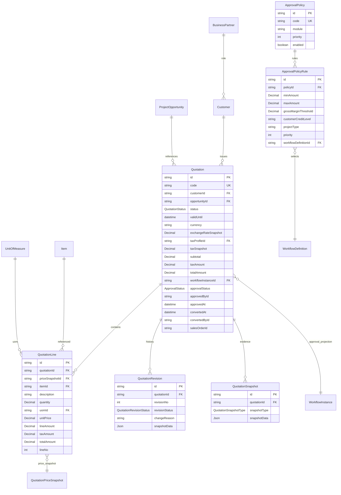

# Sprint 4A：Quotation Foundation Design（报价领域 Schema 设计）

- 状态：**APPROVED（CTO 审核 95/100，2026-08-07）**；进入实现阶段前补 5 项增量调整（converted* 投影 / lineNo / Rule.priority / revisionStatus / snapshotType）
- 日期：2026-08-07
- 分支：feature/sprint4-sales
- 关联：Sprint4A_Quote_Review.md（架构决议）、ADR-0015（Quotation must consume Pricing Engine）、ADR-0016（Quotation Domain）、EVENTS.md v1.2（Quotation 事件 11 个已注册）、Sprint4_Quote_Domain/ERD/API/Workflow（四份预备设计）
- 依据：CTO 决策 ① 不建 QuotationApproval（Workflow 为唯一审批事实源）② EXPIRED 惰性判定（不增调度器）③ 事件先注册后开发（已注册）；CTO 审核补充 5 项：convertedAt/convertedById/salesOrderId 投影、QuotationLine.lineNo、ApprovalPolicyRule.priority、QuotationRevision.revisionStatus、QuotationSnapshot.snapshotType

> **本文件为 Sprint 4A Schema 设计交付物，后续开发一律以此为准。**
> **边界锁定：** 保留 6 模型（Quotation / QuotationLine / QuotationRevision / QuotationSnapshot / ApprovalPolicy / ApprovalPolicyRule）；
> **禁止**：QuotationApproval / QuotationVersion / 报价专属附件表 / 自建价格计算 / 本地 build/test/prisma/docker。

---

## 1. 模型范围（CTO 锁定）

| 动作 | 模型 | 说明 |
| --- | --- | --- |
| ✅ 保留 | Quotation | 报价单头（含审批投影字段） |
| ✅ 保留 | QuotationLine | 报价行（必须含 priceSnapshotId） |
| ✅ 保留 | QuotationRevision | 修改历史（唯一版本载体） |
| ✅ 保留 | QuotationSnapshot | 关键状态证据（仅固化节点） |
| ✅ 保留 | ApprovalPolicy | 审批策略（只选择 Workflow，不执行审批） |
| ✅ 保留 | ApprovalPolicyRule | 策略规则（金额/毛利/客户信用/项目类型 → workflowDefinitionId） |
| ❌ 禁止 | QuotationApproval | WorkflowInstance/WorkflowAction/WorkflowHistory 为唯一事实源 |
| ❌ 禁止 | QuotationVersion | 与 QuotationRevision 职责重复 |
| ❌ 禁止 | 独立报价价格表 | 价格走 PricingEngine.resolvePrice() + QuotationPriceSnapshot（ADR-0015） |
| ❌ 禁止 | 独立附件表 | FileAttachment businessType="quotation"（File Center） |

---

## 2. Prisma Schema 草案（+3 枚举 / +6 模型）

```prisma
/// 报价状态（EXPIRED 为惰性判定，不依赖后台调度器写入）
enum QuotationStatus {
  DRAFT        // 草稿
  SUBMITTED    // 已提交（触发 QuotationSubmitted）
  APPROVED     // 已批准
  SENT         // 已发送客户
  ACCEPTED     // 客户接受
  REJECTED     // 已驳回（可编辑后重新提交）
  CANCELLED    // 已取消
  CONVERTED    // 已转销售订单
  EXPIRED      // 已过期（有效期为惰性判定，不主动落库）
}

/// 快照类型（CTO 审核补充⑤：SUBMITTED/APPROVED/SENT/ACCEPTED/CONVERTED，不靠 remark；Revision 是修改历史，Snapshot 是关键状态证据，职责不重叠）
enum QuotationSnapshotType {
  SUBMITTED
  APPROVED
  SENT
  ACCEPTED
  CONVERTED
}

/// 修订状态（CTO 审核补充④：区分生命周期，避免全部为 Created 不可查）
enum QuotationRevisionStatus {
  DRAFT
  SUBMITTED
  APPROVED
  SUPERSEDED
}

/// 报价单头
model Quotation {
  id           String   @id @default(cuid())
  code         String   @unique // 单据编号（DocumentSequence docType=QUOTATION，如 QT-2026-0001）
  customerId   String
  customer     Customer @relation(fields: [customerId], references: [id], onDelete: Restrict)
  opportunityId String? // 关联项目机会（可空）
  status       QuotationStatus @default(DRAFT)
  quoteDate    DateTime @default(now()) @db.Timestamptz(3)
  validUntil   DateTime? // 有效期至（EXPIRED 惰性判定依据）
  currency     String   @default("CNY")
  exchangeRateSnapshot Decimal? @db.Decimal(18, 8) // 汇率快照（仅 Header 存一次，行不存）
  taxProfileId String?  // 税率档案（不存裸 taxRate，CTO 决策 B）
  taxSnapshot  Decimal? @db.Decimal(5, 2) // 税率快照（行级可覆盖）
  subtotal     Decimal  @default(0) @db.Decimal(18, 4) // 未税合计
  discountRate Decimal  @default(0) @db.Decimal(5, 2) // 折扣率 %（discountAmount 计算得到，不双维护）
  taxAmount    Decimal  @default(0) @db.Decimal(18, 4) // 税额
  totalAmount  Decimal  @default(0) @db.Decimal(18, 4) // 含税合计
  remark       String?
  // 审批投影（CTO 决策①：Workflow 为唯一事实源，以下仅查询投影，不建 QuotationApproval 表）
  workflowInstanceId String? // 关联 WorkflowInstance（审批实例）
  // approvalStatus / approvedById 复用下方统一审计字段（ApprovalStatus 枚举：PENDING/APPROVED/REJECTED）
  approvedAt    DateTime? @db.Timestamptz(3) // 最终批准时间快捷投影
  // 转换投影（CTO 审核补充①：Sprint 4B Quotation→Sales Order 后回写，避免反复反查 SO）
  convertedAt   DateTime? @db.Timestamptz(3) // 转 Sales Order 时间投影
  convertedById String? // 转换操作人投影
  salesOrderId  String? // 生成的 Sales Order ID 投影（Sprint 4B 落地后回写）
  // 统一审计字段（approvalStatus / approvedById 同时承担审批状态/审批人投影）
  isActive    Boolean  @default(true)
  createdById String?
  updatedById String?
  approvedById String?
  approvalStatus ApprovalStatus @default(DRAFT)
  version     Int      @default(1)
  deletedAt   DateTime?
  createdAt   DateTime @default(now()) @db.Timestamptz(3)
  updatedAt   DateTime @updatedAt @db.Timestamptz(3)

  lines        QuotationLine[]
  revisions    QuotationRevision[]
  snapshots    QuotationSnapshot[]

  @@index([code])
  @@index([customerId])
  @@index([status])
  @@index([opportunityId])
  @@index([workflowInstanceId])
  @@index([deletedAt])
}

/// 报价行
model QuotationLine {
  id           String   @id @default(cuid())
  quotationId  String
  quotation    Quotation @relation(fields: [quotationId], references: [id], onDelete: Cascade)
  priceSnapshotId String? // 必须引用价格快照（ADR-0015，与 ProjectProduct.priceSnapshotId 同构）
  priceSnapshot QuotationPriceSnapshot? @relation(fields: [priceSnapshotId], references: [id], onDelete: SetNull)
  itemId       String? // 物料（可空，允许非物料行）
  item         Item?    @relation(fields: [itemId], references: [id], onDelete: SetNull)
  description  String   // 描述（快照）
  quantity     Decimal  @db.Decimal(18, 4)
  uomId        String?
  uom          UnitOfMeasure? @relation(fields: [uomId], references: [id], onDelete: SetNull)
  unitPrice    Decimal  @db.Decimal(18, 4) // 快照结果冗余（禁止前端绕过 Pricing Engine 自由填写）
  lineAmount   Decimal  @db.Decimal(18, 4) // 行未税金额
  taxAmount    Decimal  @db.Decimal(18, 4) // 行税额
  totalAmount  Decimal  @db.Decimal(18, 4) // 行含税金额
  lineNo       Int      @default(10) // CTO 审核补充②：行号（10/20/30/40 步进，插 25 不重排，不依赖 sortOrder）
  // 统一审计字段
  isActive    Boolean  @default(true)
  createdById String?
  updatedById String?
  approvedById String?
  approvalStatus ApprovalStatus @default(DRAFT)
  version     Int      @default(1)
  deletedAt   DateTime?
  createdAt   DateTime @default(now()) @db.Timestamptz(3)
  updatedAt   DateTime @updatedAt @db.Timestamptz(3)

  @@index([quotationId])
  @@index([itemId])
  @@index([priceSnapshotId])
  @@index([deletedAt])
}

/// 报价修订（统一版本载体，删除 QuotationVersion）
model QuotationRevision {
  id           String   @id @default(cuid())
  quotationId  String
  quotation    Quotation @relation(fields: [quotationId], references: [id], onDelete: Cascade)
  revisionNo   Int      // 版本号（1,2,3...）
  revisionStatus QuotationRevisionStatus @default(DRAFT) // CTO 审核补充④：DRAFT/SUBMITTED/APPROVED/SUPERSEDED
  changeReason String   // 变更原因
  snapshotData Json?    // 变更前快照（Header + Lines 集合）
  createdById  String?
  // 统一审计字段
  isActive    Boolean  @default(true)
  updatedById String?
  approvalStatus ApprovalStatus @default(DRAFT)
  version     Int      @default(1)
  deletedAt   DateTime?
  createdAt   DateTime @default(now()) @db.Timestamptz(3)
  updatedAt   DateTime @updatedAt @db.Timestamptz(3)

  @@unique([quotationId, revisionNo])
  @@index([quotationId])
  @@index([deletedAt])
}

/// 报价关键状态快照（仅在固化节点生成）
model QuotationSnapshot {
  id           String   @id @default(cuid())
  quotationId  String
  quotation    Quotation @relation(fields: [quotationId], references: [id], onDelete: Cascade)
  snapshotType QuotationSnapshotType // CTO 审核补充⑤：SUBMITTED/APPROVED/SENT/ACCEPTED/CONVERTED（不靠 remark）
  snapshotData Json?   // 完整快照（Header + Lines + 价格来源 PricePolicy 命中项）
  generatedById String?
  generatedAt  DateTime @default(now()) @db.Timestamptz(3)
  // 统一审计字段
  isActive    Boolean  @default(true)
  createdById String?
  updatedById String?
  approvalStatus ApprovalStatus @default(DRAFT)
  version     Int      @default(1)
  deletedAt   DateTime?
  createdAt   DateTime @default(now()) @db.Timestamptz(3)
  updatedAt   DateTime @updatedAt @db.Timestamptz(3)

  @@unique([quotationId, snapshotType])
  @@index([quotationId])
  @@index([deletedAt])
}

/// 审批策略（只负责选择 Workflow，不负责执行审批）
model ApprovalPolicy {
  id          String   @id @default(cuid())
  code        String   @unique
  name        String
  module      String   @default("QUOTATION") // 后续 SO/PO/Invoice 复用
  priority    Int      @default(100) // 数值越小优先级越高
  enabled     Boolean  @default(true)
  // 统一审计字段
  isActive    Boolean  @default(true)
  createdById String?
  updatedById String?
  approvedById String?
  approvalStatus ApprovalStatus @default(DRAFT)
  version     Int      @default(1)
  deletedAt   DateTime?
  createdAt   DateTime @default(now()) @db.Timestamptz(3)
  updatedAt   DateTime @updatedAt @db.Timestamptz(3)

  rules       ApprovalPolicyRule[]

  @@index([module])
  @@index([enabled])
  @@index([deletedAt])
}

/// 审批策略规则（命中即选择对应 WorkflowDefinition）
model ApprovalPolicyRule {
  id                    String   @id @default(cuid())
  policyId              String
  policy                ApprovalPolicy @relation(fields: [policyId], references: [id], onDelete: Cascade)
  minAmount             Decimal? @db.Decimal(18, 4) // 金额下限（含）
  maxAmount             Decimal? @db.Decimal(18, 4) // 金额上限（不含）
  grossMarginThreshold  Decimal? @db.Decimal(5, 2) // 毛利率阈值 %
  customerCreditLevel   String? // 客户信用等级
  projectType           String? // 项目类型
  priority              Int      @default(100) // CTO 审核补充③：规则优先级（priority DESC，避免命中冲突）
  workflowDefinitionId  String
  workflowDefinition    WorkflowDefinition @relation(fields: [workflowDefinitionId], references: [id], onDelete: Restrict)
  sort                  Int      @default(0)
  // 统一审计字段
  isActive    Boolean  @default(true)
  createdById String?
  updatedById String?
  approvedById String?
  approvalStatus ApprovalStatus @default(DRAFT)
  version     Int      @default(1)
  deletedAt   DateTime?
  createdAt   DateTime @default(now()) @db.Timestamptz(3)
  updatedAt   DateTime @updatedAt @db.Timestamptz(3)

  @@index([policyId])
  @@index([workflowDefinitionId])
  @@index([deletedAt])
}
```

> 说明：`Quotation.approvalStatus / approvedById` 复用全库统一审计字段（ApprovalStatus 枚举），同时承担审批状态/审批人投影职责；`approvedAt / workflowInstanceId` 为新增投影字段。正式 Schema 落地时以架构审核最终确认为准。

---

## 3. Quotation ERD



---

## 4. 状态机（含 EXPIRED 惰性判定）

```
DRAFT ──submit──> SUBMITTED ──审批全部通过──> APPROVED ──send──> SENT ──accept──> ACCEPTED ──convert──> CONVERTED
  │                    │                          │
  └──cancel──> CANCELLED └──reject──> REJECTED ──(编辑后重新提交)──> SUBMITTED
```

**EXPIRED（CTO 决策②：惰性判定，不落库、不增调度器）**

- 规则：`storedStatus ∈ {SENT, APPROVED}` 且 `validUntil < now` → `effectiveStatus = EXPIRED`
- API 返回时增加投影字段：

```json
{
  "status": "SENT",
  "effectiveStatus": "EXPIRED",
  "isExpired": true
}
```

- 限制：
  - 数据库暂不主动把状态更新为 `EXPIRED`
  - 已过期报价禁止：接受（accept）、转 Sales Order（convert）、继续审批
  - 用户执行延期操作 → 创建新 Revision 或更新有效期，并写 AuditLog
  - Sprint 9 OA / 独立 Scheduler 阶段再增加定时同步任务
  - `EXPIRED` 枚举保留，但本阶段不依赖后台调度器写入

**状态变更规则**

| 动作 | 前置状态 | 后置状态 | 事件 | 快照节点 |
| --- | --- | --- | --- | --- |
| create | — | DRAFT | QuotationCreated | — |
| update（商业内容） | DRAFT/REJECTED | 不变 + Revision | QuotationUpdated / QuotationRevisionCreated | — |
| submit | DRAFT | SUBMITTED | QuotationSubmitted | SUBMITTED |
| approve（Workflow 终态） | SUBMITTED | APPROVED | QuotationApproved | APPROVED |
| reject（Workflow 终态） | SUBMITTED | REJECTED | QuotationRejected | — |
| send | APPROVED | SENT | QuotationSent | SENT |
| accept | SENT（未过期） | ACCEPTED | QuotationAccepted | ACCEPTED |
| convert | ACCEPTED（未过期） | CONVERTED | QuotationConverted | CONVERTED |
| cancel | DRAFT/SUBMITTED | CANCELLED | QuotationCancelled | — |
| 惰性判定 | SENT/APPROVED + 过期 | effectiveStatus=EXPIRED | QuotationExpired（发现时记录） | — |

---

## 5. Migration 规划

- **迁移名**：`0014_quotation_foundation`
- **范围**：仅新增（+3 枚举 / +6 表），不修改任何既有表/列/索引
  - 枚举：`QuotationStatus` / `QuotationSnapshotType` / `QuotationRevisionStatus`
  - 表：`Quotation` / `QuotationLine` / `QuotationRevision` / `QuotationSnapshot` / `ApprovalPolicy` / `ApprovalPolicyRule`
- **FK 依赖**（必须已存在，均已交付）：
  - Customer（3C-1）、ProjectOpportunity（2C/3C-5）、Item / UnitOfMeasure（3C-3）、QuotationPriceSnapshot（3C-4）、WorkflowInstance / WorkflowDefinition（3A）
- **索引**：见 Schema 草案 @@index；`Quotation.code` 唯一、`QuotationSnapshot @@unique([quotationId, snapshotType])`、`QuotationRevision @@unique([quotationId, revisionNo])`
- **回滚**：DROP 6 表 + 3 枚举（纯增量，无数据迁移）

---

## 6. RBAC 规划

| 模块 | 动作（view/create/edit/delete/approve/audit/export/import/assign/close 子集） |
| --- | --- |
| quotation | view / create / edit / delete / submit / send / accept / convert / cancel / audit / export / import |
| quotation-line | view / create / edit / delete |
| quotation-revision | view（历史只读） |
| quotation-snapshot | view（证据只读） |
| approval-policy | view / create / edit / delete（MANAGER 以上） |
| approval-policy-rule | view / create / edit / delete（MANAGER 以上） |

- 审批动作不占 quotation 模块权限：走 Workflow/Approval 既有权限体系（workflow 模块）
- 手工改价：特殊权限（如 `quotation:force-price`）+ 必须生成新价格快照与审计记录（ADR-0015）

---

## 7. API 清单（Sprint 4A 仅清单，不实现）

> 遵守：API_GUIDELINES.md（分页/过滤/错误码/Idempotency-Key）、ERROR_CODES.md（QUOTATION_* 追加）、File Center（attachments businessType=quotation）

| 方法 | 路径 | 权限 | 说明 |
| --- | --- | --- | --- |
| GET | /api/quotations | quotation:view | 分页 + 过滤（code/customerId/status/effectiveStatus/dateFrom/dateTo） |
| POST | /api/quotations | quotation:create | 创建草稿（Header + Lines 同事务；行价由 PricingEngine 生成快照） |
| GET | /api/quotations/:id | quotation:view | 详情（lines/revisions/snapshots + customer + attachments + effectiveStatus 投影） |
| PATCH | /api/quotations/:id | quotation:edit | 更新（仅 DRAFT/REJECTED；乐观锁 version；商业内容变更生成 Revision） |
| DELETE | /api/quotations/:id | quotation:delete | 软删除（仅 DRAFT；级联 lines/revisions/snapshots） |
| POST | /api/quotations/:id/submit | quotation:submit | 提交（校验行/客户/未过期 → 匹配 ApprovalPolicy → 创建 WorkflowInstance → SUBMITTED） |
| POST | /api/quotations/:id/send | quotation:send | 发送客户（SENT） |
| POST | /api/quotations/:id/accept | quotation:accept | 客户接受（ACCEPTED，过期禁止） |
| POST | /api/quotations/:id/convert | quotation:convert | 转 Sales Order（CONVERTED，Sprint 4B 落地） |
| POST | /api/quotations/:id/cancel | quotation:cancel | 取消（CANCELLED） |
| POST | /api/quotations/:id/extend | quotation:edit | 延期（新 Revision / 更新 validUntil + AuditLog） |
| GET/POST | /api/quotations/:id/lines | quotation-line:* | 行 CRUD（增删改自动重算 + 价格快照） |
| PATCH/DELETE | /api/quotations/:id/lines/:lineId | quotation-line:* | 行更新/软删（lineStatus 语义由行级软删承接） |
| GET | /api/quotations/:id/revisions | quotation-revision:view | 修订历史（revisionNo desc） |
| GET | /api/quotations/:id/snapshots | quotation-snapshot:view | 快照列表 |
| POST | /api/approval-policies | approval-policy:create | 策略 CRUD |
| GET | /api/approval-policies/:id/rules | approval-policy-rule:view | 规则查询 |

**审批动作**：复用 `POST /api/workflows/instances/:id/actions`（Workflow 唯一事实源），Quotation 只回写投影（approvalStatus/approvedAt/approvedById）。

**价格**：复用 `POST /api/pricing/resolve`（PricingEngine 唯一入口，ADR-0015）。

---

## 8. 开发顺序（固定，不可跳步）

```
4A Review ✅ → Schema（本文件）→ Migration → Seed → RBAC → Pricing → API → Workflow → OpenAPI → QA → CI → Review
```

---

## 9. 变更记录

| 日期 | 说明 |
| --- | --- |
| 2026-08-07 | **CTO 审核 APPROVED（95/100）**，补充 5 项增量调整：Quotation +convertedAt/convertedById/salesOrderId（转换投影）、QuotationLine sortOrder→lineNo（10/20/30 步进）、ApprovalPolicyRule +priority（priority DESC）、QuotationRevision +revisionStatus（DRAFT/SUBMITTED/APPROVED/SUPERSEDED）、QuotationSnapshot node→snapshotType；进入实现阶段 |
| 2026-08-07 | 初始设计：CTO 3 项决策落地（不建 QuotationApproval / EXPIRED 惰性判定 / EVENTS 先注册），模型边界锁定 6 模型，EVENTS.md 升至 v1.2 |
