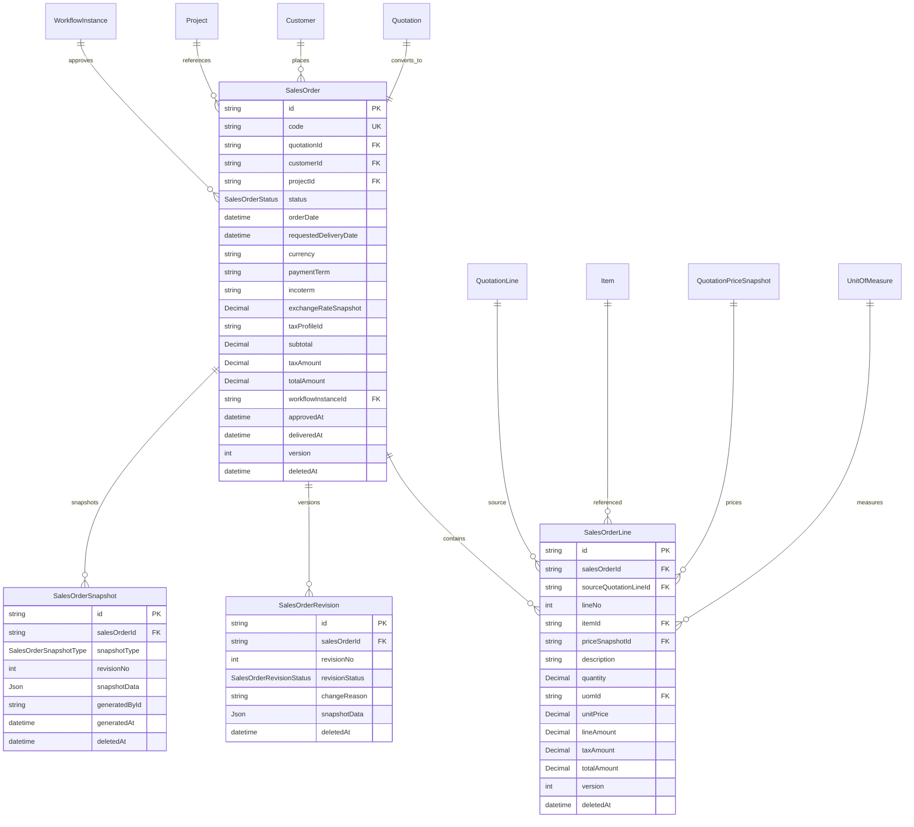

# Sprint 4B：Sales Order Foundation Design（销售订单领域 Schema 设计）

- 状态：**DRAFT（待 CTO Review，2026-08-07）；本阶段禁止写业务代码，仅设计**
- 日期：2026-08-07
- 分支：feature/sprint4-sales
- 关联：ADR-0015（Quotation must consume Pricing Engine）、ADR-0016（Quotation Domain）、ADR-0017（Sales Order Domain，本文件配套）、Sprint4A_Quote_Design.md（已实现）、Sprint4_Quote_Domain/ERD/API/Workflow（四份预备设计）、EVENTS.md（v1.2 已注册 SalesOrderCreated 占位）、ROADMAP.md（Sprint 4：4A Quotation ✅ / 4B Sales Order 设计先行）
- 依据：CTO 决策——① 先设计后实现（本阶段禁止写业务代码）；② Quotation → SalesOrder 转换唯一入口 `POST /api/quotations/{id}/convert`（4A 的 501 在 4B 正式实现）；③ Sales Order 不重新定价（继承 Quotation 商业价格，priceSnapshotId 为价格事实源）；④ 暂不新建 SalesOrderApproval / SalesOrderPrice / SalesOrderAttachment（分别复用 Workflow / PricingEngine+QuotationPriceSnapshot / File Center）

> **本文件为 Sprint 4B Schema 设计交付物，后续开发一律以此为准。**
> **边界锁定：** 保留 4 模型（SalesOrder / SalesOrderLine / SalesOrderRevision / SalesOrderSnapshot）；
> **禁止**：SalesOrderApproval / SalesOrderPrice / SalesOrderAttachment / 自建价格计算 / 本地 build/test/prisma/docker。

---

## 1. 模型范围（CTO 锁定）

| 动作 | 模型 | 说明 |
| --- | --- | --- |
| ✅ 保留 | SalesOrder | 销售订单头（含审批投影 + 交付投影字段） |
| ✅ 保留 | SalesOrderLine | 销售订单行（继承 QuotationLine 商业价格，必含 priceSnapshotId） |
| ✅ 保留 | SalesOrderRevision | 修改历史（唯一版本载体，商业条件变更时系统生成） |
| ✅ 保留 | SalesOrderSnapshot | 关键状态证据（仅固化节点） |
| ❌ 禁止 | SalesOrderApproval | WorkflowInstance/WorkflowAction/WorkflowHistory 为唯一事实源（ADR-0016 决策①同构） |
| ❌ 禁止 | SalesOrderPrice | 价格走 QuotationPriceSnapshot / PricingEngine（ADR-0015），SO 不重新定价 |
| ❌ 禁止 | SalesOrderAttachment | FileAttachment businessType="sales-order"（File Center） |

---

## 2. Prisma Schema 草案（+3 枚举 / +4 模型）

```prisma
/// 销售订单状态（不含 Invoice/Payment 状态——Delivery/Invoice/Payment 各自生命周期，SO 仅保存必要投影）
enum SalesOrderStatus {
  DRAFT              // 草稿（convert 创建后初始态）
  CONFIRMED          // 已确认（DRAFT → CONFIRMED，订单生效）
  PARTIALLY_DELIVERED // 部分交付（Delivery 联动投影，Sprint 4C）
  DELIVERED          // 已交付（Delivery 联动投影，Sprint 4C）
  COMPLETED          // 已完成（交付 + 回款完成，Sprint 4C/4D）
  CANCELLED          // 已取消（DRAFT/CONFIRMED 可取消）
}

/// 快照类型（仅固化节点：CREATED/CONFIRMED/CANCELLED；后续 4C 扩展 DELIVERED/COMPLETED）
enum SalesOrderSnapshotType {
  CREATED            // convert 生成订单时固化（初始商业快照）
  CONFIRMED          // confirm 时固化
  CANCELLED          // cancel 时固化
  // DELIVERED / COMPLETED —— Sprint 4C 交付联动时补充
}

/// 修订状态（与 QuotationRevisionStatus 同构）
enum SalesOrderRevisionStatus {
  DRAFT
  SUBMITTED
  APPROVED
  SUPERSEDED
}

/// 销售订单头
model SalesOrder {
  id           String   @id @default(cuid())
  code         String   @unique // 单据编号（DocumentSequence docType=SALES_ORDER，如 SO-2026-0001）
  quotationId  String   // 来源报价单（必填；唯一入口 convert，禁止自由 POST 创建）
  quotation    Quotation @relation(fields: [quotationId], references: [id], onDelete: Restrict)
  customerId   String
  customer     Customer @relation(fields: [customerId], references: [id], onDelete: Restrict)
  projectId    String?  // 关联项目（可空）
  project      Project? @relation(fields: [projectId], references: [id], onDelete: Restrict)
  status       SalesOrderStatus @default(DRAFT)
  orderDate    DateTime @default(now()) @db.Timestamptz(3) // 下单日期
  requestedDeliveryDate DateTime? @db.Timestamptz(3) // 期望交期（CTO 建议字段）
  currency     String   @default("CNY")
  paymentTerm  String?  // 付款条款（NET30/TT/LC...，继承 Quotation，CTO 建议字段）
  incoterm     String?  // 贸易术语（EXW/FOB/CIF...，继承 Quotation，CTO 建议字段）
  exchangeRateSnapshot Decimal? @db.Decimal(18, 8) // 汇率快照（仅 Header 存一次，继承 Quotation）
  taxProfileId String?  // 税率档案（继承 Quotation）
  subtotal     Decimal  @default(0) @db.Decimal(18, 4) // 未税合计
  taxAmount    Decimal  @default(0) @db.Decimal(18, 4) // 税额
  totalAmount  Decimal  @default(0) @db.Decimal(18, 4) // 含税合计（客户接受后的商业价格依据）
  remark       String?
  // 审批投影（Workflow 为唯一事实源，仅查询投影）
  workflowInstanceId String?
  workflowInstance WorkflowInstance? @relation(fields: [workflowInstanceId], references: [id], onDelete: SetNull)
  approvedAt    DateTime? @db.Timestamptz(3) // 最终批准时间快捷投影
  // 交付投影（Sprint 4C Delivery 回写）
  deliveredAt   DateTime? @db.Timestamptz(3) // 全部交付完成时间投影
  // 统一审计字段
  isActive    Boolean  @default(true)
  createdById String?
  updatedById String?
  approvedById String?
  approvalStatus ApprovalStatus @default(DRAFT)
  version     Int      @default(1)
  deletedAt   DateTime?
  createdAt   DateTime @default(now()) @db.Timestamptz(3)
  updatedAt   DateTime @updatedAt @db.Timestamptz(3)

  lines        SalesOrderLine[]
  revisions    SalesOrderRevision[]
  snapshots    SalesOrderSnapshot[]

  @@index([code])
  @@index([quotationId])
  @@index([customerId])
  @@index([status])
  @@index([projectId])
  @@index([workflowInstanceId])
  @@index([deletedAt])
}

/// 销售订单行（继承 QuotationLine，不重新定价；unitPrice 为快照冗余展示）
model SalesOrderLine {
  id           String   @id @default(cuid())
  salesOrderId String
  salesOrder   SalesOrder @relation(fields: [salesOrderId], references: [id], onDelete: Cascade)
  sourceQuotationLineId String? // 来源报价行（溯源；QuotationLine 软删后 SetNull）
  sourceQuotationLine QuotationLine? @relation(fields: [sourceQuotationLineId], references: [id], onDelete: SetNull)
  lineNo       Int      @default(10) // 行号（10/20/30/40 步进，插 25 不重排）
  itemId       String? // 物料（可空，允许非物料行）
  item         Item?    @relation(fields: [itemId], references: [id], onDelete: Restrict)
  priceSnapshotId String? // 必须引用价格快照（ADR-0015：继承 QuotationLine.priceSnapshotId）
  priceSnapshot QuotationPriceSnapshot? @relation(fields: [priceSnapshotId], references: [id], onDelete: SetNull)
  description  String   // 描述（快照）
  quantity     Decimal  @db.Decimal(18, 4)
  uomId        String?
  uom          UnitOfMeasure? @relation(fields: [uomId], references: [id], onDelete: SetNull)
  unitPrice    Decimal  @db.Decimal(18, 4) // 快照结果冗余（继承 QuotationLine.unitPrice，禁止前端 unitPrice = 123）
  lineAmount   Decimal  @db.Decimal(18, 4) // 行未税金额
  taxAmount    Decimal  @db.Decimal(18, 4) // 行税额
  totalAmount  Decimal  @db.Decimal(18, 4) // 行含税金额
  // 统一审计字段
  isActive    Boolean  @default(true)
  createdById String?
  updatedById String?
  approvedById String?
  approvalStatus ApprovalStatus @default(DRAFT)
  version     Int      @default(1)
  deletedAt   DateTime?
  createdAt   DateTime @default(now()) @db.Timestamptz(3)
  updatedAt   DateTime @updatedAt @db.Timestamptz(3)

  @@unique([salesOrderId, lineNo])
  @@index([salesOrderId])
  @@index([itemId])
  @@index([priceSnapshotId])
  @@index([deletedAt])
}

/// 销售订单修订（系统生成，不开放自由编辑；商业条件变更自动递增 revisionNo）
model SalesOrderRevision {
  id           String   @id @default(cuid())
  salesOrderId String
  salesOrder   SalesOrder @relation(fields: [salesOrderId], references: [id], onDelete: Cascade)
  revisionNo   Int      // 版本号（1,2,3...）
  revisionStatus SalesOrderRevisionStatus @default(DRAFT)
  changeReason String   // 变更原因
  snapshotData Json?    // 变更前快照（Header + Lines 集合）
  createdById  String?
  // 统一审计字段
  isActive    Boolean  @default(true)
  updatedById String?
  approvedById String?
  approvalStatus ApprovalStatus @default(DRAFT)
  version     Int      @default(1)
  deletedAt   DateTime?
  createdAt   DateTime @default(now()) @db.Timestamptz(3)
  updatedAt   DateTime @updatedAt @db.Timestamptz(3)

  @@unique([salesOrderId, revisionNo])
  @@index([salesOrderId])
  @@index([deletedAt])
}

/// 销售订单快照（仅固化节点生成，只读）
model SalesOrderSnapshot {
  id           String   @id @default(cuid())
  salesOrderId String
  salesOrder   SalesOrder @relation(fields: [salesOrderId], references: [id], onDelete: Cascade)
  snapshotType SalesOrderSnapshotType
  revisionNo   Int      // 快照对应的修订号
  snapshotData Json?    // 完整快照（Header + Lines + 价格来源 priceSnapshotId）
  generatedById String?
  generatedAt  DateTime @default(now()) @db.Timestamptz(3)
  // 统一审计字段
  isActive    Boolean  @default(true)
  createdById String?
  updatedById String?
  approvedById String?
  approvalStatus ApprovalStatus @default(DRAFT)
  version     Int      @default(1)
  deletedAt   DateTime?
  createdAt   DateTime @default(now()) @db.Timestamptz(3)
  updatedAt   DateTime @updatedAt @db.Timestamptz(3)

  @@unique([salesOrderId, snapshotType])
  @@index([salesOrderId])
  @@index([deletedAt])
}
```

---

## 3. Sales Order ERD



**关系与约束（真实 Schema 对齐 4A 同构）**

| 关系 | 基数 | onDelete | 说明 |
| --- | --- | --- | --- |
| Quotation → SalesOrder | 1:1 | Restrict | 一张报价单最多一张 SO（quotationId 唯一入口） |
| Customer → SalesOrder | 1:N | Restrict | 有订单的客户不可物理删 |
| Project → SalesOrder | 1:N | Restrict | 有订单的项目不可物理删 |
| QuotationLine → SalesOrderLine | 1:N | SetNull | 报价行软删不影响 SO 行（溯源） |
| QuotationPriceSnapshot → SalesOrderLine | 1:N | SetNull | 价格快照（SO 不重新定价） |
| SalesOrder → SalesOrderLine | 1:N | Cascade | 行随单据软删 |
| SalesOrder → SalesOrderRevision | 1:N | Cascade | 修订历史随单据 |
| SalesOrder → SalesOrderSnapshot | 1:N | Cascade | 快照随单据 |
| WorkflowInstance → SalesOrder | 1:N | SetNull | 审批实例删除不影响订单投影 |

---

## 4. 状态机（Sprint 4B）

```
DRAFT ──confirm──> CONFIRMED ──(Sprint 4C Delivery 联动)──> PARTIALLY_DELIVERED ──> DELIVERED ──> COMPLETED
  │                    │
  └──cancel──> CANCELLED └──cancel──> CANCELLED
```

**主状态明确不含** Invoice/Payment 状态（CTO：Delivery/Invoice/Payment 各自生命周期，SO 只保存必要投影，如 deliveredAt；应收/回款由 Invoice/Payment 模块承载）。

**状态变更规则（Sprint 4B 落地范围）**

| 动作 | 前置状态 | 后置状态 | 事件 | 快照节点 |
| --- | --- | --- | --- | --- |
| convert（Quotation） | Quotation ACCEPTED | DRAFT | SalesOrderCreated（+ QuotationConverted） | CREATED |
| confirm | DRAFT | CONFIRMED | SalesOrderConfirmed | CONFIRMED |
| cancel | DRAFT/CONFIRMED | CANCELLED | SalesOrderCancelled | CANCELLED |
| update（商业条件，待 CTO Pending ②） | 未冻结状态 | 不变 + Revision | SalesOrderUpdated | — |
| Delivery 联动（Sprint 4C） | CONFIRMED | PARTIALLY_DELIVERED/DELIVERED | SalesOrderDeliveryStarted/SalesOrderDelivered | 4C 补充 |
| 完成（Sprint 4C/4D） | DELIVERED | COMPLETED | SalesOrderCompleted | 4C 补充 |

---

## 5. Quotation → SalesOrder 转换（唯一入口，Sprint 4B 核心）

**唯一入口：** `POST /api/quotations/{id}/convert`（4A 的 501 在 4B 正式实现）。

**前置校验（全部满足才可转换）：**
1. Quotation 存在且 deletedAt=null
2. `status = ACCEPTED`
3. 未过期（`effectiveStatusOf(quotation).isExpired === false`）
4. 未转换（`convertedAt == null && salesOrderId == null`）

**事务执行（单事务，任一步失败整体回滚）：**
```
① DocumentSequence 取号（docType=SALES_ORDER，前缀 SO，位数 6）
② 创建 SalesOrder（status=DRAFT）
   - 继承：customerId / projectId / currency / paymentTerm / incoterm
           / exchangeRateSnapshot / taxProfileId / subtotal / taxAmount / totalAmount
   - orderDate = now；requestedDeliveryDate 可后续 PATCH
③ 复制有效 QuotationLine（deletedAt=null）→ SalesOrderLine
   - 继承：itemId / quantity / uomId / unitPrice / lineAmount / taxAmount / totalAmount / priceSnapshotId
   - 溯源：sourceQuotationLineId = QuotationLine.id
   - 不重新定价（价格红线：SO 继承 Quotation 商业价格）
④ 创建 SalesOrderSnapshot(CREATED)（snapshotData = Header + Lines + priceSnapshotId 集合）
⑤ 回写 Quotation：salesOrderId / convertedAt / convertedById
⑥ Quotation.status = CONVERTED
⑦ AuditLog（quotation.convert / sales-order.create）
⑧ Domain Event：QuotationConverted + SalesOrderCreated
```

**禁止**：自由 `POST /api/sales-orders` 作为转换替代入口（Direct Sales Order 为 CTO Pending Decision ①，未拍板前不实现）。

---

## 6. Workflow / Approval 设计

- **不建 SalesOrderApproval 表**（ADR-0016 决策①同构）：审批状态/审批人/意见/时间以 Workflow 为唯一事实源。
- SalesOrder 仅保存投影：`workflowInstanceId / approvalStatus / approvedAt / approvedById`。
- 审批动作复用 `POST /api/workflows/instances/:id/actions`。
- **CTO Pending Decision ③**：SO Confirm 是否需要再次审批，还是 Accepted Quotation 已足够——未拍板前 confirm 不创建 WorkflowInstance（Accepted Quotation 即审批终态），拍板后再定。
- ApprovalPolicy 复用：`module` 支持扩展（SO 如需独立审批策略可加 `module="SALES_ORDER"`，本阶段仅设计）。

---

## 7. Domain Events 设计（先注册后开发，EVENTS.md v1.4）

| eventType | 触发时机 | 载荷示例 |
| --- | --- | --- |
| `SalesOrderCreated` | convert 生成订单（DRAFT） | `{ salesOrderId, salesOrderCode, quotationId, quotationCode, customerId, projectId, currency, totalAmount, createdBy }` |
| `SalesOrderUpdated` | 头/行商业条件变更（Revision） | `{ salesOrderId, salesOrderCode, revisionNo, changeReason, customerId, totalAmount, changedBy }` |
| `SalesOrderConfirmed` | confirm（DRAFT → CONFIRMED） | `{ salesOrderId, salesOrderCode, customerId, totalAmount, confirmedBy }` |
| `SalesOrderCancelled` | cancel（DRAFT/CONFIRMED → CANCELLED） | `{ salesOrderId, salesOrderCode, cancelledBy, reason }` |
| `SalesOrderDeliveryStarted` | 首次交付（Sprint 4C 联动） | `{ salesOrderId, salesOrderCode, deliveryId, startedBy }` |
| `SalesOrderDelivered` | 全部交付完成（Sprint 4C 联动） | `{ salesOrderId, salesOrderCode, deliveryId, deliveredAt }` |
| `SalesOrderCompleted` | 交付+回款完成（Sprint 4C/4D） | `{ salesOrderId, salesOrderCode, completedAt }` |

- 统一载荷至少包含：`salesOrderId / salesOrderCode / quotationId / customerId / currency / totalAmount`（eventId/eventType/occurredAt 由 Event Envelope 提供）。
- EVENTS.md §2.3 已有 `SalesOrderCreated` 占位（`{orderId, code, customerId, amount}`），v1.4 升级为统一载荷 + 补齐 7 事件。

---

## 8. Migration 0015 规划

- **迁移名**：`0015_sales_order_foundation`
- **范围**：仅新增（+3 枚举 / +4 表），不修改任何既有表/列/索引
  - 枚举：`SalesOrderStatus` / `SalesOrderSnapshotType` / `SalesOrderRevisionStatus`
  - 表：`SalesOrder` / `SalesOrderLine` / `SalesOrderRevision` / `SalesOrderSnapshot`
- **FK 依赖**（均已交付）：Quotation/QuotationLine（4A）、Customer（3C-1）、Project（3C-5）、Item/UnitOfMeasure（3C-3）、QuotationPriceSnapshot（3C-4）、WorkflowInstance（3A）
- **索引**：见 Schema 草案；`SalesOrder.code` 唯一、`SalesOrderLine @@unique([salesOrderId, lineNo])`、`SalesOrderSnapshot @@unique([salesOrderId, snapshotType])`、`SalesOrderRevision @@unique([salesOrderId, revisionNo])`
- **回滚**：DROP 4 表 + 3 枚举（纯增量，无数据迁移）
- **本阶段不创建 Migration**（设计审批通过后实现）

---

## 9. RBAC 规划

| 模块 | 动作（view/create/edit/delete/approve/audit/export/import/assign/close 子集） |
| --- | --- |
| sales-order | view / edit / confirm / cancel / audit / export / import（**无 create**——转换唯一入口；Direct SO 待 Pending ①） |
| sales-order-line | view / edit（无 create/delete——由 convert 复制；商业条件变更走 Revision） |
| sales-order-revision | view（历史只读） |
| sales-order-snapshot | view（证据只读） |
| quotation（沿用） | convert（已存在 4A） |

- 审批动作不占 sales-order 模块权限：走 Workflow/Approval 既有权限体系（workflow 模块）
- 手工改价：特殊权限（如 `sales-order:force-price`）+ 必须生成新价格快照与审计记录（ADR-0015，待 Pending ②）

---

## 10. API 清单（Sprint 4B 仅清单，不实现）

> 遵守：API_GUIDELINES.md（分页/过滤/错误码/Headers/Idempotency）、ERROR_CODES.md（SALES_ORDER_* 追加）、File Center（attachments businessType=sales-order）

| 方法 | 路径 | 权限 | 说明 |
| --- | --- | --- | --- |
| GET | /api/sales-orders | sales-order:view | 分页 + 过滤（code/quotationId/customerId/status/dateFrom/dateTo） |
| GET | /api/sales-orders/:id | sales-order:view | 详情（含 lines/revisions/snapshots + customer + quotation 摘要） |
| PATCH | /api/sales-orders/:id | sales-order:edit | 更新（乐观锁 version；范围待 Pending ②） |
| GET | /api/sales-orders/:id/lines | sales-order-line:view | 行列表 |
| PATCH | /api/sales-orders/:id/lines/:lineId | sales-order-line:edit | 行更新（范围待 Pending ②） |
| GET | /api/sales-orders/:id/revisions | sales-order-revision:view | 修订历史（revisionNo desc） |
| GET | /api/sales-orders/:id/snapshots | sales-order-snapshot:view | 快照列表（只读） |
| POST | /api/sales-orders/:id/confirm | sales-order:confirm | 确认订单（DRAFT → CONFIRMED） |
| POST | /api/sales-orders/:id/cancel | sales-order:cancel | 取消（DRAFT/CONFIRMED → CANCELLED） |
| POST | /api/quotations/:id/convert | quotation:convert | **唯一创建入口**：Quotation(ACCEPTED) → SalesOrder（4B 正式实现，替代 501） |
| ~~POST~~ | ~~/api/sales-orders~~ | — | **不开放**（Direct SO 待 Pending ①，未拍板前禁止） |

**审批动作**：复用 `POST /api/workflows/instances/:id/actions`（Workflow 唯一事实源）。
**价格**：复用 `POST /api/pricing/resolve`（仅商业条件变更重定价场景，ADR-0015）。

---

## 11. CTO Pending Decisions（待拍板，未拍板前不实现）

| # | 问题 | 影响面 | 默认草案 |
| --- | --- | --- | --- |
| ① | 是否允许 **Direct Sales Order**（无 Quotation）？ | 是否开放 `POST /api/sales-orders`、quotationId 是否可空 | 不开放；quotationId 必填（转换唯一入口） |
| ② | Quotation → SO 后是否允许**修改价格和数量**？ | PATCH 头/行范围、重定价流程、Revision/Snapshot/审批 | 价格禁止改（继承快照）；数量变更可走重定价 + Revision（待确认） |
| ③ | SO **Confirm 是否需要再次审批**，还是 Accepted Quotation 已足够？ | confirm 是否创建 WorkflowInstance | Accepted Quotation 即审批终态，confirm 不重复审批 |
| ④ | **部分交付状态**由 SO 自己维护，还是由 **Delivery 聚合投影**？ | PARTIALLY_DELIVERED/DELIVERED 归属 | 由 Delivery 聚合投影回写（SO 只存 deliveredAt 投影） |

---

## 12. 开发顺序（固定，不可跳步）

```
4B Design Review（本文件 + ADR-0017）→ Schema → Migration 0015 → Seed → RBAC → convert API（501 替换）
→ SO CRUD/Action API → Workflow 联动 → OpenAPI → QA → CI → Review
（暂不开发 Delivery/Invoice；CTO Pending 4 项未拍板前不进入相关实现）
```

---

## 13. 变更记录

| 日期 | 版本 | 说明 |
| --- | --- | --- |
| 2026-08-07 | v0.1 | 初稿：SalesOrder 4 模型/3 枚举、ERD、状态机、convert 唯一入口、Workflow/Events/Migration/RBAC/API、4 项 CTO Pending Decisions |
