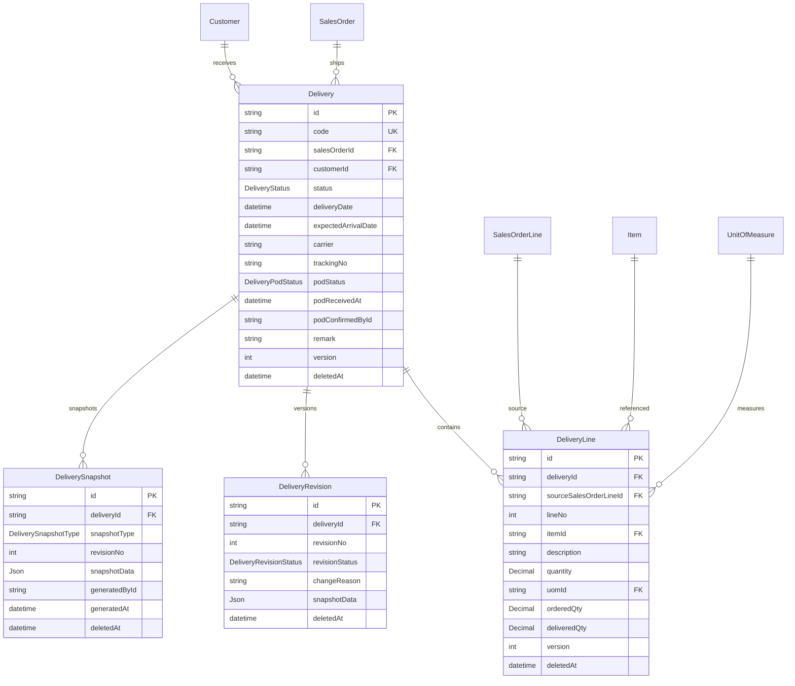

# Sprint 4C：Delivery Foundation Design（交付领域 Schema 设计）

- 状态：**DRAFT（待 CTO Review，2026-08-07）；本阶段禁止写业务代码，仅设计**
- 日期：2026-08-07
- 分支：feature/sprint4-sales
- 关联：ADR-0015（Quotation must consume Pricing Engine）、ADR-0016（Quotation Domain）、ADR-0017（Sales Order Domain）、ADR-0018（Delivery Domain，本文件配套）、Sprint4B_SO_Design.md（已实现，PR #13 合并）、Sprint4A_Quote_Design.md（已实现）、EVENTS.md（v1.4 已注册 SalesOrder 事件，4C 追加 Delivery 事件）、ROADMAP.md（Sprint 4：4A Quotation ✅ / 4B Sales Order ✅ / 4C Delivery 设计先行）
- 依据：CTO 决策——① 先设计后实现（本阶段禁止写业务代码）；② **Delivery 是交付事实源，SalesOrder 只保存聚合投影**（PARTIALLY_DELIVERED / DELIVERED 由 Delivery 聚合回写，禁止手工 PATCH）；③ 本阶段不开发 Invoice/Payment（Delivery/Invoice/Payment 各自生命周期）；④ 暂不新建 DeliveryApproval / DeliveryAttachment / DeliveryPrice（分别复用 Workflow / File Center / SalesOrder+QuotationPriceSnapshot）

> **本文件为 Sprint 4C Schema 设计交付物，后续开发一律以此为准。**
> **边界锁定：** 保留 4 模型（Delivery / DeliveryLine / DeliveryRevision / DeliverySnapshot）；
> **禁止**：DeliveryApproval / DeliveryAttachment / DeliveryPrice / 自建交付数量计算 / 本地 build/test/prisma/docker / 开发 Invoice/Payment。

---

## 1. 模型范围（CTO 锁定）

| 动作 | 模型 | 说明 |
| --- | --- | --- |
| ✅ 保留 | Delivery | 交付单头（交付事实源，1:N 关联 SalesOrder；单据编号 DocumentSequence docType=DELIVERY_ORDER，前缀 DO） |
| ✅ 保留 | DeliveryLine | 交付单行（记录**本次实际交付量**；sourceSalesOrderLineId 溯源；DeliveryLine 是交付事实表，SalesOrderLine 不承载交付明细） |
| ✅ 保留 | DeliveryRevision | 修改历史（唯一版本载体，交付内容变更时系统生成） |
| ✅ 保留 | DeliverySnapshot | 关键状态证据（仅固化节点：CREATED/READY/DISPATCHED/DELIVERED/CANCELLED） |
| ❌ 禁止 | DeliveryApproval | WorkflowInstance/WorkflowAction/WorkflowHistory 为唯一事实源（ADR-0016 决策①同构） |
| ❌ 禁止 | DeliveryAttachment | FileAttachment businessType="delivery"（File Center） |
| ❌ 禁止 | DeliveryPrice | 价格事实源在 SalesOrder/QuotationPriceSnapshot（ADR-0015），Delivery 不重新定价、不持有价格 |

**核心关系（CTO 锁定）：**
```
SalesOrder
 ↓ 1:N
Delivery
 ↓ 1:N
DeliveryLine
 ↓
sourceSalesOrderLineId（溯源 → SalesOrderLine）
```

**部分交付按行累计（CTO Review 94/100 修正：区分"预留交付量"与"已实际交付量"）：**
- `orderedQty`：SalesOrderLine.quantity（订单行原始订购量，不变）
- `deliveredQty`：SalesOrderLine 上的**已实际交付量投影**（仅 status = DELIVERED/COMPLETED 的 DeliveryLine 累计，由 confirm-delivery 聚合回写；DRAFT/READY/DISPATCHED **不计入**）
- `remainingQty`：`orderedQty - deliveredQty`（投影派生，始终表达真正尚未实际交付的数量）
- **预留/占用（动态计算，不新增列）**：创建/编辑 DeliveryLine 时事务内计算
  - `confirmedDeliveredQty` = SUM(status ∈ {DELIVERED, COMPLETED} 的 DeliveryLine.quantity)
  - `openDeliveryQty` = SUM(status ∈ {DRAFT, READY, DISPATCHED} 的其他 DeliveryLine.quantity)
  - `availableQty` = orderedQty - confirmedDeliveredQty - openDeliveryQty（防超交校验依据）
- **规则（CTO 锁定）**：DRAFT/READY/DISPATCHED 只**占用**可交付数量；只有 `confirm-delivery` 才增加 `SalesOrderLine.deliveredQty`；防止两个未完成 Delivery 同时分配超过订单数量 → 用 `availableQty` 校验（超出 → 409 DELIVERY_QUANTITY_EXCEEDED）
- **DeliveryLine.quantity 记录本次实际交付量**；SalesOrderLine 不成为交付事实表（deliveredQty/remainingQty 仅为只读投影，禁止手工 PATCH）

---

## 2. Prisma Schema 草案（+4 枚举 / +4 模型 + SalesOrderLine 2 投影列）

```prisma
/// 交付状态（Delivery 自身生命周期；不含 Invoice/Payment——发票/收款由 4D 模块承载）
enum DeliveryStatus {
  DRAFT              // 草稿（创建后初始态，可编辑行）
  READY              // 就绪（行彻底冻结、可发运；READY 后行只读，不支持修改/重新 ready）
  DISPATCHED         // 已发运（已出库/运输中）
  DELIVERED          // 已交付（客户确认收货或存在可靠交付确认——业务确认动作，非物流自动更新）
  COMPLETED          // 已完成（交付业务闭环；4C 仅保留枚举，不提供 /complete action）
  CANCELLED          // 已取消（DRAFT/READY 可取消；DISPATCHED+ 禁止）
}

/// 交付快照类型（仅固化节点）
enum DeliverySnapshotType {
  CREATED            // 创建时固化（初始交付快照）
  READY              // ready 时固化（行冻结后）
  DISPATCHED         // dispatch 时固化（发运证据）
  DELIVERED          // confirm-delivery 时固化（交付证据）
  CANCELLED          // cancel 时固化
}

/// 交付修订状态（与 SalesOrder/Quotation 同构）
enum DeliveryRevisionStatus {
  DRAFT
  SUBMITTED
  APPROVED
  SUPERSEDED
}

/// POD（Proof of Delivery）签收状态（CTO Review ④拍板：File Center 存文件 + 最小投影字段，不建 DeliveryPOD 表）
enum DeliveryPodStatus {
  PENDING            // 待签收
  RECEIVED           // 已签收（podReceivedAt/podConfirmedById 回填）
  WAIVED             // 豁免（业务不需要 POD 时可置此状态后允许 confirm-delivery）
}

/// 交付单头（交付事实源）
model Delivery {
  id           String   @id @default(cuid())
  code         String   @unique // 单据编号（DocumentSequence docType=DELIVERY_ORDER，前缀 DO，位数 6）
  salesOrderId String   // 来源销售订单（必填 NOT NULL；CTO Review ①拍板：Direct Delivery 禁止）
  salesOrder   SalesOrder @relation(fields: [salesOrderId], references: [id], onDelete: Restrict)
  customerId   String   // 收货客户（继承 SalesOrder.customerId）
  customer     Customer @relation(fields: [customerId], references: [id], onDelete: Restrict)
  status       DeliveryStatus @default(DRAFT)
  deliveryDate DateTime @default(now()) @db.Timestamptz(3) // 交付日期（计划/实际）
  expectedArrivalDate DateTime? @db.Timestamptz(3) // 预计到达（DISPATCHED 后）
  carrier      String?  // 承运方（物流公司/车次/单号，可空）
  trackingNo   String?  // 运单号（可空）
  // POD 最小投影（CTO Review ④拍板；原始文件走 FileAttachment businessType="delivery" attachmentType="POD"）
  podStatus    DeliveryPodStatus @default(PENDING)
  podReceivedAt DateTime? @db.Timestamptz(3) // 签收时间（RECEIVED 时回填）
  podConfirmedById String? // 签收确认人（RECEIVED 时回填）
  remark       String?  // 备注
  // 统一审计字段
  isActive    Boolean  @default(true)
  createdById String?
  updatedById String?
  approvedById String?
  approvalStatus ApprovalStatus @default(DRAFT)
  version     Int      @default(1)
  deletedAt   DateTime?
  createdAt   DateTime @default(now()) @db.Timestamptz(3)
  updatedAt   DateTime @updatedAt @db.Timestamptz(3)

  lines        DeliveryLine[]
  revisions    DeliveryRevision[]
  snapshots    DeliverySnapshot[]

  @@index([code])
  @@index([salesOrderId])
  @@index([customerId])
  @@index([status])
  @@index([deletedAt])
}

/// 交付单行（本次实际交付量；交付事实表）
model DeliveryLine {
  id           String   @id @default(cuid())
  deliveryId   String
  delivery     Delivery @relation(fields: [deliveryId], references: [id], onDelete: Cascade)
  sourceSalesOrderLineId String? // 溯源 → SalesOrderLine（SalesOrderLine 软删后 SetNull）
  sourceSalesOrderLine SalesOrderLine? @relation(fields: [sourceSalesOrderLineId], references: [id], onDelete: SetNull)
  lineNo       Int      @default(10) // 行号（10/20/30/40 步进）
  itemId       String?  // 物料（继承 SalesOrderLine.itemId，可空）
  item         Item?    @relation(fields: [itemId], references: [id], onDelete: Restrict)
  description  String   // 描述（快照）
  quantity     Decimal  @db.Decimal(18, 4) // 本次实际交付量（正数；防超交由事务层校验）
  uomId        String?  // 交付单位（继承 SalesOrderLine.uomId）
  uom          UnitOfMeasure? @relation(fields: [uomId], references: [id], onDelete: SetNull)
  // 只读投影（由 SalesOrderLine 回写值快照展示，非事实源；禁止手工填写）
  orderedQty   Decimal  @db.Decimal(18, 4) // 订单行订购量快照（校验用）
  deliveredQty Decimal  @db.Decimal(18, 4) // 已实际交付量快照（仅 DELIVERED/COMPLETED 累计；校验用）
  // 统一审计字段
  isActive    Boolean  @default(true)
  createdById String?
  updatedById String?
  approvedById String?
  approvalStatus ApprovalStatus @default(DRAFT)
  version     Int      @default(1)
  deletedAt   DateTime?
  createdAt   DateTime @default(now()) @db.Timestamptz(3)
  updatedAt   DateTime @updatedAt @db.Timestamptz(3)

  @@unique([deliveryId, lineNo])
  @@index([deliveryId])
  @@index([sourceSalesOrderLineId])
  @@index([itemId])
  @@index([deletedAt])
}

/// 交付修订（系统生成，不开放自由编辑；交付内容变更自动递增 revisionNo）
model DeliveryRevision {
  id           String   @id @default(cuid())
  deliveryId   String
  delivery     Delivery @relation(fields: [deliveryId], references: [id], onDelete: Cascade)
  revisionNo   Int      // 版本号（1,2,3...）
  revisionStatus DeliveryRevisionStatus @default(DRAFT)
  changeReason String   // 变更原因
  snapshotData Json?    // 变更前快照（Header + Lines 集合）
  createdById  String?
  // 统一审计字段
  isActive    Boolean  @default(true)
  updatedById String?
  approvedById String?
  approvalStatus ApprovalStatus @default(DRAFT)
  version     Int      @default(1)
  deletedAt   DateTime?
  createdAt   DateTime @default(now()) @db.Timestamptz(3)
  updatedAt   DateTime @updatedAt @db.Timestamptz(3)

  @@unique([deliveryId, revisionNo])
  @@index([deliveryId])
  @@index([deletedAt])
}

/// 交付快照（仅固化节点生成，只读）
model DeliverySnapshot {
  id           String   @id @default(cuid())
  deliveryId   String
  delivery     Delivery @relation(fields: [deliveryId], references: [id], onDelete: Cascade)
  snapshotType DeliverySnapshotType
  revisionNo   Int      // 快照对应的修订号
  snapshotData Json?    // 完整快照（Header + Lines + sourceSalesOrderLineId 集合 + 金额参考）
  generatedById String?
  generatedAt  DateTime @default(now()) @db.Timestamptz(3)
  // 统一审计字段
  isActive    Boolean  @default(true)
  createdById String?
  updatedById String?
  approvedById String?
  approvalStatus ApprovalStatus @default(DRAFT)
  version     Int      @default(1)
  deletedAt   DateTime?
  createdAt   DateTime @default(now()) @db.Timestamptz(3)
  updatedAt   DateTime @updatedAt @db.Timestamptz(3)

  @@unique([deliveryId, snapshotType])
  @@index([deliveryId])
  @@index([deletedAt])
}

/// SalesOrder / SalesOrderLine 追加交付投影（Migration 0016 设计，仅新增列，不改既有）
/// SalesOrder 追加：无（deliveredAt 已在 0015 预留；PARTIALLY_DELIVERED/DELIVERED 状态枚举已存在）
/// SalesOrderLine 追加 2 投影列（CTO Review 94/100：不新增第三列，不增加 allocatedQty 列）：
///   deliveredQty  Decimal @default(0) @db.Decimal(18, 4)
///     // 已实际交付量（仅 confirm-delivery 聚合回写；DRAFT/READY/DISPATCHED 不计入）
///   remainingQty Decimal @db.Decimal(18, 4)
///     // 剩余可交付量 = quantity - deliveredQty（表达真正尚未实际交付的数量）
///     // 初始化：0016 数据迁移将 remainingQty 置为 quantity（DB default 无法引用 quantity，
///     // 故 deliveredQty default 0，remainingQty 由迁移初始化）；之后全部由 Delivery 聚合逻辑维护
/// 预留/占用（动态计算，不落列）：创建/编辑 DeliveryLine 时事务内计算
///   confirmedDeliveredQty = SUM(status ∈ {DELIVERED, COMPLETED} 的 DeliveryLine.quantity)
///   openDeliveryQty = SUM(status ∈ {DRAFT, READY, DISPATCHED} 的其他 DeliveryLine.quantity)
///   availableQty = quantity - confirmedDeliveredQty - openDeliveryQty（防超交校验，超限 → 409 DELIVERY_QUANTITY_EXCEEDED）
```

---

## 3. Delivery ERD



**关系与约束（真实 Schema 对齐 4A/4B 同构）**

| 关系 | 基数 | onDelete | 说明 |
| --- | --- | --- | --- |
| SalesOrder → Delivery | 1:N | Restrict | 有交付单的订单不可物理删（Delivery 为事实源） |
| Customer → Delivery | 1:N | Restrict | 收货客户（继承 SO） |
| SalesOrderLine → DeliveryLine | 1:N | SetNull | 订单行软删不影响交付行（溯源 sourceSalesOrderLineId） |
| Item → DeliveryLine | 1:N | Restrict | 物料 |
| Delivery → DeliveryLine | 1:N | Cascade | 行随单据软删 |
| Delivery → DeliveryRevision | 1:N | Cascade | 修订历史随单据 |
| Delivery → DeliverySnapshot | 1:N | Cascade | 快照随单据 |
| WorkflowInstance → Delivery | 1:N | SetNull | （预留：Delivery 如需审批复用 Workflow，本阶段不建表） |

---

## 4. 状态机（Sprint 4C）

```
DRAFT ──ready──> READY ──dispatch──> DISPATCHED ──confirm-delivery──> DELIVERED
  │                │
  └──cancel──> CANCELLED  └──cancel──> CANCELLED
```

> **COMPLETED 本阶段不实现（CTO Review 拍板）**：枚举保留给后续（Delivery + POD + Invoice/其他闭环条件 → COMPLETED）；Sprint 4C 不提供 `/complete` action，API 到 `confirm-delivery → DELIVERED` 结束。

**状态变更规则（Sprint 4C 落地范围）**

| 动作 | 前置状态 | 目标状态 | 说明 |
| --- | --- | --- | --- |
| `ready` | DRAFT | READY | 行**彻底冻结**（READY 后行只读；不支持修改/重新 ready；发现错误 → cancel → 新建 Delivery，不引入 amendment 流程） |
| `dispatch` | READY | DISPATCHED | 发运（已出库/运输中；可写 carrier/trackingNo/expectedArrivalDate） |
| `confirm-delivery` | DISPATCHED | DELIVERED | **业务确认动作**（客户已收货或存在可靠交付确认，非物流自动更新）；写入 deliveredAt；触发 SO 聚合回写 |
| `cancel` | DRAFT / READY | CANCELLED | 取消；DISPATCHED+ 禁止取消（需走后续变更流程） |

**POD 与 confirm-delivery（CTO Review ④拍板）**
- `confirm-delivery` 要求 POD 状态：`podStatus ∈ {RECEIVED, WAIVED}`（PENDING 时禁止确认，409）；
- POD 原始文件走 FileAttachment（businessType="delivery"，attachmentType="POD"）；Delivery 仅存最小投影（podStatus/podReceivedAt/podConfirmedById）。

**SalesOrder 聚合投影回写（CTO 锁定：Delivery 为事实源，禁止手工 PATCH）**

| SalesOrder 状态 | 触发条件（Delivery 聚合） |
| --- | --- |
| PARTIALLY_DELIVERED | 至少一张非 CANCELLED Delivery 已 DELIVERED，且存在 remainingQty > 0 的订单行 |
| DELIVERED | 所有有效订单行 deliveredQty >= orderedQty（全部交付完成，回写 deliveredAt=now） |

- 聚合判定发生在 `confirm-delivery` 事务内：遍历该 SO 全部有效 SalesOrderLine，比较 deliveredQty vs quantity。
- SalesOrder.status 与 deliveredAt 由系统在 Delivery 确认时回写；**不提供任何 PATCH 入口**。

---

## 5. 事务规则（并发安全核心，CTO 锁定 + CTO Review 94/100 修正）

### 5.1 创建/编辑 DeliveryLine（DRAFT 阶段）

```
① 读 Delivery（校验 status=DRAFT）
② 读 SalesOrder（校验 status ∈ {CONFIRMED, PARTIALLY_DELIVERED}；锁定行）
③ 读 SalesOrderLine（FOR UPDATE 真实行锁）
   - SELECT ... FOR UPDATE（并发防超交核心：两单同交同一行时串行化）
④ 事务内动态计算（CTO Review：不新增 allocatedQty 列，动态算）：
   confirmedDeliveredQty = SUM(status ∈ {DELIVERED, COMPLETED} 的 DeliveryLine.quantity)
   openDeliveryQty = SUM(status ∈ {DRAFT, READY, DISPATCHED} 的其他 DeliveryLine.quantity)
   availableQty = orderedQty - confirmedDeliveredQty - openDeliveryQty
⑤ 校验 new allocated quantity <= availableQty（防超交；超限 → 409 DELIVERY_QUANTITY_EXCEEDED）
   - 注意：DRAFT/READY/DISPATCHED 只“占用”可交付数量，不计入 deliveredQty
⑥ 写 DeliveryLine（本次实际交付量）
⑦ 创建 DeliveryRevision + AuditLog
⑧ Domain Event（DeliveryCreated / DeliveryUpdated）
```

### 5.2 confirm-delivery（DISPATCHED → DELIVERED）—— 唯一增加 deliveredQty 的时机

```
① 读 Delivery（校验 status=DISPATCHED；校验 podStatus ∈ {RECEIVED, WAIVED}，否则 409）
② 锁定 SalesOrder（FOR UPDATE，防并发聚合回写竞争）
③ 对每个 DeliveryLine：
   - 重新校验 availableQty（事务内原子累计）防超交（409 DELIVERY_QUANTITY_EXCEEDED）
④ Delivery.status = DELIVERED + deliveredAt = now
⑤ 生成 DeliverySnapshot(DELIVERED)
⑥ 聚合回写 SalesOrderLine（CTO Review：仅此时增加）：
   deliveredQty += 本单行 quantity；remainingQty = quantity - deliveredQty
⑦ 聚合回写 SalesOrder：
   - 全部行交付完成 → status=DELIVERED + deliveredAt=now → 事件 SalesOrderDelivered
   - 部分完成 → status=PARTIALLY_DELIVERED → 事件 SalesOrderPartiallyDelivered
⑧ AuditLog + Domain Event（DeliveryConfirmed + SalesOrderPartiallyDelivered/SalesOrderDelivered）
```

### 5.3 并发场景（必须覆盖）

| 场景 | 风险 | 防护 |
| --- | --- | --- |
| 两张 Delivery 同时交同一 SO Line | 都读到相同 availableQty → 超交 | SalesOrderLine `FOR UPDATE` 真实行锁：第二个事务阻塞到第一个提交，重读后再校验 |
| confirm-delivery 与另一张 Delivery 编辑并发 | 聚合回写覆盖/丢失 | 事务内先锁 SalesOrder（FOR UPDATE），再锁各 SalesOrderLine |
| ready 后行修改 vs dispatch | 行锁定失效 | READY 后行 PATCH 拒绝（409）；不支持重新 ready（CTO Review：发现错误 → cancel → 新建） |

> 实现时以 `prisma.$transaction` + `SELECT ... FOR UPDATE`（Prisma 交互事务 + 原生锁查询，对齐 4B convert 行锁模式）实现，禁止"读-算-写"分离的乐观更新（避免超交）。

---

## 6. Workflow / Approval 设计

- **不建 DeliveryApproval 表**（ADR-0016 决策①同构）：审批以 Workflow 为唯一事实源。
- Delivery 本阶段**不触发审批**（交付是执行单据，非商业审批对象）；如后续需要（如超交审批）复用 `POST /api/workflows/instances/:id/actions` + ApprovalPolicy `module="DELIVERY"`（本阶段仅设计）。
- 附件走 FileAttachment `businessType="delivery"`（File Center，不建表）。

---

## 7. Domain Events 设计（先注册后开发，EVENTS.md v1.5）

| eventType | 触发时机 | 载荷示例 |
| --- | --- | --- |
| `DeliveryCreated` | 创建交付单（DRAFT） | `{ deliveryId, deliveryCode, salesOrderId, salesOrderCode, customerId, createdBy }` |
| `DeliveryUpdated` | 头/行内容变更（Revision） | `{ deliveryId, deliveryCode, revisionNo, changeReason, changedBy }` |
| `DeliveryReady` | ready（DRAFT → READY） | `{ deliveryId, deliveryCode, salesOrderId, readyBy }` |
| `DeliveryDispatched` | dispatch（READY → DISPATCHED） | `{ deliveryId, deliveryCode, carrier, trackingNo, dispatchedBy }` |
| `DeliveryConfirmed` | confirm-delivery（DISPATCHED → DELIVERED） | `{ deliveryId, deliveryCode, deliveredAt, confirmedBy }` |
| `DeliveryCancelled` | cancel（DRAFT/READY → CANCELLED） | `{ deliveryId, deliveryCode, cancelledBy, reason }` |
| `SalesOrderPartiallyDelivered` | Delivery 聚合：SO 部分交付（回写投影） | `{ salesOrderId, salesOrderCode, deliveryId, remainingQty, updatedAt }` |
| `SalesOrderDelivered` | Delivery 聚合：SO 全部交付（回写投影） | `{ salesOrderId, salesOrderCode, deliveryId, deliveredAt }` |

- 统一载荷至少包含：`deliveryId / deliveryCode / salesOrderId / customerId`（eventId/eventType/occurredAt 由 Event Envelope 提供）。
- `SalesOrderDeliveryStarted` / `SalesOrderDelivered` / `SalesOrderCompleted`（4B 已注册）由 4C Delivery 联动触发：首次交付（部分）→ SalesOrderPartiallyDelivered（4C 新注册），全部完成 → SalesOrderDelivered。

---

## 8. Migration 0016 规划（本阶段不创建）

- **迁移名**：`0016_delivery_foundation`（CTO Review 通过后实现）
- **范围**：仅新增（+4 枚举 / +4 表 + SalesOrderLine 追加 2 投影列），不修改既有表结构/索引
  - 枚举：`DeliveryStatus` / `DeliverySnapshotType` / `DeliveryRevisionStatus` / `DeliveryPodStatus`（CTO Review ④拍板新增）
  - 表：`Delivery` / `DeliveryLine` / `DeliveryRevision` / `DeliverySnapshot`
  - SalesOrderLine 追加 2 投影列（CTO Review：不新增 allocatedQty 第三列）：
    - `deliveredQty Decimal @default(0)`（已实际交付量；仅 confirm-delivery 聚合回写）
    - `remainingQty Decimal`（= quantity - deliveredQty；**初始化由 0016 数据迁移置为 quantity**——DB default 无法引用 quantity，故 remainingQty 不用 default(0)，迁移脚本逐行回填）
- **FK 依赖**（均已交付）：SalesOrder/SalesOrderLine（4B）、Customer（3C-1）、Item/UnitOfMeasure（3C-3）
- **索引**：`Delivery.code` 唯一、`DeliveryLine @@unique([deliveryId, lineNo])`、`DeliverySnapshot @@unique([deliveryId, snapshotType])`、`DeliveryRevision @@unique([deliveryId, revisionNo])`
- **回滚**：DROP 4 表 + 4 枚举 + 移除 2 投影列（纯增量）
- **本阶段不创建 Migration**（CTO Review 后进入 Schema 实现阶段时创建）

---

## 9. RBAC 规划

| 模块 | 动作（view/create/edit/delete/approve/audit/export/import/assign/close 子集） |
| --- | --- |
| delivery | view / create（经 SO 创建）/ edit（DRAFT）/ ready / dispatch / confirm-delivery / cancel / audit / export / import |
| delivery-line | view / edit（仅 DRAFT；无 create/delete——行来自 SO Line 复制） |
| delivery-revision | view（历史只读） |
| delivery-snapshot | view（证据只读） |

- 审批动作不占 delivery 模块权限（本阶段无审批；如需超交审批走 workflow 模块）。
- SalesOrder 聚合回写（PARTIALLY_DELIVERED/DELIVERED）为系统动作，不开放权限。

---

## 10. API 清单（Sprint 4C 仅规划，不实现）

> 遵守：API_GUIDELINES.md（分页/过滤/错误码/Headers/Idempotency）、ERROR_CODES.md（DELIVERY_* 追加）、File Center（attachments businessType=delivery）

| 方法 | 路径 | 权限 | 说明 |
| --- | --- | --- | --- |
| GET | /api/deliveries | delivery:view | 分页 + 过滤（code/salesOrderId/customerId/status/dateFrom/dateTo） |
| POST | /api/sales-orders/:salesOrderId/deliveries | delivery:create | **唯一创建入口**（CTO Review ①拍板：salesOrderId NOT NULL；Direct Delivery 禁止，不开放 POST /api/deliveries） |
| GET | /api/deliveries/:id | delivery:view | 详情（含 lines/revisions/snapshots + salesOrder + customer + POD 投影摘要） |
| PATCH | /api/deliveries/:id | delivery:edit | 更新头（仅 DRAFT；乐观锁 version） |
| GET | /api/deliveries/:id/lines | delivery-line:view | 行列表 |
| PATCH | /api/deliveries/:id/lines/:lineId | delivery-line:edit | 行更新（仅 DRAFT；数量变更重校验 availableQty 防超交，超限 → 409 DELIVERY_QUANTITY_EXCEEDED） |
| POST | /api/deliveries/:id/ready | delivery:ready | DRAFT → READY（行**彻底冻结** + READY 快照；不支持修改/重新 ready） |
| POST | /api/deliveries/:id/dispatch | delivery:dispatch | READY → DISPATCHED（发运 + DISPATCHED 快照） |
| POST | /api/deliveries/:id/confirm-delivery | delivery:confirm-delivery | DISPATCHED → DELIVERED（**业务确认收货**；要求 podStatus ∈ {RECEIVED, WAIVED}；聚合回写 SO 投影 + DELIVERED 快照） |
| POST | /api/deliveries/:id/cancel | delivery:cancel | DRAFT/READY → CANCELLED（CANCELLED 快照） |
| ~~POST~~ | ~~/api/deliveries~~ | — | **不开放**（CTO Review ①拍板：Direct Delivery 禁止） |

**审批动作**：复用 `POST /api/workflows/instances/:id/actions`（如需超交审批，本阶段不实现）。
**价格**：不涉及（Delivery 无价格；金额参考走 SalesOrder/QuotationPriceSnapshot）。

---

## 11. CTO Pending Decisions（已全部拍板，CTO Review 94/100）

| # | 问题 | 影响面 | **拍板结论（CTO Review 2026-08-07）** |
| --- | --- | --- | --- |
| ① | 是否允许无 SalesOrder 的 **Direct Delivery**？ | 是否开放 `POST /api/deliveries`、salesOrderId 是否可空 | **不允许**；salesOrderId NOT NULL；`POST /api/sales-orders/{id}/deliveries` 唯一入口；不开放 `POST /api/deliveries`（ERP 销售链 Quotation→SO→Delivery→Invoice 明确，Direct Delivery 绕开订单数量/客户/价格/开票来源） |
| ② | 是否允许**超交（over-delivery）**？ | confirm-delivery 校验逻辑、remainingQty 语义 | **Sprint 4C 不允许任何超交**：硬规则 `new allocated quantity <= availableQty`；超出 → 409 `DELIVERY_QUANTITY_EXCEEDED`；不做固定 +5%，不加超交审批；后续需要时建 `DeliveryTolerancePolicy` 或 Item/SO Line 级 `overDeliveryTolerancePct`（按商品差异定，不全系统固定） |
| ③ | **DELIVERED 是物流送达还是客户签收**？ | confirm-delivery 语义、deliveredAt 定义、POD 关联 | **DELIVERED = 客户确认收货 / 可证明已实物交付**（不是物流送达）：DISPATCHED = 已出库/已发运/运输中；DELIVERED = 客户已收货或存在可靠交付确认；COMPLETED = 交付业务闭环；`confirm-delivery` 是**业务确认动作**，非物流状态自动更新（后续 Invoice/AR 依赖交付事实） |
| ④ | **POD 字段直接建模**还是完全走 File Center？ | Delivery 是否加 POD 投影、附件引用 | **File Center 存文件 + Delivery 保存最小 POD 投影字段**（不建 DeliveryPOD 表）：Delivery 加 `podStatus（PENDING/RECEIVED/WAIVED）/ podReceivedAt / podConfirmedById`；POD 原始文件走 FileAttachment（businessType="delivery"，attachmentType="POD"）；`podStatus=WAIVED` 时允许 confirm-delivery |

---

## 12. 开发顺序（固定，不可跳步）

```
4C Design Review（本文件 + ADR-0018 + EVENTS v1.5，CTO 94/100 已通过）→ Schema → Migration 0016 → Seed → RBAC
→ Delivery CRUD/Lines（availableQty 动态校验防超交）→ ready/dispatch/confirm-delivery/cancel（confirm 才回写 deliveredQty）
→ SO 聚合回写 → OpenAPI → QA → CI → Review
（本阶段禁止开发 Invoice/Payment 与 /complete；POD 仅最小投影 + File Center）
```

---

## 13. 变更记录

| 日期 | 版本 | 说明 |
| --- | --- | --- |
| 2026-08-07 | v0.2 | CTO Review 94/100（APPROVED WITH CHANGES）9 项必改：① 区分预留量/已交付量（deliveredQty 仅 DELIVERED/COMPLETED 累计，DRAFT/READY/DISPATCHED 动态占用 availableQty 防超交，不新增列）② remainingQty 由 0016 迁移初始化为 quantity ③ 4 项 Pending 全部拍板（Direct Delivery 禁止 / 超交禁止 409 DELIVERY_QUANTITY_EXCEEDED / DELIVERED=客户确认收货 / POD=File Center+最小投影字段）④ READY 行彻底冻结（不支持重新 ready，发现错误 cancel→新建）⑤ COMPLETED 仅枚举不实现 action ⑥ +4 枚举（新增 DeliveryPodStatus）| 
| 2026-08-07 | v0.1 | 初稿：Delivery 4 模型/3 枚举、ERD、状态机、交付聚合回写、事务规则（FOR UPDATE 防超交）、并发场景、API 规划、8 个 Domain Events、4 项 CTO Pending Decisions |
