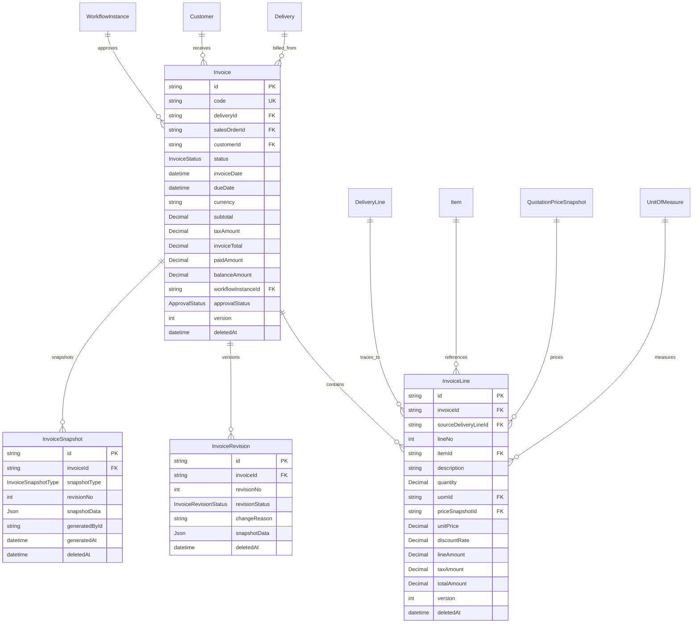

# Sprint 4D：Invoice Foundation Design（发票领域 Schema 设计）

> 定位（CTO 启动令 2026-08-07）：**Invoice 是销售财务链的起点**（Quotation → SalesOrder → Delivery → Invoice → AR → Receipt）。
> **Invoice 是财务事实，不是物流事实**。本阶段仅设计（3 文件），不写代码：`Sprint4D_Invoice_Design.md` + `ADR-0019` + `EVENTS.md v1.7`。
> 边界锁死原因：Invoice 是 ERP 财务链起点，后续 AR / Receipt / Credit Note / Debit Note / GL 都依赖它，比 4A~4C 更需要一次性设计正确。

---

## 1. 模型范围（CTO 锁定）

| 动作 | 模型 | 说明 |
| --- | --- | --- |
| ✅ 新增 | Invoice | 发票头（**财务事实源**；1:N 关联 Delivery；单据编号 DocumentSequence docType=INVOICE，前缀 INV；只维护 invoiceTotal/paidAmount/balanceAmount） |
| ✅ 新增 | InvoiceLine | 发票行（`sourceDeliveryLineId` 必填溯源；金额快照**直接复制**，禁止重新计算） |
| ✅ 新增 | InvoiceRevision | 修改历史（唯一版本载体，发票内容变更时系统生成） |
| ✅ 新增 | InvoiceSnapshot | 关键状态证据（仅固化节点：CREATED/ISSUED/CANCELLED；PARTIALLY_PAID/PAID 待 4E） |
| ❌ 禁止 | InvoiceApproval | WorkflowInstance/WorkflowAction/WorkflowHistory 为唯一事实源（ADR-0016 决策①同构）；继续 workflowInstanceId + approvalStatus 投影 |
| ❌ 禁止 | InvoiceAttachment | FileAttachment businessType="invoice"（File Center） |
| ❌ 禁止 | InvoicePrice | **价格事实源在 SalesOrder/QuotationPriceSnapshot（ADR-0015），Invoice 不重新定价、不调用 Pricing Engine** |

**核心关系（CTO 锁定）：**
```
Delivery
 ↓ 1:N
Invoice
 ↓ 1:N
InvoiceLine
 ↓
sourceDeliveryLineId（溯源 → DeliveryLine）
```

**完整可追溯链（CTO 锁定，四段溯源）：**
```
QuotationLine
 ↓ sourceQuotationLineId
SalesOrderLine
 ↓ sourceSalesOrderLineId
DeliveryLine
 ↓ sourceDeliveryLineId
InvoiceLine
```

**Payment 边界（CTO 锁定）：** Invoice 只负责 `invoiceTotal / paidAmount / balanceAmount` 三个金额投影；Payment 本身属 **Sprint 4E**（AR/Payment），本阶段不实现收款动作。

---

## 2. Prisma Schema 草案（+4 枚举 / +4 模型；Migration 0017 规划，本阶段不创建）

```prisma
/// 发票状态（发票自身生命周期；Payment 由 4E 模块承载）
enum InvoiceStatus {
  DRAFT            // 草稿（创建后初始态，可编辑头）
  ISSUED           // 已开票（对外正式开票；后续不可直接取消，走 Credit Note）
  PARTIALLY_PAID   // 部分收款（4E 回写投影）
  PAID             // 已收清（4E 回写投影）
  CANCELLED        // 已取消（仅 DRAFT 可取消；不提供 VOID——VOID 语义后续交 Credit Note）
}

/// 发票快照类型（仅固化节点；PARTIALLY_PAID/PAID 待 4E 补充）
enum InvoiceSnapshotType {
  CREATED          // 创建时固化（初始发票快照）
  ISSUED           // issue 时固化（对外开票证据）
  CANCELLED        // cancel 时固化
}

/// 发票修订状态（与 Delivery/SalesOrder/Quotation 同构）
enum InvoiceRevisionStatus {
  DRAFT
  SUBMITTED
  APPROVED
  SUPERSEDED
}

/// 发票行状态（预留；4D 仅枚举）
enum InvoiceLineStatus {
  ACTIVE
  CANCELLED
}

/// 发票头（财务事实源；CTO 启动令锁定）
model Invoice {
  id           String   @id @default(cuid())
  code         String   @unique // 单据编号（DocumentSequence docType=INVOICE，前缀 INV，位数 6）
  deliveryId   String   // 来源交付单（必填 NOT NULL；唯一入口 POST /api/deliveries/{id}/invoice；Direct Invoice 禁止）
  delivery     Delivery @relation(fields: [deliveryId], references: [id], onDelete: Restrict)
  salesOrderId String   // 冗余投影（经 Delivery 溯源 SalesOrder；便于 AR/对账）
  customerId   String   // 开票客户（继承 Delivery.customerId）
  customer     Customer @relation(fields: [customerId], references: [id], onDelete: Restrict)
  status       InvoiceStatus @default(DRAFT)
  invoiceDate  DateTime @default(now()) @db.Timestamptz(3) // 开票日期
  dueDate      DateTime? @db.Timestamptz(3) // 到期日（4E AR 使用）
  currency     String   @default("CNY")
  // 金额（财务事实，直接复制自 DeliveryLine 快照；禁止重新计算）
  subtotal     Decimal  @default(0) @db.Decimal(18, 4) // 未税合计
  taxAmount    Decimal  @default(0) @db.Decimal(18, 4) // 税额
  invoiceTotal Decimal  @default(0) @db.Decimal(18, 4) // 含税合计
  // 收款投影（仅 4E 回写；本阶段固定 0）
  paidAmount   Decimal  @default(0) @db.Decimal(18, 4) // 已收款（Sprint 4E 更新）
  balanceAmount Decimal @default(0) @db.Decimal(18, 4) // 应收余额 = invoiceTotal - paidAmount
  remark       String?
  // 审批投影（Workflow 为唯一事实源；不建 InvoiceApproval 表）
  workflowInstanceId String?
  workflowInstance WorkflowInstance? @relation(fields: [workflowInstanceId], references: [id], onDelete: SetNull)
  approvalStatus ApprovalStatus @default(DRAFT)
  approvedAt    DateTime? @db.Timestamptz(3)
  approvedById  String?
  // 统一审计字段
  isActive    Boolean  @default(true)
  createdById String?
  updatedById String?
  version     Int      @default(1)
  deletedAt   DateTime?
  createdAt   DateTime @default(now()) @db.Timestamptz(3)
  updatedAt   DateTime @updatedAt @db.Timestamptz(3)

  lines     InvoiceLine[]
  revisions InvoiceRevision[]
  snapshots InvoiceSnapshot[]

  @@index([deliveryId])
  @@index([salesOrderId])
  @@index([customerId])
  @@index([status])
  @@index([deletedAt])
}

/// 发票行（金额快照直接复制；sourceDeliveryLineId 必填溯源）
model InvoiceLine {
  id           String   @id @default(cuid())
  invoiceId    String
  invoice      Invoice  @relation(fields: [invoiceId], references: [id], onDelete: Cascade)
  sourceDeliveryLineId String? // 溯源 → DeliveryLine（DeliveryLine 软删后 SetNull；必填语义，软删防御）
  sourceDeliveryLine DeliveryLine? @relation(fields: [sourceDeliveryLineId], references: [id], onDelete: SetNull)
  lineNo       Int      @default(10) // 行号（10/20/30/40 步进）
  itemId       String?  // 物料（继承 DeliveryLine.itemId，可空）
  item         Item?    @relation(fields: [itemId], references: [id], onDelete: Restrict)
  description  String   // 描述（快照，复制自 DeliveryLine.description）
  quantity     Decimal  @db.Decimal(18, 4) // 开票数量（<= DeliveryLine.quantity 已交付量，防超开票）
  uomId        String?  // 单位（继承 DeliveryLine.uomId）
  uom          UnitOfMeasure? @relation(fields: [uomId], references: [id], onDelete: SetNull)
  // 金额快照（CTO 红线：**直接复制** DeliveryLine 溯源 SalesOrderLine 的价格快照，禁止重新计算/调用 Pricing Engine）
  priceSnapshotId String? // 直接复制 SalesOrderLine.priceSnapshotId（溯源链取价）
  priceSnapshot QuotationPriceSnapshot? @relation(fields: [priceSnapshotId], references: [id], onDelete: SetNull)
  unitPrice    Decimal  @db.Decimal(18, 4) // 单价快照（复制）
  discountRate Decimal  @default(0) @db.Decimal(18, 4) // 折扣率快照（复制）
  lineAmount   Decimal  @db.Decimal(18, 4) // 行未税金额（复制计算值，不重算）
  taxAmount    Decimal  @db.Decimal(18, 4) // 行税额（复制）
  totalAmount  Decimal  @db.Decimal(18, 4) // 行含税金额（复制）
  // 统一审计字段
  isActive    Boolean  @default(true)
  createdById String?
  updatedById String?
  approvedById String?
  approvalStatus ApprovalStatus @default(DRAFT)
  version     Int      @default(1)
  deletedAt   DateTime?
  createdAt   DateTime @default(now()) @db.Timestamptz(3)
  updatedAt   DateTime @updatedAt @db.Timestamptz(3)

  @@unique([invoiceId, lineNo])
  @@index([invoiceId])
  @@index([sourceDeliveryLineId])
  @@index([itemId])
  @@index([deletedAt])
}

/// 发票修订（系统生成，不开放自由编辑；发票内容变更自动递增 revisionNo）
model InvoiceRevision {
  id           String   @id @default(cuid())
  invoiceId    String
  invoice      Invoice  @relation(fields: [invoiceId], references: [id], onDelete: Cascade)
  revisionNo   Int
  revisionStatus InvoiceRevisionStatus @default(DRAFT)
  changeReason String
  snapshotData Json?
  createdById  String?
  // 统一审计字段
  isActive    Boolean  @default(true)
  updatedById String?
  approvedById String?
  approvalStatus ApprovalStatus @default(DRAFT)
  version     Int      @default(1)
  deletedAt   DateTime?
  createdAt   DateTime @default(now()) @db.Timestamptz(3)
  updatedAt   DateTime @updatedAt @db.Timestamptz(3)

  @@unique([invoiceId, revisionNo])
  @@index([invoiceId])
  @@index([deletedAt])
}

/// 发票快照（仅固化节点生成，只读）
model InvoiceSnapshot {
  id           String   @id @default(cuid())
  invoiceId    String
  invoice      Invoice  @relation(fields: [invoiceId], references: [id], onDelete: Cascade)
  snapshotType InvoiceSnapshotType
  revisionNo   Int
  snapshotData Json?    // 完整快照（Header + Lines + sourceDeliveryLineId 集合；金额 Decimal 字符串，禁止 toNumber）
  generatedById String?
  generatedAt  DateTime @default(now()) @db.Timestamptz(3)
  // 统一审计字段
  isActive    Boolean  @default(true)
  createdById String?
  updatedById String?
  approvedById String?
  approvalStatus ApprovalStatus @default(DRAFT)
  version     Int      @default(1)
  deletedAt   DateTime?
  createdAt   DateTime @default(now()) @db.Timestamptz(3)
  updatedAt   DateTime @updatedAt @db.Timestamptz(3)

  @@unique([invoiceId, snapshotType])
  @@index([invoiceId])
  @@index([deletedAt])
}
```

**设计要点：**
- `Invoice.deliveryId` NOT NULL（Direct Invoice 禁止；唯一入口 `POST /api/deliveries/{id}/invoice`）
- `InvoiceLine.sourceDeliveryLineId` 必填（四段溯源链末端）
- **InvoiceLine 价格字段全部为快照复制**（priceSnapshotId/unitPrice/discountRate/lineAmount/taxAmount/totalAmount），schema 无任何 Pricing Engine 调用点
- 反向关系需补：Customer.invoices / Delivery.invoices / Item.invoiceLines / UOM.invoiceLines / SalesOrder（经 Delivery 间接）
- `SalesOrder` 不加 invoice 投影列（Invoice 通过 deliveryId → salesOrderId 溯源；如需 SalesOrder.invoiceTotal 投影待 4E/对账需求评估）

---

## 3. Invoice ERD



**四段溯源链（CTO 锁定，财务可追溯）：**
```
QuotationLine (sourceQuotationLineId)
  ↓
SalesOrderLine (sourceSalesOrderLineId)
  ↓
DeliveryLine  (sourceDeliveryLineId)
  ↓
InvoiceLine
```

---

## 4. 状态机（Sprint 4D）

```
DRAFT ──issue──▶ ISSUED ──(4E 收款)──▶ PARTIALLY_PAID ──(4E 收清)──▶ PAID
  │
  └──cancel──▶ CANCELLED（仅 DRAFT 可取消）
```

| 规则 | 说明 |
| --- | --- |
| DRAFT → ISSUED | issue action；生成 ISSUED 快照；发布 InvoiceIssued |
| DRAFT → CANCELLED | cancel action；仅 DRAFT 可取消；生成 CANCELLED 快照；发布 InvoiceCancelled |
| ISSUED → CANCELLED | **禁止**（已开票后续走 Credit Note，不直接取消；CTO 默认建议，Pending Decision ④） |
| ISSUED → PARTIALLY_PAID / PAID | 仅 4E Receipt 回写；本阶段枚举保留不实现 |
| **无 VOID** | VOID 语义后续由 Credit Note 承载（CTO 启动令明确"不要 VOID"） |

---

## 5. 数据来源（CTO 锁定：唯一来源 Delivery）

- **Invoice 唯一来源：Delivery**（`POST /api/deliveries/{id}/invoice`）
- **禁止**：`Quotation → Invoice`、`SalesOrder → Invoice`（不允许从报价/订单直接开票）
- 创建 Invoice 前置条件：Delivery.status = **DELIVERED**（客户已确认收货，方可开票）
- 创建 Invoice 行：从 Delivery 的有效行选择（显式传入，参考 4C 分批发货模式）；`quantity <= DeliveryLine.quantity`（防超开票，类似防超交的可用量校验——开票数量不得超过已交付数量）
- 取价：**通过 `DeliveryLine.sourceSalesOrderLineId` 溯源到 SalesOrderLine 复制价格快照**（DeliveryLine 本身无价格列——4C ADR-0018 决策④：交付不持有价格；取价路径见第 6 节）

---

## 6. 金额原则（CTO 新增红线：Invoice 永远不重新计算价格）

- **Invoice 不调用 Pricing Engine**；Pricing Engine 的作用域**到 Sales Order 为止**（ADR-0015）
- Invoice 创建时**直接复制**价格快照：
  - `priceSnapshotId` ← SalesOrderLine.priceSnapshotId（经 DeliveryLine.sourceSalesOrderLineId 溯源）
  - `unitPrice / discountRate / lineAmount / taxAmount / totalAmount` ← SalesOrderLine 对应快照值（**逐字段复制，不做任何重算**）
- 头金额 `subtotal / taxAmount / invoiceTotal` 由行复制值**加总**（Decimal 求和，非重新定价）
- **取价路径（四段溯源链取价，天然保证一致性）：**
  ```
  InvoiceLine.sourceDeliveryLineId
    → DeliveryLine.sourceSalesOrderLineId
    → SalesOrderLine.priceSnapshotId / unitPrice / lineAmount / taxAmount / totalAmount
  ```
  （若 CTO Review 后决定 DeliveryLine 增加价格投影列，可在 Migration 0017 中调整——本设计默认溯源取价，保持 Delivery 物流事实源纯净）
- 禁止：前端提交 unitPrice / 任何价格字段（schema 无价格输入点）；Invoice 阶段不重算税额/折扣

---

## 7. 事务规则（并发安全核心）

### 7.1 创建 Invoice（唯一入口 POST /api/deliveries/{id}/invoice）

```
事务内固定顺序：
1. FOR UPDATE 锁 Delivery（校验 status = DELIVERED）
2. FOR UPDATE 锁 SalesOrder（经 delivery.salesOrderId；防 SO 级并发）
3. 按 id ASC 锁本 Delivery 涉及的全部 DeliveryLine（防死锁，参考 4C confirm 锁序）
4. 校验每个 InvoiceLine.sourceDeliveryLineId 有效 + quantity <= DeliveryLine.quantity（防超开票）
5. 经溯源链读取 SalesOrderLine 价格快照（复制，不重算）
6. 原子取号（DocumentSequence docType=INVOICE，前缀 INV，位数 6）
7. 创建 Invoice 头（DRAFT）+ InvoiceLine（金额快照复制）
8. 生成 InvoiceRevision + InvoiceSnapshot(CREATED)
9. 发布 InvoiceCreated
```

### 7.2 并发场景（必须覆盖）

| 场景 | 防护 |
| --- | --- |
| 同一 Delivery 并发开票 | FOR UPDATE 锁 Delivery 串行化 |
| 同一 DeliveryLine 多 Invoice 并发 | 按 id ASC 锁 DeliveryLine（参考 4C），累计开票量校验（quantity <= 已交付量 - 已开票量，防超开票） |
| 多 Delivery 合并开票（Pending ②） | 锁多 Delivery（按 id 排序）+ 全部涉及 DeliveryLine id ASC |
| Invoice issue 并发 | 锁 Invoice + 校验 DRAFT |
| Decimal 精度 | 全程 Prisma.Decimal；Snapshot JSON 金额 toString() 禁止 toNumber() |

---

## 8. Workflow / Approval 设计

- **不建 InvoiceApproval 表**：WorkflowInstance/WorkflowAction/WorkflowHistory 为唯一事实源（与 4A/4B/4C 同构）
- Invoice 保存投影：`workflowInstanceId / approvalStatus / approvedAt / approvedById`
- 审批触发：issue 前按 ApprovalPolicy（module="INVOICE"）条件匹配；命中则创建 WorkflowInstance，审批终态回写投影
- 复用现有 workflow-sync 模式（syncInvoiceApproval / maybeTriggerInvoiceApproval，实现阶段再建）

---

## 9. Domain Events 设计（先注册后开发，EVENTS.md v1.7）

| eventType | 触发时机 | 实现状态 |
| --- | --- | --- |
| `InvoiceCreated` | 创建发票（DRAFT，经 Delivery） | ⏳ 注册待实现（4D） |
| `InvoiceIssued` | issue（DRAFT → ISSUED） | ⏳ 注册待实现（4D） |
| `InvoiceCancelled` | cancel（DRAFT → CANCELLED） | ⏳ 注册待实现（4D） |
| `InvoicePartiallyPaid` | 4E Receipt 回写（ISSUED → PARTIALLY_PAID） | ⏳ 注册待实现（4E） |
| `InvoicePaid` | 4E 收清（→ PAID） | ⏳ 注册待实现（4E） |

> 后两个（PartiallyPaid/Paid）虽然 4E 才实现，**也要先注册**（CTO 启动令：先注册后开发）。

---

## 10. Migration 0017 规划（本阶段不创建）

- `0017_invoice_foundation`：+4 CREATE TYPE（InvoiceStatus / InvoiceSnapshotType / InvoiceRevisionStatus / InvoiceLineStatus）+ 4 CREATE TABLE（Invoice / InvoiceLine / InvoiceRevision / InvoiceSnapshot）+ 反向关系列（Customer.invoices / Delivery.invoices / Item.invoiceLines / UOM.invoiceLines）+ 索引 + FK
- onDelete：Invoice→Delivery/Customer Restrict；Line→Invoice Cascade、→DeliveryLine SetNull、→Item Restrict、→PriceSnapshot SetNull；Revision/Snapshot→Invoice Cascade
- 红线：仅 CREATE/ALTER/INDEX/FK，无 DROP/RENAME/TRUNCATE/改旧字段
- 若 CTO Review 决定 DeliveryLine 增加价格投影列，则并入本迁移（ALTER TABLE DeliveryLine ADD COLUMN）

---

## 11. RBAC 规划

- 模块：`invoice` / `invoice-line` / `invoice-revision` / `invoice-snapshot`
- 动作复用现有 10 项（view/create/edit/delete/approve/audit/export/import/assign/close），映射：
  - issue → `invoice:approve`
  - cancel → `invoice:close`
  - 头/行编辑 → `invoice:edit` / `invoice-line:edit`
- 不新造 action 枚举（与 4B/4C 一致，seed 扩展 SEED_ACTION_MODULES）

---

## 12. API 清单（Sprint 4D 仅规划，不实现）

| 分组 | 端点 | 说明 |
| --- | --- | --- |
| 主档 | GET `/api/invoices` | 列表（分页 + code/deliveryId/customerId/status 过滤；**无 POST**——Direct Invoice 禁止） |
| 主档 | POST `/api/deliveries/{id}/invoice` | **唯一创建入口**（Delivery=DELIVERED 才可开票） |
| 主档 | GET `/api/invoices/{id}` | 详情（含 lines/revisions/snapshots + delivery/customer 摘要） |
| 主档 | PATCH `/api/invoices/{id}` | 头更新（仅 DRAFT；乐观锁 version；金额字段不可手工改） |
| 行 | GET `/api/invoices/{id}/lines` | 行列表（只读；行在创建时从 Delivery 选择） |
| Action | POST `/api/invoices/{id}/issue` | DRAFT → ISSUED（ISSUED 快照 + InvoiceIssued） |
| Action | POST `/api/invoices/{id}/cancel` | DRAFT → CANCELLED（CANCELLED 快照 + InvoiceCancelled；ISSUED+ 禁止） |

> 不开放 `POST /api/invoices`；无 `/complete`；Payment 端点属 4E。

---

## 13. CTO Pending Decisions（本轮重点，4 项待拍板）

| # | 问题 | 默认建议 | 影响面 |
| --- | --- | --- | --- |
| ① | **一张 Delivery 是否允许拆成多张 Invoice？** | **允许（Partial Billing）**——分次开票场景（如按行/按批次开票） | 创建路由允许 deliveryId 相同多 Invoice；超开票校验按 DeliveryLine 累计 |
| ② | **多张 Delivery 是否允许合并开一张 Invoice？** | **允许（Consolidated Invoice）**——多交付合并开票（如月度合并） | 创建路由支持多条 deliveryId 或经 SalesOrder 聚合；锁序按多 Delivery 排序 |
| ③ | **Invoice 是否允许编辑 Line？** | **禁止**——金额来自 Delivery，行不可编辑/新增/删除（仅 DRAFT 可编辑头） | 不提供 lines PATCH；行在创建时确定 |
| ④ | **Invoice Cancel 是否允许直接取消？** | **仅 DRAFT 可取消**——已 ISSUED 后续走 Credit Note，不允许直接取消 | cancel 状态限制（DRAFT only） |

> 未拍板前不实现：本阶段仅设计。CTO Review 拍板后进入 Schema 实现。

---

## 14. 开发顺序（固定，不可跳步）

**Design（本文档）→ CTO Review（4 项 Pending 拍板）→ Schema → Migration 0017 → Seed → RBAC → API（创建/issue/cancel）→ Workflow（条件审批）→ OpenAPI → QA → Test Cases → ADR/ERD/EVENTS 同步 → CI → CTO Final Review → Merge**

---

## 15. 变更记录

| 日期 | 版本 | 说明 |
| --- | --- | --- |
| 2026-08-07 | v1.0 | Sprint 4D Invoice Foundation 设计初稿（CTO 启动令锁定：4 模型/禁止 3 表/唯一来源 Delivery/金额红线/状态机/API 规划/4 项 Pending Decisions） |
