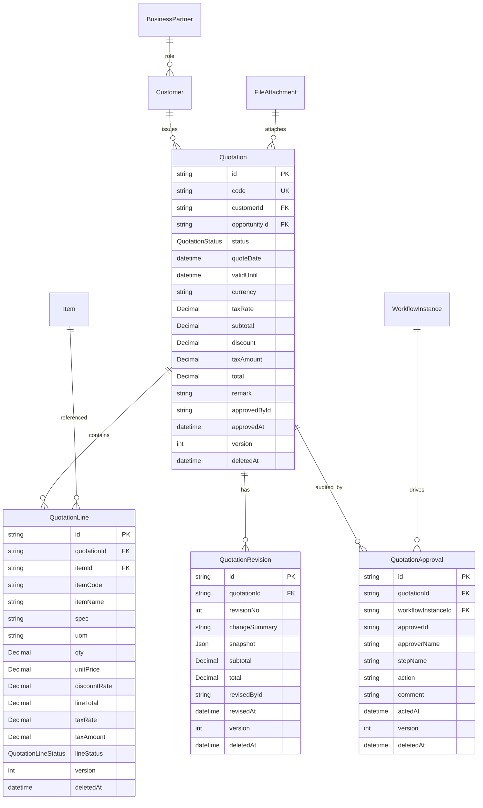

# Sprint 4 预备：Quote ERD（报价领域 ERD，仅设计不写代码）

> 状态：Design（Sprint 4 Sales 提前准备）
> 关联：Sprint4_Quote_Domain.md / Sprint4_Quote_API.md / Sprint4_Quote_Workflow.md



## 关系说明

| 关系 | 基数 | onDelete | 说明 |
| --- | --- | --- | --- |
| Customer → Quotation | 1:N | Restrict | 有报价的客户不可物理删（逻辑软删） |
| Quotation → QuotationLine | 1:N | Cascade | 行随单据软删 |
| Item → QuotationLine | 1:N | SetNull | 物料可被引用（Sprint 3C-3 落地后强关联） |
| Quotation → QuotationRevision | 1:N | Cascade | 修订历史随单据 |
| Quotation → QuotationApproval | 1:N | Cascade | 审批记录随单据 |
| WorkflowInstance → QuotationApproval | 1:N | SetNull | 工作流实例删除不影响审批留痕 |
| FileAttachment → Quotation | N:1 | SetNull | 附件统一走 File Center（businessType=quotation） |

## 主链关系（Sprint 4 销售主链）

```
BusinessPartner ──角色──> Customer ──1:N──> Quotation ──1:N──> QuotationLine
                                                │
                                                ├──1:N──> QuotationRevision（版本留痕）
                                                ├──1:N──> QuotationApproval（审批留痕，Workflow 驱动）
                                                └──提交──> QuotationSubmitted（Domain Event）
```
