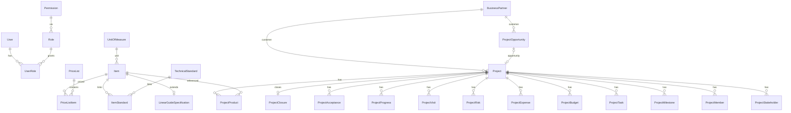

# 领域模型文档（Domain Model）

- 版本：v0.2.0-sprint2b
- 日期：2026-08-05
- 范围：中国工业企业（直线导轨制造与贸易）CRM —— 主数据 + 项目领域（数据架构与字段标准，业务功能后续 Sprint 开发）

## 1. 领域总览

```
主数据（Master Data）          项目领域（Project Domain）
─────────────────              ─────────────────────────
UnitOfMeasure ─┐               ProjectOpportunity (售前: 线索→准入→方案→报价)
Item ──────────┼─ 扩展          └─ 1:0..1 ─ Project (实施: 试样→测试→小批量→批量供货→…)
LinearGuideSpecification        ├─ ProjectStakeholder (客户关系人)
TechnicalStandard               ├─ ProjectMember (内部成员)
ItemStandard (Item×Standard)    ├─ ProjectMilestone (里程碑)
BusinessPartner (客户/供应商)   ├─ ProjectTask (任务)
PriceList ── PriceListItem      ├─ ProjectBudget (预算)
CommercialTerm                  ├─ ProjectExpense (费用)
DocumentSequence (编号规则)     ├─ ProjectProduct (项目物料 → Item)
                                ├─ ProjectRisk (风险)
                                ├─ ProjectVisit (走访/沟通)
                                ├─ ProjectProgress (进展)
                                ├─ ProjectAcceptance (验收)
                                └─ ProjectClosure (结项, 1:1)
```

## 2. 主数据（ADR-0002）

### 2.1 Item 统一物料

- 类别：`ItemCategory` = FINISHED_GOOD / RAW_MATERIAL / ACCESSORY / PURCHASED_PART / SERVICE / PACKAGING
- 通用字段：code（内部编码,唯一）/ name（中文名称）/ model（型号）/ mnemonic（助记码）/ unitId
- **工业字段（Sprint 2C 补充，库存可直接复用）**：brand（品牌）/ manufacturer（制造商）/ oemCode（OEM 编码）/ customerItemNo（客户料号）/ supplierItemNo（供应商料号）/ drawingNo（图号）/ drawingVersion（图纸版本）/ lifecycle（生命周期 INTRO/GROWTH/MATURE/DECLINE/EOL）/ obsolete（停产标记）/ replacementItemId（替代料,自关联）/ minPackQty（最小包装）/ procurementLeadTime（采购周期,天）/ moq（MOQ）/ safetyStock（安全库存）
- 扩展模型 `LinearGuideSpecification`（1:1）：系列 / 滑块型式 / 导轨型式 / 互换性 / 精度等级 /
  预压力 / 导轨长度 / 额定动负荷 / 额定静负荷 / 额定力矩 / 润滑 / 防尘 / 材质 / 硬度 / 安装方式
- 示例：SG45 / SM45H / SR35 / SV25；合同示例 `SMH45A-2-R1515-Z0-N-22.5`

### 2.2 BusinessPartner 统一往来单位

- `PartnerType` = CUSTOMER / SUPPLIER / BOTH（客户兼供应商）
- 中国工商字段：uscc（统一社会信用代码,唯一）/ taxpayerType（纳税人类型）/ legalRepresentative / registeredAddress
- 开票结算：invoiceInfo / bankName / bankAccount / settlementTerms
- **中国企业字段（Sprint 2C 补充）**：shortName（客户简称）/ fullName（客户全称）/ groupName（集团名称）/ region（所属区域）/ industry（所属行业）/ companySize（企业规模）/ creditRating（信用等级）/ sourceChannel（来源渠道）/ foundedDate（成立日期）/ registeredCapital（注册资本,万元）/ employeeCount（员工人数）/ website（官网）/ wechatOfficialAccount（微信公众号）/ tags（企业标签,Json）

### 2.3 PriceList + PriceListItem（含税价格体系）

- `PriceType`（价格类型）：PURCHASE（采购价）/ SALES（销售价）/ VIP / AGENT（代理）/ ENGINEERING（工程）/ STRATEGIC（战略客户）/ REGIONAL（区域价）/ CUSTOMER（客户专属价）/ HISTORICAL（历史价）
- 行项：unitPriceExclTax / taxRate / taxAmount / unitPriceInclTax
- validFrom / validTo（生效/失效日期）/ minOrderQty / tieredPricing / freightIncluded / approvalStatus
- 税率来源：`DEFAULT_TAX_RATE` 环境变量（默认 13，禁止代码写死）

### 2.4 其他主数据

- TechnicalStandard（技术标准,如 GB/T 17616）+ ItemStandard
- UnitOfMeasure（KG/M/PC/SET/BOX/M2）、CommercialTerm（EXW/FOB/CIF/NET30）
- DocumentSequence：`DocumentType` 枚举直接支持 17 种单据（QUOTATION/SO/PO/PI/CI/DO/GRN/GI/INVOICE/CREDIT_NOTE/DEBIT_NOTE/PAYMENT_VOUCHER/RECEIPT/EXPENSE/JOURNAL/CONTRACT/PROJECT），后续新增业务模块无需改表

## 3. 项目领域（ADR-0003）

### 3.1 双段模型

| 维度 | ProjectOpportunity | Project |
| --- | --- | --- |
| 阶段 | LEAD/QUALIFIED/SOLUTION/QUOTATION | SAMPLING/TESTING/SMALL_BATCH/MASS_SUPPLY/PAUSED/FAILED/CLOSED |
| 关系 | 1 → 0..1 Project（`Project.opportunityId` 唯一） | 可无机会直接建档 |
| 财务字段 | 客户投入/预计营收/成本/毛利/费用预算/销售目标/回款状态/竞争对手/成功概率 | 同左 |

### 3.2 Project 补充财务字段（Sprint 2C，供 Dashboard 统计）

- 预计合同金额（expectedContractAmount）/ 预计利润（expectedProfit）/ 预计毛利率（expectedGrossMarginRate）
- 回款金额（receivedAmount）/ 已开发票（invoicedAmount）/ 未开发票（uninvoicedAmount）/ 应收余额（receivableBalance）
- 项目评级（projectRating）/ 赢单概率（successProbability）/ 竞争对手（competitors）/ 失败原因（failureReason）

### 3.3 子模型职责

| 模型 | 关键字段 |
| --- | --- |
| ProjectStakeholder | role（REQUESTER/TECHNICAL/PURCHASER/DECISION_MAKER/END_USER）、姓名/职务/部门/电话/邮箱 |
| ProjectMember | userId（可空）、roleInProject、joinedAt/leftAt |
| ProjectMilestone | plannedDate/actualDate、status、deliverable（交付成果）、delayReason（延期原因） |
| ProjectTask | milestoneId、assigneeId、dueDate、status、priority |
| ProjectBudget | category、amount、currency=CNY |
| ProjectExpense | category、amount、currency、incurredAt |
| ProjectProduct | itemId→Item、quantity、unitPrice |
| ProjectRisk | description/impact/probability、mitigation（应对）、ownerId（责任人）、status、closedAt |
| ProjectVisit | visitType、visitedAt、contactName、summary、nextAction（下次行动）、reminderAt（提醒） |
| ProjectProgress | recordedAt、progressPercent、summary |
| ProjectAcceptance | expectedDate/actualDate、result（PASSED/CONDITIONAL_PASS/FAILED/PENDING）、resultNote |
| ProjectClosure | closedAt、reason、summary |

## 4. 通用审计字段（全部业务表）

```
createdById / updatedById / approvedById  — 创建人/修改人/审核人
approvalStatus (DRAFT/PENDING/APPROVED/REJECTED, 默认 DRAFT)
version (Int, 默认 1)                      — 版本号（乐观锁）
deletedAt (软删除) / isActive (停用标记)
createdAt / updatedAt (Timestamptz(3))
```

## 4.1 细粒度权限（Sprint 2C，供审批流直接复用）

- 权限码格式：`${module}:${action}`
- 动作（PERMISSION_ACTIONS）：`view / create / edit / delete / approve / audit / export / import / assign / close`
- 模块（PERMISSION_MODULES）：user / role / audit / item / business-partner / price-list / technical-standard / unit-of-measure / commercial-term / document-sequence / project-opportunity / project / project-visit / project-risk
- RBAC：SUPER_ADMIN/ADMIN 全量；MANAGER 主数据+项目读写 + 动作级；MEMBER 只读 + view
- seed 预置全部 read/write + 动作级权限（`SEED_ACTION_PERMISSIONS` 生成）

## 5. ERD


